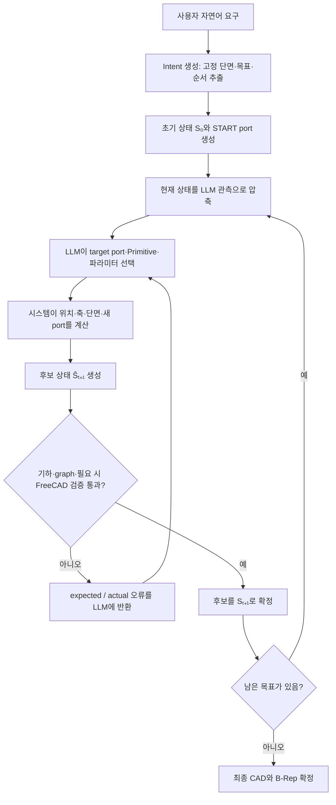
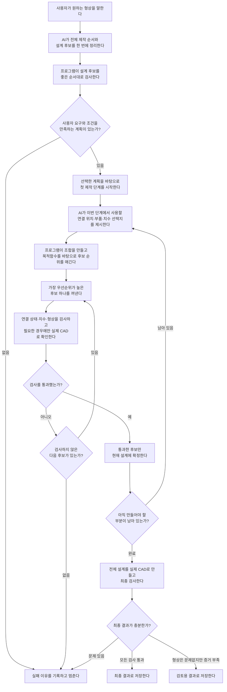

# Primitive-Based Parametric CAD Generation — 설계 스펙 (Design Specification)

| 항목 | 내용 |
|------|------|
| 문서명 | Primitive-Based Parametric CAD Generation — Design Spec |
| 버전 | v1 (기존) · v2 (개선 구조) 통합 정리 |
| 최종 갱신 | 2026-07-14 |
| 대상 도메인 | 속이 빈(hollow) 파이프/배관 형상의 파라메트릭 CAD 자동 생성 |
| 핵심 스택 | LLM(설계 제안) + 결정론적 시스템(계산·검증) + FreeCAD / MCP(형상 생성) |
| 출처 | Notion — "Primitive-Based Parametric CAD Generation" 및 하위 문서 "Primitive-Based Ver2" |

---

## 1. 개요 (Overview)

사용자의 자연어 요구로부터 **속이 빈 파이프 형상의 3D CAD를 자동 생성**하는 시스템의 설계 명세다.

핵심 아이디어는 **완성된 CAD를 LLM이 한 번에 그리지 않는다**는 것이다. 대신,
사용자가 요구한 형상을 작은 조립 단위로 나누고, LLM이 다음에 붙일 **부품(Primitive)의 종류와 치수(파라미터)를 제안**하면,
시스템이 실제로 **연결 가능한지 계산·검사한 뒤 통과한 부품만 하나씩 이어 붙인다.**

### 1.1 역할 분담

| 주체 | 책임 | 예시 |
|------|------|------|
| **LLM** | 각 단계에서 연결할 부품과 그 부품의 파라미터(수치)를 제안 | "여기 부분에 30 mm 파이프를 붙여라" |
| **시스템** | 파라미터를 바탕으로 위치·두께·연결 방향 계산 → 최종 상태를 FreeCAD 형상으로 검사 | 현재 조립 상태 기준으로 위치·연결 프레임·상속 치수·끝점을 계산한 뒤, 연결 가능성과 형상 안정성을 검사 |

> **설계 원칙**: LLM은 "무엇을·대략 얼마로" 붙일지 **의도(intent)** 만 담당하고, 정확한 좌표·프레임·검증은 전적으로 **결정론적 시스템**이 담당한다. 이로써 LLM의 수치 오류가 형상 정합성을 깨뜨리지 못하도록 격리한다.

---

## 2. 핵심 개념 및 데이터 모델

### 2.1 상태 (State)

- 전체 CAD 조립 상태를 $S_t$ 로 표기한다.
- $S_0$: 초기 상태 — 빈 module–port graph와 **START port** 하나로 시작한다.
- $\hat{S}_{t+1}$: LLM 제안 + 시스템 계산으로 만들어진 **후보 상태(candidate)**. 검증을 통과해야 $S_{t+1}$ 로 확정된다.

### 2.2 포트 (Port)

각 부품의 연결 인터페이스. 포트는 다음 속성을 가진다.

| 기호 | 의미 |
|------|------|
| $P = (x, y, z)$ | 포트의 위치 좌표 |
| $t = (t_x, t_y, t_z)$ | 포트가 향하는 방향(접선) 단위 벡터 |
| $D$ | 파이프 외경(outer diameter) |
| $w$ | 파이프 벽 두께(wall thickness) |

- **열린 포트(open port)**: 아직 다른 부품과 연결되지 않아 다음 부품을 붙일 수 있는 포트.
- 부품을 붙일 때마다 열린 포트가 소비되거나 새로 생성되며, 이 관계가 **module–port graph**로 관리된다.

### 2.3 중간 표현 (GeometryIR)

- LLM이 만든 **의미 설계(design graph)** 와, 실제 제작을 위한 **GeometryIR(형상 명세)** 두 층으로 표현한다.
- 검증 단계에서 두 표현의 포트 목록·연결 관계가 서로 일치하는지 대조한다(§6.3.3).

---

## 3. Primitive 카탈로그

**Primitive**는 복잡한 CAD를 만들기 위해 미리 정의해 둔 **작은 형상 생성 모듈**이다.
LLM은 현재 상태에서 Primitive 하나와 필요한 파라미터를 선택하고, 시스템은 실제 위치와 연결 정보를 계산한다.

현재 지원하는 Primitive 집합:

```json
[route, transition, junction, connect_ports, terminate, inline_component]
```

### 3.1 Route — 경로 연장

- **역할**: 현재 포트에서 직선·원호·spline 형태로 파이프 경로를 연장한다. 기존 단면을 유지하면서 새로운 끝 포트를 생성한다.

| 파라미터 | 기본값 | 설명 |
|----------|--------|------|
| `path_kind` | `line` | `line` / `circular_arc` / `spline` |
| `length` | 80 mm | 경로 길이 |
| `direction` | +X | 진행 방향 |
| `외경 (D)` | 20 mm | 파이프 외경 |
| `두께 (w)` | 2 mm | 벽 두께 |
| `radius`, `angle` | — | `circular_arc`일 때 반경·각도 |
| `waypoints` | — | `spline`일 때 경유점 |

- **파라미터에 따른 변화**
  - `length` 증가 → 파이프가 더 길어짐
  - `direction` 변경 → 진행 방향이 달라짐
  - `path_kind = circular_arc` → 반경·각도에 따라 원호 형태로 휘어짐
  - `path_kind = spline` → waypoint 위치에 따라 S자 또는 3차원 곡선으로 변경

### 3.2 Transition — 단면 변화

- **역할**: 파이프의 외경·두께를 서서히 변경한다. `offset`을 사용하면 중심축이 이동하는 **편심(eccentric) transition**을 생성한다.

| 파라미터 | 기본값 | 설명 |
|----------|--------|------|
| `diameter_in` | 20 mm | 시작 외경 |
| `diameter_out` | 30 mm | 끝 외경 |
| `wall_thickness_out` | 2.5 mm | 끝 벽 두께 |
| `length` | 60 mm | 변화 구간 길이 |
| `offset` | (0, 0, 0) | 입·출구 중심축 어긋남 |

- **파라미터에 따른 변화**
  - `diameter_out` 증가/감소 → 끝부분이 더 굵어지거나 가늘어짐
  - `length` 증가 → 같은 직경 변화가 더 길고 완만하게 나타남
  - `offset` 증가 → 입구와 출구의 중심축이 서로 어긋남(편심 reducer)
  - `wall_thickness_out` 변경 → 출구의 안쪽 구멍 크기가 달라짐

### 3.3 Junction — 분기

- **역할**: 하나의 유로를 두 개의 outlet으로 분기한다. 각 outlet의 방향·길이·외경·두께를 각각 지정한다.

| 파라미터 | 기본값 | 설명 |
|----------|--------|------|
| `primary axis` | +X | primary outlet 방향 |
| `primary length` | 65 mm | primary outlet 길이 |
| `branch axis` | +Y | branch outlet 방향 |
| `branch length` | 50 mm | branch outlet 길이 |
| outlet별 `외경`/`두께` | — | 가지마다 독립 지정 가능 |
| `blend_mode` | — | 교차부를 날카롭게/둥글게 연결 |

- **파라미터에 따른 변화**
  - outlet `axis` 변경 → 분기 각도와 공간 방향이 달라짐
  - outlet `length` 증가 → 해당 가지가 더 길어짐
  - outlet 외경/두께 변경 → 가지마다 서로 다른 굵기와 안쪽 구멍
  - `blend_mode` 변경 → 교차부를 날카롭게 또는 둥글게 연결
- **조립 예시**: `앞쪽 파이프 → Junction → [primary 파이프, branch 파이프]`
  단독 부품일 때 보이는 둥근 입력 단면은, 실제 사용 시 앞쪽 파이프의 끝 포트와 같은 위치에서 맞물려 조립체 안쪽의 연결면이 된다.

### 3.4 Connect Ports — 포트 연결

- **역할**: 이미 존재하는 두 개의 열린 포트를 하나의 경로로 연결한다. 연결이 끝나면 두 포트를 모두 사용(소비)하므로 **새로운 열린 포트는 생성되지 않는다.**

| 파라미터 | 기본값 | 설명 |
|----------|--------|------|
| `other_port_id` | — | 연결 대상 포트 |
| `path_kind` | `line` | `line` / `circular_arc` / `spline` |
| `두 port 사이 거리` | 100 mm | 연결 경로 길이 |
| `waypoints` | — | `spline`일 때 경유점 |

- **파라미터에 따른 변화**
  - `other_port_id` 변경 → 연결 대상이 바뀌며 전체 길이·방향이 달라짐
  - `path_kind = line` → 직선 연결
  - `path_kind = circular_arc` → 중간점 기준 원호 연결
  - `path_kind = spline` → waypoint를 지나는 우회/굽은 연결

### 3.5 Terminate — 마감

- **역할**: 열린 포트를 cap 또는 plug 형상으로 막는다. 마지막 포트를 소비하고 **새 포트는 생성하지 않는다.**

| 파라미터 | 기본값 | 설명 |
|----------|--------|------|
| `termination_type` | `cap` | `cap`(외경 전체를 덮는 뚜껑) / `plug`(안쪽 구멍을 채우는 마개) |
| `thickness` | 4 mm | cap 돌출 길이 또는 plug 삽입 깊이 |

- **파라미터에 따른 변화**
  - `termination_type = cap` → 파이프 외경 전체를 덮는 뚜껑
  - `termination_type = plug` → 파이프 안쪽 구멍을 채우는 마개
  - `thickness` 증가 → cap 돌출 길이 또는 plug 삽입 깊이 증가

### 3.6 Inline Component — 부속품 삽입

- **역할**: 파이프 흐름 중간에 flange·coupling·union·valve 같은 부속품을 삽입한다. 안쪽 유로는 유지하면서 부속품의 실제 외형을 추가한다.

| 파라미터 | 기본값 | 설명 |
|----------|--------|------|
| `component_type` | `flange` | `flange` / `coupling` / `union` / `valve` |
| `전체 길이` | 24 mm | 부속품 전체 길이 |
| `body_outer_diameter` | 40 mm | body 외경 |
| `body_length` | 5 mm | body 축 방향 길이 |
| `bolt 수` | 4개 | (flange) 볼트 홀 개수 |
| `bolt circle` | 30 mm | (flange) 볼트 배치 원 지름 |

- **파라미터에 따른 변화**
  - `body_outer_diameter` 증가 → 부속품 몸체가 더 굵어짐
  - `body_length` 증가 → 몸체의 축 방향 두께 증가
  - flange의 bolt 수/간격/구멍 크기 변경 → 볼트 패턴 변화
  - `component_type = coupling` → 전체 구간을 감싸는 sleeve 형태
  - `component_type = union` → 중앙 body와 양쪽 ring 형태
  - `component_type = valve` → body 위에 수직 actuator 추가

---

## 4. 알고리즘 v1 — 순차 조립 (Sequential Assembly)

### 4.1 동작 원리

1. LLM이 완성된 CAD 전체를 한 번에 작성하지 **않는다.**
2. 미리 정의된 작은 형상 생성 규칙(Primitive)을 **하나씩 선택하고 연결**한다.

### 4.2 처리 흐름



### 4.3 단계 요약

1. 사용자의 자연어 요구 입력
2. 목표 생성 (**Intent 생성**) — 고정 단면·목표·순서 추출
3. 초기 상태 $S_0$ 형성
4. LLM으로 상태 관측 → LLM이 파라미터 선택 → 시스템이 수치 계산 → 후보 상태 $\hat{S}_{t+1}$ 생성
5. 검증 기준 확인 → **확정** 또는 오류난 부분을 LLM에게 반환(재제안 요청)

---

## 5. 알고리즘 v2 — 설계 공간 열거 + 목적함수 선택 (개선 구조)

### 5.1 v1의 문제점 (개선 동기)

기존 v1의 재시도 루프는 다음과 같이 동작했다.

1. LLM이 값 하나 제안 → 2. 검증기 거절 → 3. 오류를 LLM에 전달 → 4. LLM이 새 값 전달 → 5. 다시 검증 …

이때 **LLM이 점점 검증을 통과할 수 있는 값에 도달하지 못하고 시도 횟수를 초과**하는 현상이 발생했다.

- 같은 설명·오류가 누적 → **토큰 사용량 ↑**
- 저수준 모델 특성상, 입력값이 많아질수록 오류를 반영해 고치지 못하는 현상

### 5.2 새로운 구조의 핵심 아이디어

1. LLM이 **허용할 형태의 선택지, 값의 유한한 범위, 필수 조건, 선택 우선순위**를 한 번에 제시한다.
2. 시스템이 그 범위 안에서 가능한 값의 **조합을 만든다.**
3. 각 조합을 내부 계산으로 검사해 조건을 만족하지 않는 조합을 **제거한다.**
4. 남은 조합을 LLM이 정한 **우선순위(목적함수)로 비교**해 가장 좋은 하나를 선택한다.
5. 선택된 설계 **하나만 최종 기하 검증**하고 → FreeCAD / MCP로 실제 CAD에 반영한다.

### 5.3 개선 효과

| 개선점 | 이유 |
|--------|------|
| 토큰 사용량 ↓ | 검증 실패마다 LLM을 다시 호출하지 않음 |
| 값 발산·비정상 값 방지 | 시스템이 지정된 범위 안에서만 값을 선택 |
| 시행착오 제거 | 가능한 조합을 전체 비교하여 조건을 만족하는 최적 후보를 바로 선택 |
| 안정성·재현성 ↑ | 동일 조건에서 항상 같은 결과를 선택 |

### 5.4 개선된 처리 흐름



### 5.5 후보 생성·필터·선택 상세

**(1) LLM 출력 및 후보 생성** — LLM은 CAD 파라미터 후보 선택표를 만들고, 시스템이 이를 조합한다.

```text
# LLM이 제시한 선택지
파이프 경로: 직선 / 90도 원호
길이: 20mm / 30mm
분기 방식: 없음 / Y분기

# 시스템이 만든 조합
후보 1 = 직선 + 20mm + 분기 없음
후보 2 = 직선 + 30mm + 분기 없음
후보 3 = 직선 + 20mm + Y분기
...
```

**(2) 필수 조건 위배 조합 제거** — LLM 출력에는 후보군과 함께 핵심 조건이 포함된다.

```text
# 핵심 조건
전체 길이는 100mm 이하
분기는 최대 2개
부품 수는 최대 5개

# 검사 결과
40mm × 2개 + 부품 5개 → 조건 만족 → 유지
60mm × 2개 = 120mm     → 길이 초과 → 제거
40mm × 3개              → 분기 초과 → 제거
부품 7개                → 부품 수 초과 → 제거
```

**(3) 목적함수로 최적 후보 하나 선택** — LLM이 설계 공간과 함께 목적함수(우선순위)를 제안한다.

```text
1순위: 전체 파이프 길이가 짧을 것
2순위: primitive 개수가 적을 것
3순위: 곡률이 작을 것
```

- 각 후보의 파이프 길이 계산 → 짧을수록 점수 ↑
- 각 후보의 부품 수 계산 → 적을수록 점수 ↑
- 각 후보의 최대 곡률 계산 → 작을수록 점수 ↑
- (작을수록/클수록 점수 ↑ 방향은 LLM이 선택)

---

## 6. 검증 규칙 (Validation)

선택된 후보에 대해 다음 검사를 순서대로 수행한다. 하나라도 실패하면 후보를 거절한다.

### 6.1 LLM 출력 구조 검사

- 각 Primitive마다 필요한 값이 정확히 있는지 확인한다.
  - 예) `LINE`에는 반드시 (길이, 시작점, 방향, 끝점)이 필요하다.
- **실패 기준**
  - 필수 값이 빠짐 → 실패
  - 정의되지 않은 값이 추가됨 → 실패
  - 숫자가 아닌 값이 정의됨 → 실패

### 6.2 포트 연결 검사 (기하 정합)

이전 Primitive($M_1$)의 출력 포트와 현재 Primitive($M_2$)의 입력 포트가 다음을 **모두 정확히 만족**해야 한다.

| 조건 | 의미 |
|------|------|
| $P_{M1.out} = P_{M2.in}$ | 두 포트의 위치 좌표 $(x, y, z)$ 일치 |
| $t_{M1.out} = t_{M2.in}$ | 두 포트의 방향 벡터 $(t_x, t_y, t_z)$ 일치 |
| $D_{M1.out} = D_{M2.in}$ | 파이프 외경 일치 |
| $w_{M1.out} = w_{M2.in}$ | 파이프 벽 두께 일치 |

### 6.3 포트 Topology 검사

Primitive 종류마다 포트 개수가 정해져 있다. 다음을 검사한다.

1. **동일 포트 중복 연결 금지** — 하나의 포트를 서로 다른 Primitive가 동시에 입력 포트로 사용할 수 없다.
2. **의미 설계 ↔ GeometryIR 일치** — 설계도와 실제 제작 명세서의 포트 목록이 서로 일치하는지 비교한다.
   - 예) 설계도: `M1.out → M2.in` / 제작 명세서: `M1.out → M3.in` → **불일치이므로 거절**
3. **Graph 표현 확인** — 포트 연결 관계가 설계 graph에도 표현되어 있는가?

### 6.4 파이프 단면 검사 (빈 통로 존재)

파이프 안쪽에 실제 빈 통로(내경)가 남아 있어야 한다. 즉 내경이 0보다 커야 한다.

$$
0 < 2w < D
$$

- 내경: $D_{\text{inner}} = D - 2w$
- 따라서 $D_{\text{inner}} > 0$

### 6.5 Primitive별 Geometry 검사

#### 6.5.1 LINE — 직선 검증

| 검사 | 수식 |
|------|------|
| 길이는 양수 | $L > 0$ |
| 방향 벡터는 단위 벡터 | $\lVert t \rVert^2 = t_x^2 + t_y^2 + t_z^2 = 1$ |
| 끝점 계산 정합 | $P_1 = P_0 + L\,t$ |

- **예시**: $P_0 = (10, 0, 0)$, $t = (1, 0, 0)$, $L = 30$
  → $P_1 = (10,0,0) + 30\,(1,0,0) = (40, 0, 0)$

#### 6.5.2 ARC — 원호 검증

| 검사 | 수식 / 조건 |
|------|-------------|
| 중심선 반경은 양수 | $R > 0$ |
| 회전량 제한 | $0 < \lvert\theta\rvert < 1\ \text{turn}$ (1 turn = 360°) |
| 90° 단위 제한 | $4\theta \in \mathbb{Z}$ → ±90°, ±180°, ±270° 원호만 정확히 지원 |
| 접선은 단위 벡터 | $\lVert t_0 \rVert^2 = 1$ |
| 법선은 단위 벡터 | $\lVert n \rVert^2 = 1$ |
| 시작 접선 ⟂ 원호 평면 법선 | $t_0 \cdot n = 0$ |
| 시작점이 원 위에 존재 | $r = P_0 - C$, $\lVert r \rVert^2 = R^2$ |
| 반지름이 원호 평면 위에 존재 | $r \cdot n = 0$ |
| 회전 방향(중심 위치) 정합 | $r = \operatorname{sign}(\theta)\,R\,(t_0 \times n)$ |

> 원호의 시작 접선은 원호 평면 안에 있으므로 그 평면의 법선과 수직이어야 하며, LLM이 지정한 원의 중심이 접선·회전 방향에 맞는 쪽에 있는지 $r = \operatorname{sign}(\theta)\,R\,(t_0 \times n)$ 로 확인한다.

---

## 7. 실험 결과 및 문제점 (v1 기준)

### 7.1 정량 결과

| 항목 | 횟수 | 비율 |
|------|------|------|
| 총 시도 | 109회 | 100% |
| **성공** (최종 형상 생성) | 17회 | 약 15.6% |
| 실패 — Intent 조기 종료 | 약 35~39회 | 약 32~36% |
| 실패 — Step 중 거절 반복 | 약 13~15회 | 약 11.9% |
| 실패 — 기타 | — | 크레딧 예산 부족, FreeCAD 강제종료, 메모리 오류, 사용자 강제종료 등 |

> 검증까지 통과하면 매우 잘 만들어지지만, **그 전에 실패하는 경우가 대부분**이다.

### 7.2 주요 실패 유형

**(1) Intent 단계 조기 종료**
- 본격 조립이 아닌 **계획 생성 단계**에서 조기 종료.
- Intent 단계에서는 goal 도달 순서, 방향·길이·분기 스타일 등 큰 틀의 파라미터와 외경/두께·시작 위치/축·제약 조건을 결정한다.
- 프롬프트가 조금만 복잡한 형상을 요구해도 **Intent 검증 단계에서 거절**당한다.

**(2) Step 진행 중 후보 상태 $\hat{S}_{t+1}$ 거절 후 무한 반복**
- Intent 단계는 통과 → 일부 Step 진행 → Primitive 결합 시작.
- LLM이 만든 후보 상태 $\hat{S}_{t+1}$ 가 검증에서 거절.
- 정상 흐름이라면 LLM에게 실패 이유와 적절한 후보값이 전달되지만, LLM이 계속 잘못된 방향의 후보를 생성 → **최대 시도 횟수 도달 후 자동 종료.**

### 7.3 검증된 시나리오 (성공 예시)

| # | 목표 형상 | 요구 조건 요약 |
|---|-----------|----------------|
| 1 | 넓은 U자(l_l) 파이프 | 외경 20 mm·두께 2 mm, 수평 하부 140 mm + 양끝 수직 100 mm, 90° 벤드 반경 25 mm, 양 끝 개방 |
| 2 | S자(serpentine) 다중 벤드 파이프 | 좌 수직 130 mm → U벤드(R35) → 중앙 수직 110 mm → 상부 브리지(span 50, R25) → 우 수직 115 mm → 90° 벤드 → 수평 출구 120 mm |
| 3 | coupling 연결 + cap 마감 | 외경 20·두께 2 파이프 80 mm 직진 → coupling 30 mm → 40 mm 구간에서 외경 12 mm로 축소 → 60 mm 직진 → cap 마감 |
| 4 | 오각별 폐곡선 | 외경 20·두께 2, 직선 40 mm × 10개, 좌 144°/우 72° 교대 회전, 꼭짓점 벤드 반경 10 mm, 시작·끝 연결 |

---

## 8. v2 진행 상황 및 향후 과제

### 8.1 완료

- 현재는 LLM이 한 번에 모든 계획을 제시 → 시스템이 한 번에 모든 조합을 탐색 → 한 번에 최종 형상을 출력하는 구조.
- **이슈**: Gemini가 한 번에 Plan을 만드느라 오래 걸려 **timeout 발생**.
- **대응**: 기존처럼 `계획 → primitive 선택·조립 → 최종 형상 생성` 순으로 변경 중 (2026-07-13 16:01 기준).

### 8.2 진행 중 — 미해결 위험

- 새 구조는 LLM 반복 호출을 없애 토큰 증가·값 발산 문제는 줄였다.
- 그러나 시스템이 후보 전체를 Geometry 검증하지 않고 **목적함수상 1등 후보 하나만 검증**한다.
- 1등 후보가 Geometry 검증에 실패해도 2등·3등을 순서대로 검사하지 않고 **그대로 중단**한다.
- 따라서 유효한 후보가 후보군 안에 존재하더라도, 1등이 실패하면 발견하지 못한다.

### 8.3 해결 방안

- **후보 하나가 실패하면 다음 후보에 대해 Geometry 검사를 이어가도록 변경** 필요.
- 인자 $n$을 설정하면, 후보 실패 시 다음 후보로 넘어가 **$n$순위까지 수행**하도록 함.
- 현재는 $n$번째 후보도 Geometry 검사에 실패하면 **자동 종료**되도록 하고, **차후 LLM이 수정할 수 있는 루프를 추가할 예정.**

---

## 부록 A. 용어 정리

| 용어 | 의미 |
|------|------|
| Primitive | 미리 정의된 작은 형상 생성 모듈 (route, transition, junction, connect_ports, terminate, inline_component) |
| Port | 부품의 연결 인터페이스. 위치 $P$·방향 $t$·외경 $D$·두께 $w$ 속성 보유 |
| Intent | 사용자 요구에서 추출한 큰 틀의 계획(단면·목표·순서·제약) |
| State $S_t$ | 현재까지 조립된 CAD 상태 |
| 후보 상태 $\hat{S}_{t+1}$ | 검증 전, LLM 제안 + 시스템 계산으로 만들어진 다음 상태 후보 |
| GeometryIR | 실제 제작을 위한 형상 명세(의미 설계와 대조 검증 대상) |
| 목적함수 | 남은 후보 중 최적 하나를 고르기 위한 우선순위 기준(길이·부품 수·곡률 등) |
