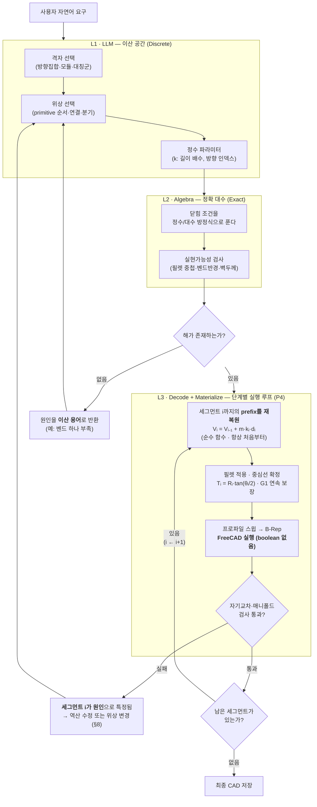

# v3 설계 스펙 — Lattice-Based Discrete CAD Generation

> **한 줄 요약**: 설계 결정은 **이산 격자**에서만 하고, 연속 기하는 **해석적 복원 함수**로 한 번에 만든다.
> LLM은 숫자를 제안하지 않는다 → **거절당할 값이 존재하지 않는다.**

| 항목 | 내용 |
|------|------|
| 문서명 | Lattice-Based Discrete CAD Generation — Design Spec v3 |
| 대상 | [DESIGN_SPEC.md](DESIGN_SPEC.md) 의 v1/v2를 대체하는 개선 아키텍처 |
| 작성일 | 2026-07-14 |
| 상태 | 제안 (Proposal) — 미구현 |
| 핵심 변경 | `Generate-and-Test` → `Construct-and-Decode` |
| 개정 | 2026-07-14 — **P4를 "지연 실체화(최종 1회)"에서 "단계별 실체화(모드 선택)"으로 변경** (§6.3 신규) |

---

## 1. 왜 v3인가 — v1/v2 실패의 근본 원인

기존 통계: **총 109회 시도 중 성공 17회(15.6%)**. 실패의 구조적 원인은 세 가지다.

### 1.1 등호 제약 + 이산 열거 = 원리적 불가능

- v1/v2의 검증은 **등호 제약**이다: $P_{M1.out} = P_{M2.in}$, $t$, $D$, $w$ 모두 정확히 일치.
- 등호 제약의 유효 해집합은 파라미터 공간에서 **부피가 0(measure-zero)** 인 면이다.
- 그런데 v2는 **이산 격자를 열거해서** 그 위에 착지하기를 기대한다.
- **→ 84% 실패는 LLM의 무능이 아니라 구조의 귀결이다.**

### 1.2 계산 가능한 값을 LLM에게 맞히라고 시킨다

기존 §6.1은 `LINE`에 **(길이, 시작점, 방향, 끝점)** 을 모두 요구한다. 그러나:

$$P_1 = P_0 + L\,t \qquad\text{(끝점은 계산되는 값)}$$
$$r = \operatorname{sign}(\theta)\,R\,(t_0 \times n) \qquad\text{(원호 중심도 계산되는 값)}$$

- **계산 가능한 값을 LLM에게 제안시키고, 시스템이 채점**하고 있다.
- 이 구조에서 나올 수 있는 결과는 "정답" 아니면 "실패"뿐이며, **얻는 이득이 0이다.**

### 1.3 아무도 요구하지 않은 정밀도를 지키려다 죽는다

기존 §7.3의 실제 실험 프롬프트를 보라.

> "outer diameter of **approximately** 20 mm" · "**approximately** 140 mm long" · "bend radius of **approximately** 25 mm"

- **요구사항 자체가 이미 근사치다.** 사용자는 연속 정밀도를 요구한 적이 없다.
- 1 mm 격자면 사용자가 원하는 것을 100% 표현한다.
- **→ 시스템은 존재하지 않는 요구를 만족시키려다 스스로 붕괴하고 있었다.**

---

## 2. 설계 원칙 (4대 원칙)

| # | 원칙 | 효과 |
|---|------|------|
| **P1** | **파생값 금지** — 시스템이 계산할 수 있는 값은 LLM이 절대 제안하지 않는다 | 검증 항목이 "시험"에서 **"항등식"** 으로 바뀜 |
| **P2** | **포트 상속** — 새 노드는 붙는 포트에서 $P, t, D, w$ 를 물려받는다 | **연결 불일치가 발생 자체 불가능** |
| **P3** | **이산 결정** — 모든 설계 결정은 격자(lattice) 위의 정수 선택이다 | 부동소수점·허용오차 문제 **소멸** |
| **P4** | **단계별 실체화** — 매 단계 **prefix를 처음부터 재복원(re-decode)** 하여 커널로 실행하고 실제 형상을 확인한다 | 커널만 아는 실패(자기교차)를 **원인 세그먼트 단위로 국소화** |

> **P1의 귀결**: 제안하지 않은 값은 거절당할 수 없다. 이것이 v3의 전부다.

> **P4에 관한 주석 (개정)**
> 초안의 P4는 *"커널은 맨 마지막에 한 번만 호출한다(지연 실체화)"* 였다. 근거는 v1의 실패 버킷에 FreeCAD 크래시·timeout·메모리 오류가 많았으므로 **커널 노출을 N회 → 1회로 줄이자**는 것이었다.
>
> 그러나 이 논리에는 두 가지 허점이 있다.
> 1. **수학이 맞다고 커널이 맞는 건 아니다.** decode 파이프라인이 정말 의도대로 동작하는지는 **실측으로만** 확인된다. 최종 1회 호출은 그 확인을 맨 마지막까지 미룬다.
> 2. **자기교차는 커널만 안다(§7.3·§12).** 최종 1회 호출로 실패하면 *"어딘가 교차함"* 만 알 수 있지만, 단계별로 실행하면 **"세그먼트 $i$ 를 추가한 순간 교차가 생겼다"** 는 원인 특정이 공짜로 따라온다. 이는 §8의 repair를 훨씬 정확하게 만든다.
>
> 따라서 P4는 **"커널을 언제 부르는가"를 모드로 선택**하는 것으로 개정한다 (§6.3).
> **`incremental`(기본) → 안정화 후 `deferred`.** 즉 **지연 실체화는 계율이 아니라, 수학 레이어를 신뢰하게 된 뒤 켜는 최적화다.**
>
> **중요**: 이 개정은 **P1·P2·P3를 전혀 건드리지 않는다.** 모든 *결정*은 여전히 이산·정확 대수에서 이루어진다. 바뀌는 것은 오직 **커널을 부르는 시점**뿐이다.

---

## 3. 아키텍처 개요



**핵심 1**: L1과 L2 사이에는 **부동소수점이 존재하지 않는다.** 실수는 L3(복원)에서 처음 등장하며, 그때는 이미 모든 *결정*이 끝나 있다.

**핵심 2**: L3의 루프는 **결정을 다시 하지 않는다.** 이산 파라미터 `(dir, k)` 는 L1/L2에서 이미 확정되었고, L3는 그것을 **실체화하며 확인만** 한다. 따라서 v1/v2의 "매 step LLM 재제안 → 거절 → 재제안" 루프와는 성질이 완전히 다르다 — L3의 실패는 **원인 세그먼트가 특정된 결정론적 수정 요청**으로 이어진다.

---

## 4. 이산 설계 공간 — Lattice

### 4.1 정의

**격자(Lattice)** $\mathcal{L} = (\mathcal{D}, m)$ 는 다음으로 구성된다.

| 요소 | 의미 |
|------|------|
| $\mathcal{D} = \{\mathbf{d}_0, \dots, \mathbf{d}_{n-1}\}$ | **유한 방향 집합** (단위벡터) |
| $m$ | **길이 모듈** (기본 1 mm) — 모든 길이는 $L = m \cdot k,\ k \in \mathbb{Z}_{>0}$ |

경로는 **정수 시퀀스**로 표현된다.

$$\text{path} = \big[(j_1, k_1),\ (j_2, k_2),\ \dots,\ (j_N, k_N)\big], \qquad j_i \in \{0,\dots,n-1\},\ k_i \in \mathbb{Z}_{>0}$$

정점(vertex)은 다음으로 결정된다 — **LLM이 제안하지 않고 계산된다 (P1).**

$$V_0 = \text{start}, \qquad V_{i} = V_{i-1} + m\,k_i\,\mathbf{d}_{j_i}$$

### 4.2 격자 종류

| 종류 | 방향 집합 | 대수 구조 | 용도 |
|------|-----------|-----------|------|
| `axis6` | $\pm e_x, \pm e_y, \pm e_z$ | $\mathbb{Z}^3$ (정수) | Manhattan 배관, 직교 라우팅 |
| `planar-n` | $\mathbf{d}_j = (\cos\tfrac{2\pi j}{n},\ \sin\tfrac{2\pi j}{n},\ 0)$ | $\mathbb{Z}[\zeta_n]$ (원분정수환) | 평면 다각형·별·회전대칭 형상 |
| `hybrid` | `axis6` ⊕ `planar-n` | 직합 | 3D 구조 + 평면 대칭 혼합 |

> `planar-n`의 방향벡터 성분은 무리수($\cos 72°$ 등)지만, **원분정수환 $\mathbb{Z}[\zeta_n]$ 안에서 기호적으로 정확히 계산**된다. 부동소수점이 필요 없다.

### 4.3 닫힘 조건 (Closure)

폐곡선은 다음을 만족해야 한다.

$$\sum_{i=1}^{N} m\,k_i\,\mathbf{d}_{j_i} = \mathbf{0} \quad\Longleftrightarrow\quad \boxed{\sum_{i=1}^{N} k_i\,\mathbf{d}_{j_i} = \mathbf{0}}$$

방향별로 정수 사용량 $K_j = \sum_{i:\,j_i=j} k_i$ 를 모으면:

$$\sum_{j=0}^{n-1} K_j\,\mathbf{d}_j = \mathbf{0}$$

- **`axis6`**: $\mathbf{d}_j$ 가 정수벡터 → **정수 선형 방정식(Diophantine).** Hermite Normal Form으로 **정확히** 푼다.
- **`planar-n`**: $\mathbf{d}_j = \zeta^j$ ($\zeta = e^{2\pi i/n}$) → 조건은 $\sum_j K_j \zeta^j = 0$ in $\mathbb{Z}[\zeta_n]$.

> **닫힘 정리 (planar-n, n이 소수)**
> $n$이 소수일 때 원분다항식은 $\Phi_n(x) = 1 + x + x^2 + \cdots + x^{n-1}$ 이므로,
> $$\sum_{j=0}^{n-1} K_j \zeta^j = 0 \iff K_0 = K_1 = \cdots = K_{n-1}$$
> **즉, 각 방향을 동일한 총량만큼 사용하면 경로는 정확히 닫힌다.**
> 이는 **부동소수점 오차가 원리적으로 0**임을 의미한다 — solver도, 허용오차도 필요 없다.

### 4.4 목적함수 (해가 여러 개일 때)

정수해가 여러 개면 ILP로 최적해를 고른다.

$$\min \sum_i k_i \quad (\text{전체 길이 최소}) \qquad\text{s.t. 닫힘 + 실현가능성}$$

- v2의 "조합 열거"와 결정적 차이: **열거하지 않고 방정식을 푼다.**
- **→ 조합 폭발이 발생하지 않는다.** 격자를 아무리 촘촘하게 해도 안전하다.

---

## 5. LLM 출력 계약 (v3 Contract)

### 5.1 출력 스키마

```json
{
  "lattice": {
    "type": "planar",         // axis6 | planar | hybrid
    "n": 5,                   // planar일 때 회전 대칭 차수
    "plane": "XY",
    "module_mm": 10           // 모든 길이는 이 값의 정수배
  },
  "profile": {
    "outer_diameter_mm": 20,
    "wall_thickness_mm": 2
  },
  "bend": {
    "radius_mm": 10,
    "style": "fillet"
  },
  "path": [
    { "dir": 0, "k": 4 },     // 방향 인덱스 + 길이 배수 (정수!)
    { "dir": 2, "k": 4 },
    { "dir": 4, "k": 4 }
  ],
  "closed": true,
  "branches": [ /* junction 위상 */ ],
  "components": [ /* flange/valve 부착 위치 (경로 인덱스) */ ],
  "soft_targets": {           // 하드 제약 아님 — ILP 목적함수로만 사용
    "total_length_mm": 400
  }
}
```

### 5.2 **금지 항목 (P1 강제)**

LLM은 다음을 **출력할 수 없다.** 스키마 레벨에서 차단한다.

| 금지 | 이유 | 대신 |
|------|------|------|
| 좌표 $(x,y,z)$ | 계산됨 | `dir` + `k` |
| 끝점 $P_1$ | $P_1 = P_0 + Lt$ | 자동 도출 |
| 원호 중심 $C$ | $r = \operatorname{sign}(\theta)R(t_0 \times n)$ | 자동 도출 |
| 접선/법선 $t, n$ | 방향집합에서 결정 | `dir` 인덱스 |
| 임의 실수 길이 | 격자 위반 | 정수 $k$ |

> **이 표가 v3의 핵심이다.** 기존 §6.2·§6.5 검증 실패의 **전부**가 이 표의 항목들이었다.
> 출력할 수 없으면 틀릴 수 없다.

---

## 6. 복원 함수 (Decode) — 순수 함수

$$\text{Decode}: (\mathcal{L},\ \text{path},\ \text{profile},\ \text{bend}) \longmapsto \text{B-Rep}$$

**결정론적 · 해석적 · 학습 불필요.** (오토인코더와 달리 **디코더를 이미 알고 있으므로** 신경망이 필요 없다.)

### 6.1 파이프라인

**Step 1 — 정점 계산** (정확 대수, 부동소수점 없음)
$$V_i = V_{i-1} + m\,k_i\,\mathbf{d}_{j_i}$$

**Step 2 — 필렛 적용** (모서리 라운딩)

정점 $V_i$ 에서의 꺾임각과 접선 길이:
$$\theta_i = \arccos(\mathbf{d}_{j_i} \cdot \mathbf{d}_{j_{i+1}}), \qquad T_i = R_i \tan\!\left(\frac{\theta_i}{2}\right)$$

$V_i$ 를 기준으로 양쪽으로 $T_i$ 만큼 물러난 지점이 원호의 시작·끝점이 된다.

> **중요**: 필렛은 정점을 **이동시키지 않는다.** 따라서
> **폴리라인이 닫히면 → 필렛된 곡선도 반드시 닫힌다.** 닫힘이 필렛과 무관하게 보존된다.

**Step 3 — 중심선 확정**
- 직선구간 + 원호구간의 교대 시퀀스.
- **$G^1$(접선) 연속이 구성상 자동 보장**된다. (원호가 양쪽 직선에 접하도록 만들어졌으므로)

**Step 4 — 스윕 → B-Rep**
- 원형 프로파일 $(D, w)$ 를 중심선을 따라 스윕.
- **커널(FreeCAD/OCCT) 호출.** 호출 시점은 §6.3의 실행 모드가 결정한다. (P4)

> Decode는 **순수 함수**이므로, 경로 전체가 아니라 **prefix** $[1..i]$ 에 대해서도 그대로 호출할 수 있다. 이 성질이 §6.3의 단계별 실행을 가능하게 한다.

### 6.2 이 단계에서 사라지는 것들

| 기존 검증 항목 | v3에서의 상태 |
|----------------|---------------|
| §6.2 포트 일치 ($P, t, D, w$) | **불변식** — 상속되므로 항상 참 (P2) |
| §6.5.1 끝점 $P_1 = P_0 + Lt$ | **정의** — 계산식 그 자체 |
| §6.5.2 원호 중심·접선·법선 검사 | **도출값** — 필렛에서 자동 생성 |
| §6.5.2 ARC 90° 제한 ($4\theta \in \mathbb{Z}$) | **소멸** — 임의 격자 각도 지원 (144° 별 가능) |
| 부동소수점 허용오차 $\varepsilon$ | **불필요** — 정수/대수 정확 연산 |

### 6.3 단계별 실행 루프 (Incremental Materialization) — **P4**

> **원칙**: **검증(check)과 실체화(materialize)는 다른 것이다.**
> 검증은 **항상 매 단계** 수행하되 **커널 없이 수학으로** 한다(§7.1·§7.2).
> 실체화는 **커널을 실제로 실행**하는 것이며, 그 **시점을 모드로 선택**한다.

#### 6.3.1 실행 모드

| 모드 | 커널 호출 | 언제 쓰나 |
|------|-----------|-----------|
| **`incremental`** (기본) | 매 단계 (또는 $k$ 단계마다) | **개발·검증기** — decode가 의도대로 동작하는지 실측 확인이 필요할 때, 자기교차의 **원인 세그먼트 특정**이 필요할 때 |
| **`deferred`** | 최종 1회 | **안정화 이후** — 수학 레이어를 신뢰하게 된 뒤의 최적화. 커널 크래시 노출을 최소화 |

**시스템 설정** (LLM 출력이 **아니다** — P1 유지):

```yaml
execution:
  mode: incremental        # incremental | deferred
  materialize_every: 1     # k단계마다 실체화 (1 = 매 단계)
  on_kernel_failure: repair  # repair | abort
```

#### 6.3.2 알고리즘

```python
def build(lattice, path, profile, bend, cfg):
    """path는 L1/L2에서 이미 확정된 이산 시퀀스 [(dir, k), ...]"""

    for i in range(1, len(path) + 1):

        # ── L2: 이산·대수 검사 (커널 없음 · 항상 매 단계 수행) ──
        ok, fix = check_feasibility(path[:i], profile, bend)   # §7.1 · §7.2
        if not ok:
            return Repair(segment=i, suggestion=fix)           # §8 역산 수정

        # ── L3: prefix 재복원 → 실체화 ──
        if cfg.mode == "incremental" and i % cfg.materialize_every == 0:
            centerline = decode(lattice, path[:i], bend)   # 순수 함수 · 항상 처음부터
            solid      = kernel.sweep(centerline, profile) # FreeCAD MCP · boolean 없음

            if not solid.is_valid():                       # §7.3 자기교차 · 매니폴드
                return Repair(segment=i, cause=solid.error)
                # ↑ 실패한 순간의 i = 문제를 일으킨 세그먼트. 원인이 특정된다.

    # ── 최종 형상 ──
    centerline = decode(lattice, path, bend)
    return kernel.sweep(centerline, profile)
```

#### 6.3.3 설계상 중요한 두 가지

**(1) boolean union을 쓰지 않는다 — 이것이 v1과의 결정적 차이**

- v1은 매 step **조각 솔리드를 만들어 이어 붙였다.** boolean union은 OCCT에서 **가장 잘 깨지고 허용오차에 민감한 연산**이며, 문서 상태가 누적될수록 더 무겁고 더 불안정해진다. v1의 FreeCAD 크래시·메모리 오류 상당수가 여기서 나왔다.
- v3의 단계별 실행은 매 단계 **prefix 전체를 처음부터 재복원**해 **한 번의 연속 스윕**으로 만든다. 중심선은 $G^1$ 연속이 보장되므로(§6.1 Step 3) **매끄러운 단일 스윕 1회**면 끝난다.
- **→ 커널을 N번 부르지만, 호출당 위험은 v1보다 낮다.** "매 step 커널 호출"이라는 표면적 형태는 같아도 성질이 다르다.

**(2) 결정은 여전히 이산이다 — P1·P2·P3 불변**

- L3 루프는 **아무것도 새로 결정하지 않는다.** `(dir, k)` 는 이미 확정되었다.
- 따라서 이 루프는 v1/v2의 "LLM 재제안 ↔ 거절" 무한 루프와 **구조적으로 다르다.** 실패해도 LLM이 숫자를 다시 찍는 게 아니라, **원인 세그먼트가 특정된 결정론적 수정값**이 나온다(§8).

#### 6.3.4 얻는 것 · 지불하는 것

| | 내용 |
|---|------|
| **얻는 것** | **① 자기교차 국소화** — 실패 시 "세그먼트 $i$ 가 원인"이 확정된다. `deferred`였다면 *"어딘가 교차함"* 만 알 수 있다.<br/>**② 조기 중단** — 뒤쪽 세그먼트를 계산·실행하기 전에 멈춘다.<br/>**③ decode 실측 검증** — 수학이 옳다고 커널이 옳은 건 아니다. 실행이 그 간극을 메운다.<br/>**④ 의미 검증(§7.4) 연동** — 각 단계 렌더링을 VLM/사용자에게 점진적으로 보여줄 수 있다. |
| **지불하는 것** | **① 커널 노출 N배** — 크래시·timeout 위험이 호출 수에 비례한다. (단, (1)에 의해 호출당 위험은 낮다)<br/>**② 총 스윕 비용 $O(N^2)$** — 매 단계 prefix 전체를 재복원하므로. 단일 스윕이 저렴해 실용상 문제되지 않는 규모가 대부분이다. |
| **완화 수단** | `materialize_every: k` 로 실행 주기를 늘린다 → 국소화 해상도를 $k$ 세그먼트 단위로 낮추는 대신 호출 수를 $1/k$ 로 줄인다.<br/>decode 신뢰가 쌓이면 `mode: deferred` 로 전환한다. |

#### 6.3.5 폐곡선(closed) 처리

- prefix $[1..i]$ 는 마지막 세그먼트 전까지 **열린 경로**다. 따라서 중간 단계는 **열린 파이프**로 스윕되고, 닫힘은 최종 단계에서 완성된다.
- **닫힘 자체는 §4.3에서 이미 대수적으로 보장**되므로 커널이 판정할 필요가 없다. 커널은 닫힘이 아니라 **자기교차·매니폴드만** 본다.

---

## 7. 검증 규칙 (v3)

검증 항목이 **대폭 줄어든다.** 남은 것만 명세한다.

### 7.1 격자 레벨 (정확 · 정수 연산)

| 검사 | 조건 |
|------|------|
| 닫힘 | $\sum_j K_j \mathbf{d}_j = \mathbf{0}$ (§4.3) |
| 포트 중복 사용 | 한 포트를 두 노드가 입력으로 쓰지 않음 |
| 위상 정합 | 분기·종단 노드의 포트 수가 정의와 일치 |

### 7.2 실현가능성 (정확 · 유리수 연산)

| 검사 | 수식 | 의미 |
|------|------|------|
| **필렛 비중첩** | $T_i + T_{i+1} \le m\,k_{i+1}$ | 인접 벤드가 서로 파고들지 않음 |
| **벤드 반경 하한** | $R \ge R_{\min} = c \cdot D$ (권장 $c \ge 1.5$) | 스윕 시 안쪽 자기교차 방지 |
| **벽 두께** | $0 < 2w < D$ | 내경 $D_{\text{inner}} = D - 2w > 0$ (기존 §6.4 유지) |

### 7.3 복원 후 (기하 · **커널 필요**)

§7.1·§7.2는 커널 없이 수학으로 끝난다. 아래 두 항목만이 **실제 실행을 요구**하며, 따라서 §6.3의 실행 루프에서 수행된다.

| 검사 | 비고 |
|------|------|
| 자기교차 (self-intersection) | 격자로 막을 수 없음 — **정당한 검사** |
| 매니폴드/watertight | 커널 결과 확인 |

> **수행 시점**: `incremental` 모드에서는 **매 단계** prefix에 대해 수행되어 **원인 세그먼트가 특정**된다. `deferred` 모드에서는 최종 형상에 대해 1회 수행된다. (§6.3)
>
> 자기교차는 **전역(global) 속성**이다 — 세그먼트 8이 세그먼트 2를 관통하는지는 둘 다 존재해야 판정된다. 단계별 실행이 주는 이득은 "더 일찍 발견"이 아니라 **"어느 세그먼트가 원인인지 확정"** 이다.

### 7.4 의미 검증 (신규)

> **주의**: v3는 기하 거절을 없애지만, 그 거절이 **조잡한 품질 필터 역할도 하고 있었다.**
> "기하적으로 유효하지만 사용자가 원한 게 아닌" 형상을 걸러낼 장치가 새로 필요하다.

- 렌더링 후 원 요구사항과 대조 (다중 뷰 이미지 → VLM 판정, 또는 소프트 타깃 수치 비교)
- **이것이 v3에서 새로 추가되어야 할 유일한 검증이다.**

---

## 8. 실패 처리 & 수정 (Repair)

**v3의 실패는 계산 가능한 수정값을 동반한다.** 이것이 v1/v2의 "무한 반복"과의 결정적 차이다.

| 실패 | 진단 | **수정 (결정론적)** |
|------|------|---------------------|
| 필렛 중첩 | $T_i + T_{i+1} > m\,k_{i+1}$ | $k_{i+1} \leftarrow \left\lceil \dfrac{T_i + T_{i+1}}{m} \right\rceil$ — **역산으로 즉시 계산** |
| 벤드 반경 미달 | $R < c\,D$ | $R \leftarrow c\,D$ 또는 $D$ 축소 |
| 닫힘 해 없음 | 정수 방정식 무해 | **LLM에게 위상 변경 요청** ("세그먼트 1개 추가" 등 — **이산 용어**) |
| 자기교차 | 기하 검사 실패 (커널) | **`incremental` 모드: 원인 세그먼트 $i$ 가 특정된 상태**로 위상 변경 요청 (예: "세그먼트 8이 세그먼트 2를 관통 — 8을 짧게 하거나 우회 정점 추가") |

### 실패의 성질이 바뀐다 — v3의 진짜 가치

| | v1/v2 | **v3** |
|---|-------|--------|
| 실패 지점 | 연속 수치 공간 | **이산 위상 공간** |
| 해집합 | 부피 0 (등호 제약) | 유한하고 작음 |
| LLM이 고칠 수 있나 | **못 고침** → 무한 반복 → 최대 시도 초과 | **고칠 수 있음** ("벤드 하나 더") |
| 피드백 내용 | "틀렸다" | **"이 위상으론 불가능하다"** |
| 수렴성 | 발산 | **유한 번에 수렴** |

---

## 9. 워크드 예제 — 오각별 (기존 §7.3 실험 4)

기존 스펙의 성공 사례이자, **ARC 90° 제약($4\theta \in \mathbb{Z}$)과 정면 모순**되던 케이스다. v3에서 어떻게 되는지 보인다.

### 9.1 요구사항 (원문)

> 외경 20 mm, 두께 2 mm 파이프, **길이 40 mm 직선 10개**, **왼쪽 144° / 오른쪽 72° 교대 회전**, 꼭짓점 **벤드 반경 10 mm**, 폐곡선.

### 9.2 격자 선택

$$\mathcal{L} = \big(\text{planar-}5,\ m = 40\,\text{mm}\big), \qquad \mathbf{d}_j = \zeta^j,\ \ \zeta = e^{2\pi i/5}$$

### 9.3 방향 시퀀스 도출 (시스템이 계산)

시작 헤딩 $h_1 = 0°$, 회전 $+144°$ 와 $-72°$ 를 교대 적용:

| seg | 1 | 2 | 3 | 4 | 5 | 6 | 7 | 8 | 9 | 10 |
|-----|---|---|---|---|---|---|---|---|---|-----|
| heading | 0° | 144° | 72° | 216° | 144° | 288° | 216° | 0° | 288° | 72° |
| `dir` $j$ | 0 | 2 | 1 | 3 | 2 | 4 | 3 | 0 | 4 | 1 |

- 총 회전량: $5 \times 144° - 5 \times 72° = 720° - 360° = 360°$ ✓ (감김수 1)
- **모든 헤딩이 72°의 배수** → `planar-5` 방향집합으로 정확히 표현됨.

### 9.4 닫힘 증명 (부동소수점 0개)

방향별 사용량을 세면:

$$K_0 = K_1 = K_2 = K_3 = K_4 = 2 \qquad (\text{각 방향이 정확히 2번씩})$$

§4.3의 **닫힘 정리**($n=5$는 소수)에 의해:

$$\sum_{j=0}^{4} K_j \zeta^j = 2\underbrace{(1 + \zeta + \zeta^2 + \zeta^3 + \zeta^4)}_{\Phi_5(\zeta)\ =\ 0} = 0 \quad \blacksquare$$

> **경로는 정확히 닫힌다.** 수치 오차가 아니라 **대수적 항등식**으로 보장된다.
> v1/v2였다면 여기서 $P_{\text{last}} = P_{\text{first}}$ 를 부동소수점으로 비교하다 거절당했을 것이다.

### 9.5 실현가능성 검사

- 편향각(deflection) $\theta_i = \arccos(\mathbf{d}_{j_i}\cdot\mathbf{d}_{j_{i+1}})$ → 회전량 그대로 **144°** 와 **72°**
- 접선 길이: $T = R\tan(\theta/2)$, $R = 10$
  - $T_{144} = 10\tan(72°) \approx 30.8$ mm
  - $T_{72} = 10\tan(36°) \approx 7.3$ mm
- 회전이 $+144°, -72°$ 로 교대하므로, **모든 세그먼트는 양옆에 144° 벤드 하나와 72° 벤드 하나**를 갖는다.
- 비중첩 조건: $T_{144} + T_{72} \le m$ → $30.8 + 7.3 = 38.1 \le 40$ ✓ **통과** (여유 1.9 mm)
- 벤드 반경: $R = 10 \ge 1.5 \times 20 = 30$? → **✗ 위반** ($R_{\min}$ 미달)
  - **자동 수정**: $R \leftarrow 30$ 제안 → 그러면 $T$ 가 커져 비중첩 위반 → **$m$(세그먼트 길이) 증가 또는 $D$ 축소를 역산해 제시**
  - **이것이 v3의 repair다.** "틀렸다"가 아니라 **"$m \ge 115$mm 이어야 한다"** 라는 구체적 수치가 나온다.

---

## 10. 기존 Primitive 매핑

| v1/v2 Primitive | v3에서의 처리 |
|-----------------|---------------|
| `route(line)` | 격자 세그먼트 $(j, k)$ |
| `route(circular_arc)` | **소멸** → 정점의 **필렛**으로 흡수 |
| `route(spline)` | 격자 폴리라인 + 필렛 (또는 다중 정점) |
| `transition` | 프로파일 변경 노드 (경로 인덱스에 부착, 라우팅과 무관) |
| `junction` | 격자 **그래프**의 분기 노드 |
| `connect_ports` | **소멸** → **닫힘 조건**(정수 방정식)으로 흡수 |
| `terminate` | 종단 노드 (cap/plug) |
| `inline_component` | 중심선 위 **장식(decoration)** — 라우팅에 영향 없음 |

> **`route(arc)`와 `connect_ports`가 격자 형식주의 안으로 녹아 없어진다.**
> 기존에 가장 많이 실패하던 두 primitive다.

---

## 11. v2 대비 개선 요약

| 항목 | v2 | **v3** |
|------|-----|--------|
| LLM 출력 | 값 후보표 (연속 수치 포함) | **이산 선택만** (격자·위상·정수) |
| 탐색 방식 | 조합 **열거** → 조합 폭발 | 방정식 **풀이** → **폭발 없음** |
| 닫힘 처리 | 탐욕 선택 → 원리적 불가 | **정수 대수 / 대칭군 → 정확** |
| 부동소수점 | 등호 비교 (ε 없음) | **결정 단계에 실수 없음** |
| 벤드 각도 | ±90/180/270°만 | **임의 격자 각도** |
| 커널 호출 | 매 step + **boolean 누적** (크래시·timeout) | 매 step **재복원 단일 스윕 (boolean 없음)** → 안정화 후 `deferred`(1회) 전환 (§6.3) |
| 커널이 검사하는 것 | 모든 기하 (포트 일치 포함) | **자기교차·매니폴드만** — 나머지는 수학이 끝냄 |
| 검증 실패 시 | 1등 실패 → 중단 | **역산 수정값 + 원인 세그먼트 특정** |
| 재현성 | LLM 재호출에 의존 | **완전 결정론적** |

### 실패 버킷별 기대 효과

| 기존 실패 | 비율 | v3에서 |
|-----------|------|--------|
| Intent 조기 종료 | 32~36% | LLM이 **수치 책임에서 해방** → 거절 사유 급감 |
| Step 거절 반복 | 11.9% | **구조적 소멸** (P1 + P2) |
| FreeCAD 크래시/timeout/메모리 | 나머지 | **boolean 누적 제거**로 호출당 위험 감소 (§6.3.3) + `deferred` 전환 시 **N회 → 1회** (P4) |

---

## 12. 미해결 과제 · 리스크

정직하게 남는 것들.

- **의미 정합성(§7.4)**: v3는 "기하적으로 유효한" 형상을 거의 항상 만든다. 그러나 그것이 **사용자가 원한 형상인지**는 보장하지 않는다. 기존의 기하 거절이 하던 (조잡한) 품질 필터가 사라지므로, **의미 검증을 새로 만들어야 한다.** ← **v3의 최대 리스크**
- **격자 표현력**: 격자로 표현 불가능한 형상(자유곡면, 임의 각도 조합)이 존재할 수 있다. → **Tier 3 fallback(Newton/LM solver)** 을 남겨둔다.
- **격자 선택의 책임이 LLM에 남는다**: 잘못된 방향집합/모듈을 고르면 해가 없다. 다만 이건 **이산 실패**이므로 진단·수정이 가능하다 (§8).
- **자기교차**: 격자로 막을 수 없다. 복원 후 기하 검사가 반드시 필요하다. (§6.3의 `incremental` 모드가 이를 **원인 세그먼트 단위로** 잡아낸다.)
- **단계별 실체화의 비용 (P4 개정의 대가)**: `incremental` 모드는 커널을 N회 호출하므로 **크래시·timeout 노출이 호출 수에 비례**한다. v1의 실패 버킷을 부분적으로 되살릴 위험이 있다.
  - **완화**: boolean 누적을 쓰지 않으므로 **호출당 위험은 v1보다 낮다**(§6.3.3). `materialize_every: k` 로 호출 수를 $1/k$ 로 줄일 수 있다.
  - **중요**: 되살아나는 것은 **커널 안정성 문제뿐**이다. 값 발산·연결 불일치·부동소수점 거절은 P1·P2·P3에 의해 **여전히 구조적으로 불가능**하다.
  - **출구 전략**: decode의 실측 신뢰가 쌓이면 `mode: deferred` 로 전환해 노출을 1회로 되돌린다.
- **ILP 규모**: 분기가 많은 대형 배관에서 정수계획 크기가 커질 수 있다. (다만 열거가 아니므로 v2보다 훨씬 완만하다.)

---

## 13. 구현 우선순위 (제안)

| 순서 | 작업 | 근거 |
|------|------|------|
| 1 | **LLM 출력 스키마에서 좌표·끝점·중심 제거** (§5.2) | 가장 싸고 효과 가장 큼 — 이것만으로 §6.2/§6.5 거절이 사라짐 |
| 2 | **격자 + 정수 닫힘 solver** (§4) | `connect_ports` 실패 소멸 |
| 3 | **Decode 파이프라인 + 단계별 실행 루프 (`incremental`)** (§6.3) | decode 실측 검증 + 자기교차 **원인 세그먼트 국소화** |
| 4 | **Repair 역산 로직** (§8) | 유한 수렴 보장 |
| 5 | **의미 검증** (§7.4) | v3의 새 리스크 대응 |
| 6 | **`deferred` 모드 전환** (§6.3.1) | decode 신뢰 확보 **이후** 커널 노출을 N회 → 1회로 축소하는 **최적화** |

> **1번만 해도 실패율이 유의미하게 떨어질 것으로 예상된다.** 스키마 한 줄 수정이 아키텍처 변경보다 먼저다.
>
> **6번은 마지막이다.** 지연 실체화는 성능·안정성 최적화이지 정확성 요건이 아니다. **수학 레이어를 실측으로 믿게 되기 전에 커널 호출을 줄이면, 틀린 decode를 조용히 통과시키게 된다.** `incremental`로 시작하는 이유가 이것이다.
