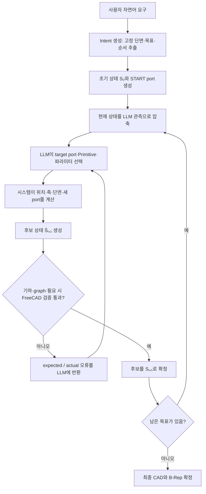

# LLM2CAD

## 1) 요약

- 자연어로 입력한 파이프 요구사항을 한 번에 FreeCAD 코드로 바꾸는 방식이 아님
- 복잡한 CAD를 작은 조립 단위인 `Primitive`로 나눈 뒤, 한 단계씩 선택·계산·검증하면서 이어 붙이는 방식
- LLM 역할:
  - 전체 설계 목표와 순서를 구조화함
  - 현재 열린 port에 연결할 Primitive와 독립 파라미터를 선택함
- 시스템 역할:
  - 선택된 값으로 위치·축·단면·끝점·새 port를 계산함
  - graph, 치수, 충돌, 곡률과 실제 FreeCAD 형상을 검증함
  - 검증을 통과한 후보만 다음 CAD 상태로 확정함
- 검증에 실패한 경우:
  - 실패한 후보 상태는 버림
  - `expected / actual` 오류를 LLM에 돌려주고 같은 상태에서 다시 계획함

## 2) 전체 알고리즘 동작

- 한 번에 생성하지 않음:
  - LLM이 완성된 CAD 전체를 직접 작성하지 않음
- 순차적으로 조립함:
  - `route`, `transition`, `junction`, `connect_ports`, `terminate`, `inline_component` 중 필요한 Primitive를 하나씩 연결함
- 검증 후 확정함:
  - typed schema와 graph 검증을 먼저 수행함
  - 필요한 단계는 FreeCAD B-Rep까지 확인한 뒤 상태를 확정함



## 3) 실행 방법

- 준비 사항:
  - Python `3.12` 이상
  - [`uv`](https://docs.astral.sh/uv/) 설치
  - FreeCAD와 FreeCAD MCP 실행 환경
  - `.env.example`을 참고한 로컬 `.env` 파일
- API key 설정:

```bash
cp .env.example .env
```

- 자연어 prompt로 실행:

```bash
./run.sh --prompt "외경 20mm, 두께 2mm인 속이 빈 파이프를 만들고 중간에 Y자 분기를 추가해줘"
```

- 긴 prompt를 파일로 실행:

```bash
./run.sh --prompt-file prompts/complex_two_y_manifold.txt
```

- API와 FreeCAD 없이 상태 전이만 확인:

```bash
./run.sh --prompt "직선 파이프를 만들어줘" --dry-run
```

- 실행 결과:
  - 매 실행은 `outputs/<실행 시각>/` 아래에 따로 저장됨
  - 최종 `.FCStd`, 단계별 action/state, 검증 보고서와 캡처 이미지가 함께 기록됨

## 4) 입력 prompt와 생성 결과

- 입력 prompt 요약:
  - `직선 inlet 뒤에 첫 번째 Y 분기를 만들고, 3D spline과 taper를 지난 뒤 두 번째 Y 분기로 끝나는 속이 빈 four-port manifold를 생성해줘.`
- 생성 결과:
  - 첫 번째 Y의 한 갈래는 열린 terminal branch로 유지됨
  - 중앙 경로는 상승하는 3D spline과 점진적인 직경 taper로 생성됨
  - 두 번째 Y에서 두 개의 열린 terminal branch가 생성됨
  - START를 포함해 총 네 개의 물리적 open end를 갖는 하나의 연결 형상으로 검증됨
- 실제 실행 자료:
  - [입력 prompt](outputs/20260710T233430881324Z/prompt.txt)
  - [실행 보고서](outputs/20260710T233430881324Z/run_report.json)
  - [FreeCAD 결과](outputs/20260710T233430881324Z/pipe_v5_5492aa9c8f7b.FCStd)


## 5) 출력 파일 참고

- `.FCStd`:
  - FreeCAD에서 열 수 있는 실제 CAD 문서
- `.step`, `.stl`:
  - 다른 CAD·제조 도구와 교환하기 위한 export 파일
- `.FCBak`:
  - FreeCAD가 편집 중 자동으로 만드는 백업 파일
  - 프로그램 실행에는 필요하지 않으므로 루트 작업 파일은 저장소에서 제외함
  - 단, `outputs/` 내부의 과거 백업은 해당 실행의 원본 기록을 보존하기 위해 그대로 둠
- `outputs/`:
  - 실행 결과와 검증 근거를 재현하기 위해 이 저장소에서는 포함함
