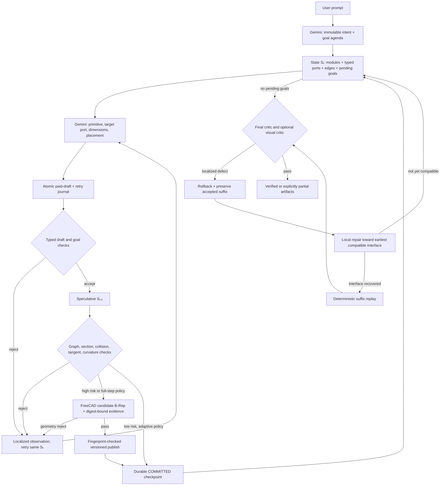

# cadgen02

## 한국어 빠른 안내

`cadgen02`는 자연어 파이프 설계 요청을 곧바로 임의의 FreeCAD 코드로
바꾸는 도구가 아니다. Gemini가 먼저 설계 계약과 실행 행동을 구조화된
JSON으로 작성하고, 애플리케이션의 결정론적 코드가 그 JSON을 해석ㆍ계산ㆍ검증한
뒤, 검증을 통과한 상태만 FreeCAD 후보 형상과 최종 산출물로 게시한다.

가장 중요한 책임 경계는 다음과 같다.

- **LLM은 설계를 선택한다.** 의도 단계에서는 목표, 순서, 치수, 토폴로지를
  작성하고, 실행 단계에서는 현재 상태에서 사용할 primitive, 연결할 포트,
  독립적인 형상 파라미터를 선택한다.
- **결정론적 코드는 설계를 대신하지 않는다.** 포트에 종속된 시작 좌표,
  단면 상속, 벡터 정규화, 원호 끝 접선, 모듈 ID처럼 이미 선택된 값으로부터
  유일하게 계산되는 값만 만든다. 검증 실패 시 다른 primitive를 몰래 고르지
  않는다.
- **검증 실패는 같은 상태의 재계획 입력이 된다.** 오류 위치와 원인,
  기대값/실제값, 가능한 경우 수정 힌트를 Gemini에 돌려보내 새 행동을 받는다.
- **프로덕션은 fail-closed이다.** 완전하고 유효한 LLM 응답이 없으면 로컬
  규칙이나 기본 CAD 형상으로 대체하지 않고 실패한다. 로컬 휴리스틱은
  `--dry-run`에서만 사용한다.

### 전체 실행 흐름

1. **사전 점검** — 프로덕션 실행에서 FreeCAD MCP가 필수이면 Gemini 토큰을
   쓰기 전에 FreeCAD/MCP 준비 상태를 검사한다.
2. **의도 작성** — Gemini가 사용자 문장을 `LLMProductionIntent`로 변환한다.
   전역 단면, 시작 프레임, 목표 목록과 의존성, 예상 열린 포트 수, 부품 및
   수치 제약을 포함하는 완전한 구조화 응답이어야 한다.
3. **불변 계약 확정** — 명시 치수 보존, 목표 순서, 방향, 분기 수, spline
   안전성 등을 검사한다. 통과한 의도에는 원문 해시와 계약 digest를 붙이고
   이후 수리 과정에서 목표를 임의로 약화하지 못하게 한다. 이 검사에서
   실패하면 아직 `S0`가 없으므로 action repair가 아니라 별도의 intent repair로
   진단을 되돌려 완전한 Intent를 다시 받는다. 각 시도는
   `intent_attempts.json`에 남는다.
4. **초기 상태 생성** — `PipeState`에 모듈, 타입이 있는 포트, 연결 그래프,
   남은 목표, 허용 오차와 계약 digest를 기록한다.
5. **행동 작성** — 각 상태마다 Gemini가 `PlannerDecision` 한 번으로
   **primitive 선택과 그 primitive의 독립 파라미터 선택을 함께** 수행한다.
   primitive만 고른 뒤 별도의 파라미터 LLM을 다시 부르는 구조가 아니다.
6. **결정론적 해석과 사전 검증** — 스키마와 registry 계약을 확인한 뒤,
   선택된 포트에서 시작 프레임ㆍ상속 단면ㆍ끝점ㆍ접선 등을 계산하여
   `ResolvedAction`과 임시 다음 상태를 만든다. 이때 실제 상태는 아직 commit
   하지 않는다.
7. **정적/FreeCAD 검증** — 그래프, 목표 완료, 단면 연속성, 충돌, 접선,
   곡률, 제약을 검사한다. 위험도가 높거나 실측이 필요한 행동은 digest가
   묶인 FreeCAD 후보 B-Rep을 만들고 길이ㆍ경계ㆍsolid/boreㆍ겹침 등을 추가
   검사한다.
8. **거절 또는 commit** — 실패하면 임시 상태를 버리고 같은 `S_t`에서
   Gemini에 구체적인 관측을 전달한다. 성공하면 행동, 상태, 검증 결과와
   checkpoint를 원자적으로 기록한다.
9. **최종 검증과 게시** — 모든 목표가 끝나면 final critic과 필수 FreeCAD
   검증을 수행한다. 통과한 후보의 payload digest와 B-Rep fingerprint를 다시
   확인한 뒤 버전이 붙은 `.FCStd`로 게시한다. 국소 결함이면 허용된 범위에서
   rollback 후 재계획하고, 호환되는 기존 suffix는 LLM 호출 없이 재검증하여
   재사용할 수 있다.

### 모듈별 역할

| 파일/모듈 | 역할 | 중요한 경계 |
|---|---|---|
| `cadgen/cli.py` | 명령행 인자, prompt 입력, 종료 코드 처리 | 실행 정책을 선택하지만 형상을 계산하지 않는다. |
| `cadgen/config.py` | 환경변수와 `Settings`, 호출/토큰/수리 한도, FreeCAD 정책 | 모든 기본 한도와 필수/선택 검증 모드의 단일 설정 원천이다. |
| `cadgen/pipeline.py` | 전체 실행 오케스트레이션, 재시도, rollback, checkpoint 전이 | LLMㆍ검증기ㆍFreeCAD 사이의 순서와 commit 경계를 관리한다. |
| `cadgen/artifact_store.py` | 표준 경로, 원자적 파일 교체, 진행 snapshot과 artifact 상태 판정 | 오케스트레이션과 파일 영속화를 분리하고 반쪽 checkpoint를 방지한다. |
| `cadgen/prompts.py` | intent/planner/repair/visual prompt와 compact 상태 payload | 모델에게 전달할 정책과 최소 상태 표현을 만든다. |
| `cadgen/gemini_client.py` | Gemini structured output 호출, JSON Schema 변환, lineage와 사용량 예산 | 불완전/비정상 JSON을 보정하지 않고 오류로 분류한다. |
| `cadgen/schemas.py` | intent, goal, primitive 파라미터, 상태, 검증 결과의 Pydantic 모델 | LLM 경계와 런타임 데이터의 타입ㆍ범위ㆍ조합을 강제한다. |
| `cadgen/registry.py` | 노출 가능한 primitive catalog와 draft/resolved-action 검증 | 프로덕션 LLM에는 schema-v2 primitive만 노출하고 소유 파라미터를 구분한다. |
| `cadgen/state.py` | `StateEngine`: 행동 해석, 파생 좌표/접선 계산, 포트 그래프 전이 | LLM 행동을 결정론적으로 해석하지만 대체 행동을 선택하지 않는다. |
| `cadgen/vector.py` | 벡터, 회전, 원호 프레임, 원형 interface 오차 계산 | 좌표계 계산을 한 곳에서 일관되게 수행한다. |
| `cadgen/geometry_policy.py` | spline 최소 곡률, C1 handle, 길이ㆍ곡률 preflight 정책 | FreeCAD와 같은 cubic 계산을 커널 없이 실행해 확실히 실패할 후보를 먼저 거부한다. |
| `cadgen/static_validation.py` | 단계/최종 그래프, 목표, 단면, 충돌, 곡률, 제약 검증과 critic 작성 | 커널 실행 전후의 결정론적 accept/reject 판정을 담당한다. |
| `cadgen/freecad_script.py` | `PipeState`를 digest가 포함된 후보/게시 FreeCAD 스크립트로 변환 | LLM 텍스트를 실행하지 않고 검증된 typed state만 코드로 직렬화한다. |
| `cadgen/freecad_mcp.py` | FreeCAD MCP 호출, 응답 sentinel, 측정값, digest/fingerprint 검증, 화면 캡처 | MCP 성공 응답도 예상 상태와 정확히 결합되지 않으면 거부한다. |
| `cadgen/freecad_app.py` | FreeCAD 프로세스 탐지와 실행 | CAD 설계와 무관한 애플리케이션 준비만 담당한다. |
| `cadgen/local_heuristic.py` | 무료 dry-run용 제한적 intent/action fixture | 프로덕션 fallback이 아니며 복잡한 자유곡선을 대신 추정하지 않는다. |
| `cadgen/stream.py` | 진행 요약 출력 | 결과나 상태를 변경하지 않는다. |
| `tests/` | schema, 경계, 복구, 실패 폐쇄, FreeCAD 증거 계약 테스트 | 실제 Gemini 과금이나 실제 MCP 전송 없이 경계를 검증한다. |

### LLM 작성값과 결정론적 파생값

아래 구분은 "어떤 숫자를 누가 정했는가"를 이해하는 기준이다.

| 구분 | LLM이 작성하는 독립값 | 시스템이 계산하는 종속값 |
|---|---|---|
| 의도 | 전역 외경/벽 두께, 시작 위치/축, 목표와 의존성, 사용자 치수, 예상 포트, 요구 부품과 제약 | 원문/계약 digest, 명시 값 보존 검사, 목표별 안전성 검사 |
| 공통 행동 | primitive, 대상 포트, 영향/완료 목표 | action/module/state ID, 대상 포트에 고정된 시작 위치와 입구 축, 연결 edge |
| `route.line` | 길이와 방향 | 끝점, 출력 포트, 상속 단면 |
| `route.circular_arc` | 중심선 bend radius, 부호가 있는 sweep angle, bend-plane normal 힌트 | 힌트의 직교화, 정확한 원호 프레임, analytic terminal tangent와 끝점 |
| `route.spline` | waypoint frame과 waypoint/offset 배치 | 입구 접선, 계약에 따른 출구 접선, C1 cubic 보간, handle 크기 최적화, non-Frenet sweep, 최소 곡률 하한 |
| `transition` | 출력 외경, 필요한 경우 출력 벽 두께, 길이, 필요한 경우 eccentric offset | 미지정 출력 벽의 입구 벽 상속, 미지정 offset의 동심 `(0,0,0)`, 끝점과 출력 interface |
| `junction` | 두 outlet의 역할ㆍ축ㆍ길이ㆍ단면, hard/fillet, hub/blend 치수 | 포트 이름/위치, 분기 수 요약, plain connector interface 메타데이터 |
| `connect_ports` | 두 번째 포트, line/arc/spline 종류와 필요한 중간점 | 두 끝 위치/축, endpoint tangent, 곡률 정책, 소비 포트와 loop edge |
| `terminate` | cap/plug와 두께 | 대상 단면과 밀봉 위치 |
| `inline_component` | 종류와 전체/body/bolt/ring/actuator 치수 | 대상 입구 프레임, 끝점, 출력 포트와 component 식별 메타데이터 |
| FreeCAD 커널 | 없음 | profile/Boolean 구성, spline sampling과 handle 탐색, 검증 probe, payload/B-Rep fingerprint |

`inherit_target`, 원호 끝 접선, spline endpoint tangent처럼 입력으로부터 유일하게
정해지는 값은 LLM이 다시 근사해서 쓰지 못하게 resolver가 소유한다. 이는
"임의 숫자 생성"이 아니라 같은 입력에서 항상 같은 결과를 만드는 계산이다.
각 시도의 원본 `draft`와 계산 후 `resolved`는 `action_attempts.json`에 함께
기록되므로, 실제 CAD에 들어간 값이 LLM 작성값인지 resolver 파생값인지 필드별로
비교할 수 있다. 최종 `actions.json`에는 검증을 통과한 resolved action만 남는다.

다음 두 경계는 명시적으로 알아둘 필요가 있다.

- 사용자에게 수치가 없는 전역 크기는 애플리케이션이 LLM 실패 뒤 몰래 채우는
  값이 아니다. intent prompt가 설정의 참조 치수를 알려주고 **LLM이 완전한
  전역 단면을 응답해야만** 계약이 만들어진다.
- 사용자가 명시한 route-through 좌표나 실제 coil/S-curve처럼 자유곡선 자체가
  요구사항인 경우의 waypoint는 독립 형상 파라미터다. 반대로 ordinary Y-manifold의
  soft asymmetry를 표현하려고 임의 좌표를 Intent에 고정하지 않는다. 그런 후보
  waypoint는 action 단계에서 선택하고 실패 시 교체할 수 있어야 한다.
- waypoint Intent는 반드시 `path_kind=spline`이어야 하며, 확정 전에 같은 C1
  predictor로 ordered polyline 하한, 계산 centerline 길이, 최소 곡률을 함께
  검사한다. 불가능한 길이/좌표/terminal tangent 조합은 `S0`를 만들지 않고
  Intent repair로 돌려보낸다. 시스템이 좌표를 몰래 이동시키지는 않는다.

### 검증 실패에서 재요청까지

한 행동은 다음 순서로 점점 강한 검증을 받는다.

1. provider JSON Schema와 Pydantic 모델이 필수 필드, 타입, primitive별 조합을
   검사한다.
2. registry가 현재 열린 포트, 허용 primitive, 목표 의존성, 파라미터 소유권과
   치수 범위를 검사한다.
3. resolver가 행동을 임시 상태에 적용하고, static validator가 포트 graph,
   단면 연속성, 목표 달성, 방향/접선/곡률, 충돌과 전역 제약을 검사한다.
4. 필요한 경우 FreeCAD가 실제 B-Rep, centerline 길이, 최소 곡률, bound box,
   solid/bore/벽, 겹침과 밀봉을 측정한다.

거절 관측에는 `issue_id`, 검증 단계와 `check_name`, 설명, 관련 action/module/
port, `expected`, `actual`, `suggestion`이 들어간다. FreeCAD spline 실패처럼
측정 가능한 경우에는 최소 곡률, 실패 지점, path-point index와 action의
waypoint index를 함께 포함한다. 현재 cubic은 인접 chord 길이에 비례해 handle을
정하므로, 가까운 점을 계속 추가하라는 일반 힌트를 쓰지 않는다. 비필수 점을
이동ㆍ삭제하여 더 긴 chord에 회전을 분산하고, 사용자 명시 anchor만 보존하라고
안내한다.
이때 `required_radius`와 실측 `minimum_radius`는 일반 진단 축약과 별도로
우선 보존되며, junction hub 한계처럼 오류 문자열에 현재값과 필요값이 있으면
바꿀 후보 파라미터와 함께 `recommended_changes`로 전달된다.
모든 오류가 언제나 하나의 정답 숫자를 갖는 것은 아니므로, 그런 경우에는
허용 조건이나 바꿔야 할 독립 파라미터를 전달한다.

유료 응답 초안은 검증 전에 checkpoint에 기록된다. 거절되면 임시 상태를
commit하지 않고, 최근 거절 행동과 새 관측을 제한된 크기로 묶어 같은 불변
상태에서 다시 요청한다. 따라서 프로세스 재시작 후에도 이미 받은 유료 응답을
버리고 새 호출부터 하는 일을 피하고, 재시도 횟수도 초기화하지 않는다.

### Fail-closed와 dry-run 경계

- 프로덕션에서 Gemini client 생성, intent 작성, planner 작성, 구조화 응답
  검증이 실패하면 해당 단계는 실패한다. `local_heuristic`이나 legacy 기본
  형상으로 전환하지 않는다.
- 스키마에 맞지 않는 부분 JSON을 닫아 주거나, 누락 필드를 응답 밖에서
  추측하여 완성하지 않는다.
- 필수 FreeCAD/MCP/visual 검증이 준비되지 않으면 검증을 생략한 성공으로
  표시하지 않는다. 가능한 경우 토큰 사용 전에 중단한다.
- 선택 검증 인프라가 중간에 사라지면 반복 호출을 막는 circuit breaker를
  켜고 결과를 `partial`로 남길 수 있지만, `verified success`로 승격하지 않는다.
- `--dry-run`은 API와 FreeCAD 없이 배관 상태 전이와 artifact 구조를 시험하기
  위한 별도 경로다. 이 경로의 정규식 휴리스틱과 legacy 기본 치수는 테스트
  fixture이며 프로덕션 정책이 아니다. dry-run 결과는 완전 검증 성공이 아닌
  `partial`이다.

### 토큰과 재시도 정책 요약

- 정상 경로는 intent 1회와, accepted action마다 primitive+parameter 통합 호출
  1회를 사용한다.
- intent는 기본 **3회 repair**, 즉 최초 호출을 포함해 최대 4회 시도한다.
  각 step은 기본 **6회 repair**, 즉 최초 호출을 포함해 최대 7회 시도한다.
  final agenda repair 기본값은 1 round이다. 모두 환경변수로 낮출 수 있다.
- step-local repair는 같은 Gemini lineage가 유효한 동안 전체 catalog/state를
  매번 반복하지 않고 국소 진단을 보낸다. commit 뒤에는 다음 상태의 compact
  Markov payload를 새로 보낸다.
- 같은 검증 실패가 세 번 이어지면 한 번 lineage를 초기화하고 전체 불변 상태로
  다시 계획한다. 정밀도 문제라면 exact decimal schema로 전환한다. 단, hard
  stop은 같은 action 파라미터와 같은 expected/actual 증거가 반복될 때만 적용해
  곡률 수치가 실제로 개선 중인 repair를 조기에 끊지 않는다.
- spline 목표와 곡률 repair는 처음부터 exact decimal-object schema를 사용한다.
  각도용 `-180` 같은 공용 숫자 enum 값이 waypoint XYZ에 섞이는 것을 방지한다.
  encoded grammar로 최초 전환할 때만 lineage를 초기화하며, 이후 geometry repair는
  같은 lineage의 compact 관측을 재사용한다. 동일 전략 stagnation 때만 다시
  전체 상태를 보낸다.
- 숫자 enum이 provider 한도를 넘거나 provider가 HTTP 400으로 해당 grammar를
  거부하면 mandatory-only enum, bounded decimal-object schema 순으로 제한적으로
  전환한다. 이는 형상 기본값 fallback이나 의미 재계획이 아니라 응답 형식 협상이다.
- 인증, 일반 네트워크/서버, rate-limit, 예산 오류를 schema 문제로 오인해 다른
  숫자나 primitive로 대체하지 않는다. 현재 transport 오류는 자동 형상 fallback
  없이 실패하며, 재개는 저장된 checkpoint를 기준으로 한다.
- 기본 structured output 한도는 intent/일반 호출 모두 16,384 tokens, 전체
  보수적 사용량 상한은 1,000,000 tokens이다. 실제 입력ㆍ출력ㆍthinkingㆍtool
  token과 cache token은 `run_report.json`의 `llm_usage`에 기록된다.
- Gemini 요청에는 `temperature`, `top_p`, `top_k`, `seed`를 넣지 않는다.
  Gemini 3.x 공식 권고대로 모델 기본 sampling을 사용한다. 현재 Gemini 3
  계열의 기본 temperature는 `1.0`이며, seed를 생략하면 서비스가 무작위 seed를
  선택한다. 응답 이후 좌표ㆍ접선ㆍ단면 계산과 검증만 deterministic 코드가
  담당한다. [Gemini 3 권고](https://ai.google.dev/gemini-api/docs/generate-content/whats-new-gemini-3.5),
  [GenerationConfig](https://ai.google.dev/api/generate-content)
- visual mode 기본값 `off`에서는 이미지 캡처와 visual critic 토큰을 쓰지 않는다.

관련 환경변수와 더 상세한 제한은 아래 영문 **Token and call controls** 절을
참조한다.

`cadgen02` is an LLM-policy agent for circular hollow-pipe CAD. Gemini authors
the plan and every production action; deterministic code checks whether the
result is geometrically and topologically acceptable, then FreeCAD MCP builds
and verifies the B-Rep.

The production boundary is intentional:

- Gemini chooses the primitive, target port, affected/completed goals, and the
  independent design degrees of freedom: dimensions, route family, signed bend
  angle, bend-plane hint, freeform waypoints, and fitting parameters.
- The engine derives IDs, target-bound start frames, normalized/orthogonal
  frames, inherited sections, and all mathematically dependent geometry. In
  particular, analytic-arc terminal tangents, route-spline inlet tangents, and
  two-port spline endpoint tangents are never LLM-authored.
- For spline routes, Gemini authors the waypoint layout. Explicit user
  coordinates use the `global`
  waypoint frame; LLM-invented qualitative shapes use global-axis offsets in
  `relative_to_target`, which the resolver translates from the selected port.
  The resolver owns the C1 piecewise-cubic interpolation, scale-aware handle
  optimization, keeps its C1 spans as one continuous multi-edge wire, derives
  both endpoint
  tangents from the inlet and immutable terminal-axis/final-chord contracts,
  and selects OCC's corrected non-Frenet sweep frame for the
  circular section. Before paid step planning, a deterministic intent preflight
  mirrors that handle optimizer and densely checks the entire waypoint chain
  against the section-derived minimum curvature radius. Every validated waypoint
  remains immutable, including qualitative offsets invented by the model; the
  engine never rescales or replaces them. If curvature is insufficient, the
  diagnostic reports the calculated current radius and required minimum radius,
  and Gemini must return a new complete waypoint contract in the next intent
  repair.
- Deterministic code may reject, measure, checkpoint, or roll back an action. It
  never chooses a replacement primitive or silently plans from prompt keywords.
- `--dry-run` uses a legacy local fixture planner only for free infrastructure
  tests. It is not the production policy.

## Control and graph model

The implementation is MDP-like, but it is not a trained reinforcement-learning
environment. The typed CAD/goal graph is the state, Gemini's structured draft
is the action, speculative graph mutation is the transition, and validators
return localized accept/reject observations.



The port graph is explicit rather than inferred from coincident geometry:

- `ModuleRef` owns typed local ports through `ModuleIncidenceEdge` records.
- `ConnectionEdge` records position, anti-parallel tangent, OD, ID, wall,
  connector gender, and standard compatibility.
- Open ports must have connection degree zero; consumed ports must have degree
  one. Loop closure is represented only by `connect_ports`, not by accidental
  coordinate overlap.
- Each committed state has a stable ID, contract digest, complete action
  history, and an atomic recovery checkpoint.

## Local repair and suffix reuse

Final validation no longer discards every accepted action after a localized
defect immediately. Before rollback, the pipeline preserves the accepted action
drafts and checkpoint branch. The replacement planner receives up to three soft
rejoin interfaces and is asked to absorb the deviation in the smallest practical
number of actions.

A rejoin does not require brittle absolute-coordinate equality. Open-port
topology, axes, OD, wall, connector contracts, and relative multi-port layout
must match, while the whole interface may translate uniformly. When the earliest
compatible boundary is recovered, the remaining old drafts are rebound to the
new port IDs: global spline waypoints receive the uniform translation, while
relative offsets stay unchanged and re-anchor naturally at the rebound target.
The suffix is replayed without new planner calls. Every replayed action still passes registry,
state-transition, collision, goal, and final FreeCAD validation. If no safe
rejoin exists, ordinary step-by-step replanning remains the fallback. Explicit
user dimensions and terminal poses are never relaxed for reuse.

Per-step FreeCAD mode currently keeps the conservative full-replan behavior;
atomic suffix replay is enabled when `CADGEN_FREECAD_STEP_MCP_ENABLED=false`,
with the replayed assembly checked by the final FreeCAD transaction.

`START` is the anchored upstream mating interface of the generated network. It
is not a downstream terminal and is not included in `expected_open_ports`; that
count describes only the open outlets left by the generated design.

## Primitive scope

Gemini normally sees five topology-complete core families:

| Primitive | Arity | Geometry controlled by Gemini |
|---|---:|---|
| `route` | 1 → 1 | line, watertight analytic elbow, or tangent-constrained C1 piecewise-cubic spline |
| `transition` | 1 → 1 | concentric/eccentric OD and wall transition |
| `junction` | 1 → 2 | verified binary split with explicit outlet axes, lengths, sections, and blend |
| `connect_ports` | 2 → 0 | line/arc/spline closure between two open ports |
| `terminate` | 1 → 0 | cap or plug |

A sixth `inline_component` family is exposed only while the LLM-authored intent
still requires an accessory. Its current canonical subtypes are `flange`,
`coupling`, `union`, and `valve`; each creates real FreeCAD geometry rather than
a string claim. Once the requested multiplicity is physically placed, the
smaller five-family planner schema and catalog are used again.

Higher-degree manifolds are expressed as trees of binary junctions. S-bends,
freeform curves, and spatially twisting centerlines use the tangent-constrained
piecewise-cubic route. Each cubic span interpolates its endpoints with shared
node tangents, and the spans form one continuous multi-edge wire before
sweeping, so waypoint joins remain C1 without visible seams while OCC receives
stable frame restart points at spatial inflections. A separate
axial-twist primitive would be redundant for a circular section. Loose spiral
or helical paths are represented by spline waypoints; an exact analytic helix
primitive remains outside the typed production basis.

This basis covers connected circular pipe networks, not every industrial piping
artifact. Exact helices, non-circular ducts, supports, threads, gaskets, and
catalog/ASME/ISO manufacturer details are outside the current scope. An
unsupported requested accessory fails at intent scope instead of silently
disappearing. New accessories should be added as typed subtypes behind the
conditional family, not as a large flat primitive list.

The older `straight_pipe`, `bend_pipe`, `junction_pipe`, `reducer_pipe`,
`connector_pipe`, and `cap_pipe` IDs remain readable for legacy/dry-run fixtures
only and are absent from the production planner schema.

## Validation and recovery

Every accepted candidate passes deterministic checks proportional to the
available evidence:

- goal dependencies, non-double-counted completion, required waypoints and
  terminal pose;
- graph incidence, degree, connected components, explicit cycles, connector
  compatibility, and unique open terminals;
- OD/ID/wall continuity, branch count/angle/plane/section/style, transition
  output section/offset, cap/plug behavior, and route tangency/curvature;
- radius-scaled circular-interface rim error, so angular alignment is converted
  into a physical millimetre mismatch and checked against the same immutable
  modeling tolerance used by FreeCAD;
- analytic signed-arc endpoint tangents and a numerically conditioned tube
  OCC/visual-quality margin (`minimum curvature radius >= 2 × outer radius`, or
  a larger authored bound);
- conservative collision broad-phase candidates (never treated as exact solid
  intersections without FreeCAD Boolean evidence);
- typed `max_extent`, `bounding_box`, `max_module_count`, and
  `max_total_centerline_length` constraints;
- FreeCAD B-Rep topology and validity, one-solid assembly and intended
  flow-bore network, per-module B-Rep, curve length, OCC `BoundBox`,
  terminal/root bore and seal probes, and sampled material/bore checks at
  non-terminal module sections;
- dense nonlocal centerline-clearance checks, sampled spline curvature, and
  exact Boolean overlap volumes between module pairs selected by the collision
  checks.

FreeCAD topology validation uses `isValid`, closed/solid/volume checks, and
`shape.check(False)`. It deliberately does not repeat OCC's global BOP argument
analyzer for every high-order sweep because that analyzer can stall or crash the
runtime. Specialized curvature, self-clearance, inter-module overlap, terminal,
and internal annular-section probes cover the corresponding failure modes. The
final hollow body is constructed as `outer_network.cut(flow_bore_network)`;
therefore its zero bore-intrusion record is a construction invariant backed by
the topology and section probes, not a second global `common()` measurement on
coincident high-order faces.

Arc/spline extent constraints fail closed without digest-bound FreeCAD
`BoundBox` evidence; spline length constraints similarly require FreeCAD curve
length. The port-section wall probes check the resulting B-Rep, while the
reported minimum wall value is still the minimum authored thickness—not a
global manufacturing-grade minimum-thickness proof after every fillet. FEM,
pressure-code compliance, tolerances, and fabrication standards remain separate
engineering gates.

Spline curvature and nonlocal self-clearance are checked by dense sampling over
the piecewise-cubic curve. These checks are much stronger than the static
authored-path broad phase, but they are not mathematical proofs of the global
curvature extremum or global minimum separation.

FreeCAD uses a recoverable candidate → validate → publish → commit protocol.
Validation schema v3 binds run/state/attempt/document identity and SHA-256 B-Rep
fingerprints for exactly `PipeAssembly` and the expected `solid_M*` objects—no
missing or extra scene shape is accepted. Publish verifies those fingerprints
again, closes/rebuilds a
same-named GUI document from the validated candidate, and saves a versioned file
such as `pipe_v3_<digest>.FCStd`; the GUI document itself is mutable, while the
saved artifact and `freecad_artifact.json` are digest-bound. `PREPARED`/
`PUBLISHED` recovery never assumes an uncertain transaction succeeded. A
run-scoped circuit breaker stops repeated optional MCP attempts after
infrastructure loss.

The generator version is part of every geometry payload digest and is checked
again in returned MCP evidence. Generator v20 identifies the multi-edge C1
cubic spline, scale-aware handle optimization, location-aware curvature-repair
evidence, consistent quintic transition probes, AABB-filtered overlap Booleans,
sphere-free exact-radius sequential junction seam fillets, current specialized evidence policy,
and object-local display tessellation used for visual review.
Candidates, checkpoints, or published artifacts produced by an older generator
version cannot satisfy a v20
digest/version check for the same logical state.

Before spending Gemini tokens, non-dry runs probe FreeCAD MCP readiness. If MCP
or visual evidence is configured as required, preflight failure stops before the
first paid call.

## Visual policy

- `off`: no screenshots or visual-model tokens.
- `on_warning`: capture digest-bound views only when the final deterministic
  critic has warnings; capture failure does not claim visual verification.
- `final_required`: capture views of the exact active published document and
  run a structured Gemini visual critic. A defect's `target_step` enters the
  same bounded rollback/replan loop instead of immediately aborting the run.

Each screenshot is bracketed by active-document and payload-digest probes so a
view from another FreeCAD document cannot be accepted accidentally. Required
visual review uses isometric, front, top, and right views; warning mode captures
evidence without automatically spending visual-model tokens. The required
visual critic also receives the immutable intent/goal contract and compact
module map, so it judges prompt fidelity as well as obvious B-Rep appearance.

## Token and call controls

The normal path uses one structured intent call and one combined
primitive-plus-parameter call per accepted action. Local repair reuses Gemini
lineage only for the rejected step and sends only localized diagnostics while
that lineage is valid; after a commit, the next action receives a fresh compact
Markov state, nearby occupancy summary, and the relevant core or accessory
subcatalog. After a final rollback, a compatible preserved suffix is replayed by
deterministic code, so unaffected actions do not spend planner tokens again.

Intent extraction uses low thinking plus a separate, larger structured-response
allowance because Gemini's generation ceiling is shared by hidden thought and
visible JSON tokens. Provider `incomplete`/`budget_exceeded` results are metered
but never parsed or stored as reusable lineage. A bounded retry discards the
partial response and asks Gemini again with the complete original request,
schema, and a sanitized diagnostic. Production never closes partial JSON,
synthesizes missing intent fields, or falls back to the local dry-run heuristic;
if no complete LLM-authored contract passes validation, the run fails closed.
Before an intent becomes immutable, a deterministic heading preflight simulates
the linear goal prefix. It rejects impossible contracts such as a `+Z` straight
followed by a non-zero turn whose requested outlet tangent is still `+Z`, so the
intent LLM repairs the agenda before step planning starts. A non-cardinal bend
does not require the LLM to calculate an irrational terminal vector: it is
represented by a signed angle plus a perpendicular plane normal, and the engine
derives the exact outlet tangent.
The general structured-output allowance defaults to 16384 tokens and intent to
16384. Intent extraction and ordinary simple steps use low thinking. The step
planner uses medium thinking when a pending goal is a spline, when stagnation is
detected, or when route-continuity, curvature, self-clearance, FreeCAD geometry,
or visual diagnostics need repair; this extra reasoning does not change the
structured-response allowance.

Planner floating-point fields normally use a finite vocabulary. Authored
mandatory values have hard local guards of 96 distinct strings and 512
serialized enum bytes, while optional derived conveniences stop at 64 strings
or 384 bytes to leave provider grammar-compilation headroom. Every value from
dependency-ready authored goals, immutable
geometric constraints, the global section, and every targetable open port is
reserved first with lossless float spelling; only historical and derived
convenience values may be truncated. If the mandatory values alone exceed either
finite-enum cap (or fall outside its supported range), intent extraction or step
planning moves directly to the exact bounded decimal-object grammar while
preserving the full prompt, state, goals, and catalog. Capacity overflow does not
choose a goal or port, split the intent, replace a dimension, synthesize an
action, or consume a semantic repair turn.

If Gemini rejects a finite step-planner response schema with HTTP 400
`invalid_request` before producing a draft, the same logical planning attempt
resets planner lineage and retries with the full state/catalog plus a
mandatory-only numeric enum when that is smaller, then the bounded
decimal-object representation. Intent extraction similarly switches once from
the finite enum to encoded decimals after a provider grammar rejection. The
successful planner schema profile is remembered for later semantic repairs of
that same immutable state, avoiding repeated rejected HTTP requests. These are
response-protocol fallbacks and do not consume the 6 semantic action-repair
attempts; authentication, rate-limit, server, network, and budget failures are
not mistaken for schema fallback conditions.

Every returned paid action draft is atomically journaled before validation.
Resume consumes that exact state/digest-bound draft before any new Gemini call,
and a durable next-attempt index prevents process restarts from resetting the
step repair budget. Rejected attempts feed the next planner the issue ID, check
phase, human-readable message, expected/actual evidence, validator suggestion,
and a bounded history of the exact rejected actions. The default is 6 repairs
after the initial action (7 total attempts per state transition); intent has a
separate default of 3 repairs.

Three consecutive rejections with the same validation phase/code on the same
module, port, goal, and normalized detailed error trigger one full-context planner
reset. Precision/analytic-value stalls switch to the bounded exact-decimal response
grammar; spline goals and curvature repairs use that grammar from their first
attempt so angle literals cannot leak into waypoint coordinates. The hard stop is
stricter: it requires the same material action parameters and the same expected/
actual evidence fingerprint six times. Numerically improving waypoint repairs may
therefore use the rest of the bounded step budget. After a final rollback, only
rejections after that step's latest accepted journal entry count toward stagnation;
the older attempts remain available for audit but cannot poison the new repair
epoch. The selected schema profile is checkpointed so resume does not regress to a
previously rejected grammar.

Intent and step policy are sent as Interactions API `system_instruction`, while
the user request, current state, and repair evidence remain dynamic `input`.
Gemini Interactions supports implicit context caching only. It is enabled
automatically, and the stateful `previous_interaction_id` repair chain plus the
stable system-instruction prefix improve the chance of a cache hit. Explicit
`cached_content` objects are intentionally not created because they are not
supported by Interactions; actual cache hits remain visible in
`llm_usage.cached_tokens`.

Configure:

- `CADGEN_GEMINI_MAX_CALLS`
- `CADGEN_GEMINI_MAX_TOTAL_TOKENS`
- `CADGEN_GEMINI_MAX_OUTPUT_TOKENS` (default `16384`)
- `CADGEN_GEMINI_INTENT_MAX_OUTPUT_TOKENS` (default `16384`)
- `CADGEN_GEMINI_HISTORY_MAX_TURNS`
- `CADGEN_GEMINI_HISTORY_TOKEN_THRESHOLD`
- `CADGEN_INTENT_REPAIR_ATTEMPTS` (default `3` repairs, `4` total attempts)
- `CADGEN_STEP_REPAIR_ATTEMPTS` (default `6` repairs, `7` total attempts per step)
- `CADGEN_FINAL_REPAIR_ROUNDS`

The call limit is enforced before a request. The token limit is a conservative
client guard based on prompt/schema/media reserves plus provider-reported input,
output, thought, and tool tokens; it is not a provider-side hard spending cap.
If a structured response omits all usage metadata, that response may be used but
all later paid calls are latched closed because the remaining budget is no
longer auditable. Provider billing can only be known from reported usage and the
provider account. When `CADGEN_GEMINI_MAX_CALLS` is omitted, its default is
computed from `max_iter`, the step retry budget, and final rollback rounds so it
does not undercut the configured local repair loops. The default total-token
safety ceiling is 1,000,000 tokens.

For adaptive FreeCAD transactions while preserving final B-Rep validation:

```dotenv
CADGEN_FREECAD_STEP_MCP_ENABLED=false
CADGEN_VISUAL_VALIDATION_MODE=off
```

`false` means adaptive rather than final-only: transition, junction,
`connect_ports`, terminate, inline component, spline, evidence-dependent
progress, and collision-warning actions are validated before commit. Simple
line/arc actions normally defer B-Rep work. Set the flag to `true` to validate
every accepted step. This policy changes FreeCAD latency, not who chooses the
design—the LLM still authors every action.

## FreeCAD MCP prerequisite

The Python package launched by `uvx` is only one side of the connection. FreeCAD
must also have the matching MCP Addon/RPC server installed and running. For the
pinned `freecad-mcp==0.1.19` integration:

1. Install the repository's `addon/FreeCADMCP` folder into FreeCAD's user `Mod`
   directory (on macOS FreeCAD 1.1 this is commonly
   `~/Library/Application Support/FreeCAD/v1-1/Mod/`), then restart FreeCAD.
2. Select the **MCP Addon** workbench and click **Start RPC Server**.
3. Optionally enable **FreeCAD MCP → Auto-Start Server** so later launches are
   ready without a manual click.

See the [FreeCAD MCP repository](https://github.com/neka-nat/freecad-mcp) for
platform-specific installation details. The default
`CADGEN_FREECAD_MCP_REQUIRED=true` readiness gate stops before the first Gemini
request if this RPC side is unavailable.

## Run and resume

Install/sync the locked environment, then configure a key:

```bash
cp .env.example .env
# Set GEMINI_API_KEY in .env.
uv sync --locked --extra dev
```

Production:

```bash
./run.sh --prompt "20 mm hollow pipe, straight 100 mm, bend upward 90 degrees, then rise 80 mm"
```

Resume an interrupted task:

```bash
./run.sh --resume outputs/<run-id>
```

Free static/scenario path (no Gemini, FreeCAD, or MCP call):

```bash
./run.sh --dry-run --skip-freecad --prompt "20 mm hollow pipe, straight 100 mm, bend up 90 degrees"
```

Dry/static results are deliberately `partial`, never fully verified production
results. CLI exit status is `0` for verified success (and explicitly requested
dry/skip modes), `2` for a production result that is only partial/config-invalid,
and `1` for a failed generation.

## Artifacts

Each output directory records:

- `intent.json` — immutable contract and typed agenda
- `intent_attempts.json` — intent schema/semantic attempt journal containing the
  sanitized diagnostic, candidate digest, lineage-reset flag, and acceptance status
- `actions.json` — accepted actions, including deterministically rebound suffix actions
- `action_attempts.json` — accepted/rejected attempt journal; replayed actions use
  the `suffix_replay` phase and spend no planner call
- `state.json` — committed module/port graph
- `step_verification.json` — transition checks and MCP measurements
- `critic_report.json` — final graph/constraint/visual evidence summary
- `freecad_script.py` — candidate-only FreeCAD generator
- `mcp_result.json`, `freecad_validation.json` or `step_mcp/` evidence — the
  latest digest-bound live validation, depending on final/adaptive policy
- `checkpoint.json` — atomic recovery state, pending paid draft, retry index,
  preserved repair suffix, and Gemini usage/lineage
- `freecad_artifact.json`, versioned `.FCStd` — published CAD binding
- `run_report.json` — `success`, `partial`, or `failed`, artifact status, token
  usage, model mapping, and separate intent/action repair counts used for audit

## Static verification

The suite uses fake Gemini and FreeCAD MCP boundaries and never spends API
quota or requires FreeCAD:

```bash
uv run --locked python -m compileall -q cadgen tests
uv run --locked pytest -q
uv lock --check
```

Current result: `336 passed`. The autouse test guard raises immediately if a
test accidentally constructs the production Gemini client or reaches the live
FreeCAD MCP transport.

The implementation follows the official
[Gemini structured-output](https://ai.google.dev/gemini-api/docs/structured-output),
[Interactions](https://ai.google.dev/gemini-api/docs/interactions-overview), and
[context-caching](https://ai.google.dev/gemini-api/docs/caching), and
[thinking/usage](https://ai.google.dev/gemini-api/docs/thinking) contracts, plus
the [FreeCAD MCP tool surface](https://github.com/neka-nat/freecad-mcp) and
[FreeCAD curve API](https://freecad.github.io/SourceDoc/df/dfe/classPart_1_1GeomBSplineCurve.html).

The feedback/validation loop is also consistent with
[ReAct](https://arxiv.org/abs/2210.03629),
[Reflexion](https://arxiv.org/abs/2303.11366), and
[SayCan](https://arxiv.org/abs/2204.01691): the model remains the policy while
external checks return observations and feasibility evidence. CAD-specific
motivation includes [Text2CAD](https://papers.nips.cc/paper_files/paper/2024/file/0e5b96f97c1813bb75f6c28532c2ecc7-Paper-Conference.pdf)
and [CADReview](https://aclanthology.org/2025.acl-long.489/).
