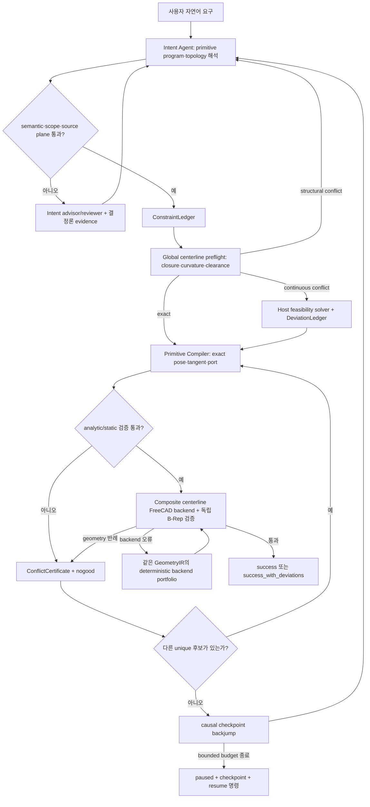
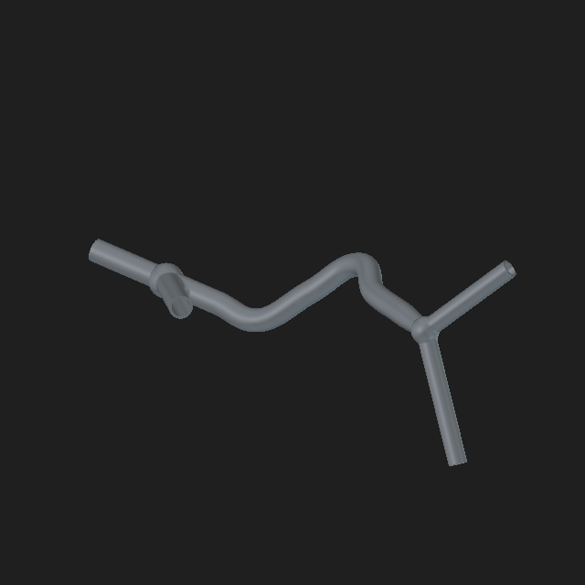

# LLM2CAD

## 1) 요약

- 자연어로 입력한 파이프 요구사항을 한 번에 FreeCAD 코드로 바꾸는 방식이 아님
- 복잡한 CAD를 작은 조립 단위인 `Primitive`로 나눈 뒤, 한 단계씩 선택·계산·검증하면서 이어 붙이는 방식
- 2026-07-12 PAPR 보강: junction 이후 multi-port에서도 host가 primary 포트를 고르고 branch를 compile하며, geometry repair 중에도 host가 연속 수치를 소유한다 (LLM 숫자 walk 루프 차단). 설계: `docs/2026-07-12_papr_architecture_ko.md`
- 기본 경로는 `LLM semantic compiler → deterministic geometry compiler`로 분리됨:
  - `Intent Agent` (`intent`): 전체 설계 목표와 순서만 구조화함
  - `Intent Validation Advisor Agent` (`intent_repair_advisor`): scope/계약 거절을 후보 오류·카탈로그 capability gap·validator gap으로 분류하고 intent 작성자에게 제한된 수정 지시만 제공함
  - `Intent Repair Reviewer Agent` (`intent_repair_reviewer`): advisor 응답이 host 권한·schema 검사를 통과하지 못했을 때 현재 결정론적 issue만 보고 repair-only 지시를 다시 작성함
  - `Primitive Compiler` (host): Intent Agent가 선택한 `line / arc / spline / connect` 의미를 현재 port에 결합하고 exact pose·접선·폐합 수치를 계산함
  - `Discrete Fallback Planner Agent` (`step_planner`): branch처럼 여러 primitive/port 선택이 실제로 남은 경우에만 후보를 선택하며 exact 연속 수치를 맞히는 기본 루프에서는 빠짐
  - `Geometry Validation Advisor Agent` (`step_repair_advisor`): 거절된 후보의 검증 근거를 역추적해 변경 방향·근거 기반 범위·중단 여부만 제안함
  - advisor/reviewer part는 stateless이며, intent/planner의 대화 계보와 섞이지 않음
- 시스템 역할:
  - accepted intent를 source provenance·우선순위·완화 가능성이 있는 `ConstraintLedger`로 투영함
  - 첫 action 전에 전체 serial centerline을 컴파일해 폐합·곡률·비인접 swept-envelope clearance를 검사함
  - ordinary driving dimension이 안전/topology와 충돌하면 기본 `best_effort` 정책에서 최소 uniform centerline scale을 계산하고 모든 차이를 `global_preflight.json`에 기록함. `strict` 모드에서는 변경하지 않음
  - 선택된 값으로 위치·축·단면·끝점·새 port를 계산함
  - graph, 치수, 충돌, 곡률과 실제 FreeCAD 형상을 검증함
  - 검증을 통과한 후보만 다음 CAD 상태로 확정함
- 검증에 실패한 경우:
  - 모든 legacy 오류를 `ConflictCertificate`로 감싸 provider/protocol, intent, topology, geometry, clearance, FreeCAD backend를 서로 다른 복구 경로로 보냄
  - 동일 prefix state digest와 동일 geometry digest는 nogood가 되어 FreeCAD 또는 LLM에 반복 제출되지 않음
  - 현재 step의 unique 후보를 소진하면 관련 이전 checkpoint로 bounded causal backjump하며, 그래도 해결할 수 없으면 `failed`로 오판하지 않고 atomic checkpoint와 resume 명령이 있는 `paused` 상태로 남김
  - intent 후보는 schema/semantic 검증뿐 아니라 `intent_scope`까지 통과해야만 accepted로 기록됨
  - intent scope/계약 실패는 후보 전체·구조화 issue·candidate/failure signature와 함께 `intent_diagnostics.json`에 먼저 기록됨
  - primary advisor는 첫 host 거절 사유와 거절 응답을 두 번째 호출에서 받으며, 두 번 모두 실패하면 별도 repair-only reviewer가 현재 issue를 재검토함
  - advisor와 reviewer가 모두 실패해도 author repair 예산이 남아 있으면 결정론적 validator evidence만으로 원래 intent agent를 다시 호출함. 진단 LLM 실패 자체가 author 개선 루프를 끊지 않음
  - terminal 판정은 advisor 제안만으로 확정하지 않고 host의 현재 issue·provenance·반복 counter가 승인해야 함
  - 명시적 요구가 현재 primitive/catalog로 표현 불가능하면 요구를 삭제해 통과시키지 않고 `stop_contract_infeasible`로 원인을 보존함
  - 같은 intent 후보와 같은 검증 근거가 반복되면 계보를 한 번 초기화한 뒤 세 번째 동일 실패에서 남은 호출을 중단함
  - 실패한 후보 상태는 버리고 append-only `search_events.jsonl`에 candidate/conflict/backjump를 기록함
  - `expected / actual` 오류와 수정 가능한 필드 범위를 LLM에 돌려주고 같은 상태에서 다시 계획함
  - 수치 검증은 목표값·실제값·gap/ratio·임계 span/위치·영향 필드를 구조화하고, 별도 `Inverse Geometry Parameter Advisor`가 이를 역추적해 인과 필드와 근거 기반 탐색 범위를 정리함
  - advisor는 Action이나 최종 값을 만들거나 실패를 면제하지 않으며, host compiler/solver 또는 새 discrete primitive 선택이 모든 검증을 다시 통과해야 함
  - advisor의 provider/schema 응답이 무효면 동일 진단 episode에서 한 번 재호출하고, 끝내 유효한 진단을 만들지 못해도 정확한 validator evidence만으로 원래 planner의 남은 bounded repair를 계속함. 진단 LLM 자체의 실패는 terminal 권한이 없음
  - 같은 검증 failure signature라도 새 후보의 파라미터와 누적 trial이 달라졌으면 상한 안에서 다시 진단함
  - immutable 계약 충돌 또는 비인과적 knob 반복이라고 advisor가 명시적으로 판정하면 남은 blind retry를 조기 중단함
  - OCC backend 오류는 geometry infeasible과 분리하며 같은 solved centerline에 composite sweep → module Boolean fallback portfolio를 적용함
  - 일정 단면 degree-2 route는 모듈별 solid를 모두 fuse하지 않고 하나의 composite centerline wire에 outer/bore profile을 각각 한 번 sweep함
  - `CADGEN_MAX_ITER`는 기본 accepted-action 예산이며, 검증된 goal DAG의 결정론적 최소가 더 크면 자동 확장됨. `CADGEN_MAX_ITER_HARD_CEILING`을 넘지는 않으며 명시적 CLI `--max-iter`는 기존처럼 hard limit임
  - 원형 arc는 중심선 반경과 외반경을 scale-aware ULP로 `regular / horn_boundary / self_intersecting` 분류하고 analytic torus segment로 생성함. spline의 더 엄격한 곡률 여유 정책과 섞지 않음
- 모든 production structured-output 호출은 validator 없는 `ProviderWireModel`만 provider에 전달함
  - type별 필수 필드는 discriminated union으로 구조화해 잘못된 조합을 생성 단계에서 차단함
  - provider JSON/schema 실패와 wire 이후 domain 의미 실패를 서로 다른 오류·재시도 예산으로 처리함
  - wire subtree에 숨은 validator나 sanitizer가 삭제할 제약이 추가되면 API 호출 전 parity guard가 즉시 거부함

## 2) 전체 알고리즘 동작

- 한 번에 생성하지 않음:
  - LLM이 완성된 CAD 전체를 직접 작성하지 않음
- 전역으로 풀고 순차적으로 commit함:
  - `route`, `transition`, `junction`, `connect_ports`, `terminate`, `inline_component` 중 필요한 Primitive를 하나씩 연결함
  - 폐곡선은 첫 모듈의 실제 inlet을 `reserved_start_anchor`로 보존하고, terminal turn과 closure가 같은 원호이면 host compiler가 한 `connect_ports` arc로 합쳐 두 goal을 동시에 증명함. 이미 일치한 포트에는 geometry 없는 typed seam만 허용함
- 검증 후 확정함:
  - typed schema와 graph 검증을 먼저 수행함
  - 필요한 단계는 FreeCAD B-Rep까지 확인한 뒤 상태를 확정함



## 3) 실행 방법

- 준비 사항:
  - Python `3.12` 이상
  - [`uv`](https://docs.astral.sh/uv/) 설치
  - FreeCAD와 FreeCAD MCP 실행 환경
  - `.env.example`을 참고한 로컬 `.env` 파일

### macOS / Linux (`run.sh`)

- API key 설정:

```bash
cp .env.example .env
```

- 자연어 prompt로 실행:

```bash
./run.sh --prompt "외경 20mm, 두께 2mm인 속이 빈 파이프를 만들고 중간에 Y자 분기를 추가해줘"
```

- 긴 prompt를 파일로 실행:

```bash
./run.sh --prompt-file prompts/complex_two_y_manifold.txt
```

- API와 FreeCAD 없이 상태 전이만 확인:

```bash
./run.sh --prompt "직선 파이프를 만들어줘" --dry-run
```

- 중단된 실행 재개:

```bash
./run.sh --resume outputs/<실행 시각>
```

### Windows CMD (`run.cmd`)

- API key 설정:

```bat
copy .env.example .env
```

- 자연어 prompt로 실행:

```bat
run.cmd --prompt "외경 20mm, 두께 2mm인 속이 빈 파이프를 만들고 중간에 Y자 분기를 추가해줘"
```

- 긴 prompt를 파일로 실행:

```bat
run.cmd --prompt-file prompts\complex_two_y_manifold.txt
```

- API와 FreeCAD 없이 상태 전이만 확인:

```bat
run.cmd --prompt "직선 파이프를 만들어줘" --dry-run
```

- 중단된 실행 재개:

```bat
run.cmd --resume outputs\<실행 시각>
```

### 공통 실행 인자

| 인자 | 설명 |
| --- | --- |
| `--prompt "요구사항"` | 명령행에서 자연어 CAD 요구사항을 직접 전달함 |
| `--prompt-file PATH` | 긴 요구사항을 UTF-8 텍스트 파일에서 읽음 |
| `--resume PATH` | 해당 실행 디렉터리의 `checkpoint.json`에서 중단된 작업을 재개함 |
| `--env-file PATH` | 사용할 환경 파일을 지정함. 기본값은 `.env` |
| `--output-dir PATH` | 실행 결과를 저장할 디렉터리를 변경함 |
| `--max-iter N` | 이번 실행의 최대 accepted-action 수를 hard limit으로 지정함 |
| `--dry-run` | Gemini와 FreeCAD를 호출하지 않고 로컬 휴리스틱으로 상태 전이만 확인함 |
| `--skip-freecad` | Gemini 계획은 사용하되 FreeCAD 실행과 MCP 호출은 생략함 |
| `--no-thinking-stream` | CLI의 진행 요약 출력을 끔 |

`--prompt`, `--prompt-file`, `--resume`은 동시에 사용할 수 없습니다. 추가 인자는 두 실행 스크립트 모두 `cadgen.cli`에 그대로 전달합니다.

### 재개 및 실행 결과 참고

- 각 거절 직후 `checkpoint.json`과 `action_attempts.json`이 함께 갱신됨
- 진단 호출 전 `DiagnosticJournal`의 pending 상태가 checkpoint에 먼저 기록되고, 완료 artifact가 있으면 resume에서 유료 호출 없이 검증 후 재사용함
- 이전 generator/policy에서 거절된 draft는 새 LLM 호출 전에 동일 draft를 현재 FreeCAD generator로 먼저 재검증함
- `Ctrl-C`/`SIGTERM` 시 CLI가 재개 명령을 출력함
- Gemini 요청과 FreeCAD 호출에는 각각 독립 timeout이 적용됨

- 실행 결과:
  - 매 실행은 `outputs/<실행 시각>/` 아래에 따로 저장됨
  - 최종 `.FCStd`, 단계별 action/state, 검증 보고서와 캡처 이미지가 함께 기록됨

## 4) 입력 prompt와 생성 결과

- 입력 prompt 요약:
  - `직선 inlet 뒤에 첫 번째 Y 분기를 만들고, 3D spline과 taper를 지난 뒤 두 번째 Y 분기로 끝나는 속이 빈 four-port manifold를 생성해줘.`
- 생성 결과:
  - 첫 번째 Y의 한 갈래는 열린 terminal branch로 유지됨
  - 중앙 경로는 상승하는 3D spline과 점진적인 직경 taper로 생성됨
  - 두 번째 Y에서 두 개의 열린 terminal branch가 생성됨
  - START를 포함해 총 네 개의 물리적 open end를 갖는 하나의 연결 형상으로 검증됨
- 실제 실행 자료:
  - [입력 prompt](outputs/20260710T233430881324Z/prompt.txt)
  - [실행 보고서](outputs/20260710T233430881324Z/run_report.json)
  - [FreeCAD 결과](outputs/20260710T233430881324Z/pipe_v5_5492aa9c8f7b.FCStd)



## 5) 출력 파일 참고

- `.FCStd`:
  - FreeCAD에서 열 수 있는 실제 CAD 문서
- `.step`, `.stl`:
  - 다른 CAD·제조 도구와 교환하기 위한 export 파일
- `.FCBak`:
  - FreeCAD가 편집 중 자동으로 만드는 백업 파일
  - 프로그램 실행에는 필요하지 않으므로 루트 작업 파일은 저장소에서 제외함
  - 단, `outputs/` 내부의 과거 백업은 해당 실행의 원본 기록을 보존하기 위해 그대로 둠
- `outputs/`:
  - 실행 결과와 검증 근거를 재현하기 위해 이 저장소에서는 포함함
  - `diagnostics/index.json`에는 진단 journal과 호출 상태가 기록됨
  - `intent_diagnostics.json`에는 scope-invalid intent 후보, 결정론적 issue, 반복 signature, primary advisor의 host 거절 chain, reviewer 사용 여부, evidence-only fallback, 최종 host retry/terminal 판단이 기록됨
  - `source_measurement_contract.json`에는 사용자 원문에서 한 번만 추출해 LLM 작성과 semantic validator가 함께 사용하는 수치 역할·범위·합성 길이 계약과 digest가 기록됨
  - `constraint_ledger.json`에는 source span/goal/field, 안전·topology·driving 우선순위, strict/relaxable 정책이 기록됨
  - `global_preflight.json`에는 전역 centerline digest, 충돌 certificate, 실현 scale과 모든 authored→realized 편차가 기록됨
  - `search_events.jsonl`에는 candidate accept/reject, exact nogood, causal backjump, pause/resume 상태가 append-only로 기록됨
  - `diagnostics/step_*_case.json`에는 모델에 전달된 typed evidence case가, `*_diagnosis.json` 또는 `*_advisor_failure.json`에는 host 검증 결과가 기록됨
  - `repair_advice.json`은 이전 프로토타입 실행과의 호환을 위해 유지되며 새 실행의 주 진단 기록은 `diagnostics/`임
