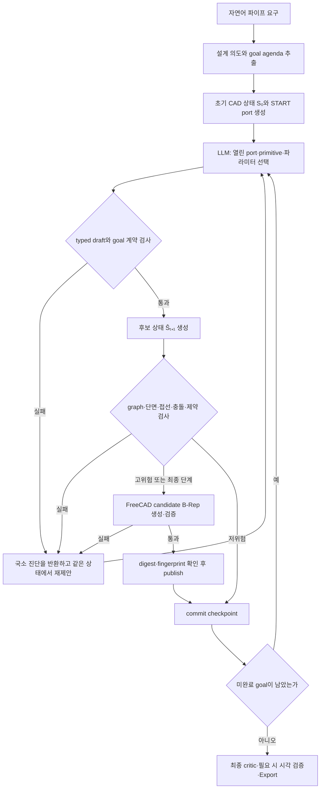

> **핵심 결론**  현재 시스템은 자연어 요구를 불변 설계 의도로 구조화한 뒤, CAD 그래프를 상태로 보고 LLM이 한 번에 하나의 primitive와 치수·방향을 선택하는 순차 계획기이다. 각 제안은 정적 기하 검사와 FreeCAD B-Rep 검증을 통과한 경우에만 다음 상태로 확정한다.

- 작성 기준일: 2026-07-10
- 실증 범위: 현재 `cadgen02` 구현, 128개 정적 회귀 테스트, 본 문서를 위해 새로 수행한 FreeCAD MCP 실험이다.
- 연구적 위치: 학습된 강화학습 모델이 아니라 **LLM 정책 + 결정론적 제약 검사**로 구성된 constrained MDP-like planning이다.

## 1. 연구 목표

- 최종 목표는 사용자가 “직경 20 mm 파이프를 80 mm 직진시킨 뒤 위로 90° 굽혀라”와 같이 자연어로 요구하면, 시스템이 연결 가능한 파이프 부품을 순차적으로 선택하여 수치적으로 일관된 CAD를 생성하는 것이다.
- 전체 형상을 한 번에 코드로 생성하지 않고, 제한된 primitive 집합을 하나씩 조립한다. 이로써 긴 설계 문제를 검증 가능한 짧은 상태 전이의 연속으로 바꾼다.
- CAD는 단순 이미지가 아니라 **module–port graph와 실제 B-Rep 형상**을 함께 갖는 환경 상태이다. LLM은 설계 결정을 담당하고, 결정론적 모듈은 가능 여부를 판정한다.
- 이 방향은 기존 연구 메모의 순차 module 배치 구상과 그래프 기반 CAD 표현을 실제 실행 가능한 구조로 구체화한 것이다 (<mention-page url="https://app.notion.com/p/39877e28977f80768177fda922874727">6차 모델</mention-page>, <mention-page url="https://app.notion.com/p/39877e28977f8059bbacf71437d52f7a">방향성 정리</mention-page>, <mention-page url="https://app.notion.com/p/39577e28977f80ee9e8def79a9d1f6c1">그래프 형태로 CAD 표현 방법</mention-page>).

## 2. 순차 의사결정 문제로서의 정식화

### 2.1 상태

$$
S_t=(\mathcal M_t,\mathcal P_t,\mathcal E_t,\mathcal O_t,\mathcal G_t,\mathcal C,\mathcal H_t)
$$

- $\mathcal M_t$: 현재까지 배치된 primitive 집합이다.
- $\mathcal P_t$: 위치, 방향, 외경, 두께, connector 속성을 가진 typed port 집합이다.
- $\mathcal E_t$: module–port incidence edge와 port–port connection edge이다.
- $\mathcal O_t$: 다음 부품을 연결할 수 있는 열린 port 집합이다.
- $\mathcal G_t$: 아직 완료되지 않은 설계 goal agenda이다.
- $\mathcal C$: 자연어로부터 추출되어 실행 중 바뀌지 않는 치수·위상·기하 제약이다.
- $\mathcal H_t$: 승인된 action, 측정값, 검증 이력이다.

### 2.2 행동

$$
A_t=(m_t,p_t^*,\theta_t,G_t^{aff},G_t^{done},C_t^{sat})
$$

- $m_t$는 선택한 primitive family, $p_t^*$는 연결 대상 열린 port이다.
- $\theta_t$는 길이, 직경, 두께, 축, 굽힘 반경, branch 방향, waypoint와 같은 기하 파라미터이다.
- $G_t^{aff}$와 $G_t^{done}$은 이 행동이 영향을 주거나 완료한다고 주장하는 goal이다.
- $C_t^{sat}$는 실제로 배치한 flange, valve 등의 부속품 주장이다.

### 2.3 전이와 관측

$$
\hat S_{t+1}=T(S_t,A_t)
$$

$$
S_{t+1}=\begin{cases}
\hat S_{t+1}, & I(S_t,A_t,\hat S_{t+1})=1\\
S_t, & I(S_t,A_t,\hat S_{t+1})=0
\end{cases}
$$

- 먼저 후보 상태 $\hat S_{t+1}$만 만든다. schema, port, goal, graph, geometry, B-Rep 검사를 모두 통과한 경우에만 commit한다.
- 실패하면 상태는 $S_t$에 그대로 머물고, “어느 port·치수·goal 검사가 왜 실패했는가”라는 국소 진단을 LLM에 돌려준다.
- 현재 구현에는 scalar reward, value function, 학습된 RL policy가 없다. 따라서 정확한 표현은 **보상 학습**보다 **제약 만족형 순차 가능성 계획**이다.
- 별도 수치 최적화 solver도 없다. LLM이 모든 설계 파라미터를 제안하고, 시스템은 정규화·상속·측정·거부만 수행한다.
- 환경은 전체 `PipeState`를 보유하지만 LLM에는 열린 port, 남은 goal, graph 요약, AABB와 국소 점유를 압축한 관측 $\omega_t=\phi(S_t)$를 전달한다. 따라서 정책 입력은 raw B-Rep 자체가 아니라 검증 가능한 Markov 요약이다.

현재 구현에 가장 가까운 목적은 reward 최대화보다 다음 제약 만족 문제이다.

$$
\min_{\tau}T\quad\text{s.t.}\quad
\mathcal G_T=\varnothing,\ I_t=1\ \forall t,\ V_{graph}(S_T)=1,\ V_{BRep}(S_T)=1
$$

## 3. 전체 시스템 흐름



- 정상 경로는 intent 호출 1회와 승인 action당 primitive+parameter 호출 1회이다.
- 실패한 step만 동일 상태에서 제한 횟수 재계획한다. 이미 승인된 앞 단계까지 다시 생성하지 않는다.
- 최종 critic이 특정 module의 문제를 발견하면 해당 checkpoint까지 rollback한 뒤 agenda를 수정하여 다시 진행한다.

## 4. Production primitive library

Production planner가 선택하는 primitive는 정확히 6개 family이다. 앞의 5개는 항상 사용 가능하며, `inline_component`는 아직 필요한 부속품이 남아 있을 때만 catalog에 나타난다.

| Family | 입·출력 arity | 역할 | LLM이 주로 정하는 값 |
|---|---|---|---|
| `route` | 1 → 1 | 직선, 원호, B-spline 경로 | 길이·방향, 반경·회전각·평면, waypoint·접선 |
| `transition` | 1 → 1 | 동심·편심 직경/두께 변화 | 출구 직경·두께, 길이, offset |
| `junction` | 1 → N | 한 유로를 둘 이상으로 분기 | 각 outlet의 축·길이·단면, hard/fillet, hub bound |
| `connect_ports` | 2 → 0 | 두 열린 port를 연결하여 loop/merge | 상대 port, line/arc/spline, waypoint·접선·최소 곡률 |
| `terminate` | 1 → 0 | 실제 cap 또는 plug로 밀봉 | 종류, 두께 |
| `inline_component` | 1 → 1 | flange·coupling·union·valve | body·bolt·ring·actuator와 connector 속성 |

- 과거의 `straight_pipe`, `bend_pipe`, `junction_pipe`, `reducer_pipe`, `connector_pipe`, `cap_pipe`는 legacy/dry-run 호환용이다. Production LLM action으로 들어오면 거부한다.
- `route` 하나가 line·circular arc·spline을 포괄하므로 primitive 수를 늘리지 않고도 경로 표현력을 유지한다.
- `inline_component`의 subtype은 문자열 주장에 그치지 않고 bolt hole, ring, actuator를 포함한 실제 형상으로 생성한다.

아래의 “기준값”은 시각 비교를 위한 공통 reference이며, production 코드가 자동 선택하는 숨은 default가 아니다. 실제 실행에서는 LLM이 해당 값을 명시적으로 저작한다.

### 4.1 `route`: 경로 길이 변화

- 기준: OD 20 mm, wall 2 mm, 직선 길이 80 mm이다.
- 변화: 길이만 140 mm로 증가시킨다. 단면과 접선은 유지되고 끝 port가 +X 방향으로 60 mm 더 이동한다.

{{IMAGE_ROUTE_BASE}}

{{IMAGE_ROUTE_VARIANT}}

### 4.2 `transition`: 출구 직경과 편심 변화

- 기준: OD 20→30 mm, 길이 60 mm, offset 0 mm인 동심 transition이다.
- 변화: 출구 OD를 12 mm로 줄이고 횡방향 offset을 6 mm로 주어 축소와 편심을 함께 확인한다.

{{IMAGE_TRANSITION_BASE}}

{{IMAGE_TRANSITION_VARIANT}}

### 4.3 `junction`: outlet 방향과 길이 변화

- 기준: +X primary 65 mm와 +Y branch 50 mm를 가진 1→2 T-junction이다.
- 변화: branch를 YZ 평면에서 45° 위로 기울이고 길이를 70 mm로 늘린다. Arity는 그대로이며 열린 branch port의 위치·방향만 달라진다.

{{IMAGE_JUNCTION_BASE}}

{{IMAGE_JUNCTION_VARIANT}}

### 4.4 `connect_ports`: 두 열린 port의 명시적 연결

- 기준: 100 mm 떨어진 두 facing port를 직선으로 연결하며 두 port를 모두 소비한다.
- 변화: port 간격을 160 mm로 늘리면 topology 2→0은 그대로이고 closure 길이만 증가한다.

{{IMAGE_CONNECT_BASE}}

{{IMAGE_CONNECT_VARIANT}}

### 4.5 `terminate`: cap과 두께 변화

- 기준: 열린 port에 4 mm cap을 배치한다.
- 변화: 두께를 증가시키거나 plug variant로 바꾸면 밀봉 재료의 위치와 체적이 달라진다.

{{IMAGE_TERMINATE_BASE}}

{{IMAGE_TERMINATE_VARIANT}}

### 4.6 `inline_component`: 부속품 body 변화

- 기준: 관통 bore를 유지하는 flange/coupling/union/valve 중 하나를 배치한다.
- 변화: body 외경, bolt 수, ring 또는 actuator 치수를 바꾸어 부속품 형상이 실제로 달라지는지 확인한다.

{{IMAGE_INLINE_BASE}}

{{IMAGE_INLINE_VARIANT}}

## 5. Primitive 선택 알고리즘

```text
입력: 자연어 요구 U, primitive catalog K
출력: 검증된 CAD 상태 S*

1. C ← LLM이 U를 불변 설계 계약과 goal agenda로 변환한다.
2. S₀ ← START port와 빈 module–port graph를 만든다.
3. 미완료 goal이 있는 동안 반복한다.
   a. LLM은 현재 열린 port, 주변 점유, 남은 goal, K를 읽는다.
   b. action Aₜ = (target port, primitive, geometry, goal claims)를 한 개 제안한다.
   c. schema·port·goal 계약이 틀리면 진단을 반환하고 같은 Sₜ에서 재제안한다.
   d. 후보 상태 Ŝₜ₊₁을 만들고 graph·단면·접선·충돌·공간 제약을 검사한다.
   e. 고위험 형상은 FreeCAD candidate B-Rep으로 실측한다.
   f. 모든 검사가 통과하면 publish·checkpoint 후 Sₜ₊₁로 commit한다.
4. 최종 graph, B-Rep, 열린 port 수, goal 측정을 다시 검사한다.
5. 통과하면 Export하고, 국소 결함이면 해당 step으로 rollback하여 반복한다.
```

- primitive와 파라미터를 한 번에 선택하므로 “부품은 맞지만 치수가 없는” 중간 결정을 만들지 않는다.
- Goal type을 primitive에 고정 매핑하지 않는다. LLM이 catalog와 현재 graph를 보고 선택하고, validator는 결과의 pose·arity·section으로 주장이 실제로 성립했는지 판정한다.
- `inherit_target`을 선택한 action은 inlet 단면을 target port에서 상속한다. 따라서 LLM이 같은 치수를 반복 입력하면서 생기는 접합 오차를 줄인다.
- `explicit`을 선택한 경우에는 외경과 두께를 모두 명시해야 하며 target과 맞지 않으면 즉시 거부한다.

## 6. 핵심 기하 수식

### 6.1 중공 원형 단면

$$
D_i=D_o-2t,\qquad D_o>2t>0
$$

- 외반경은 $r_o=D_o/2$, 내반경은 $r_i=D_o/2-t$이다.
- Route는 중심선을 따라 외부 원을 sweep한 형상에서 내부 원의 sweep을 뺀다.

### 6.2 직선·원호·transition·junction

$$
\mathbf p_{line}=\mathbf p_0+L\hat{\mathbf d}
$$

$$
\mathbf c=\mathbf p_0-\operatorname{sgn}(\theta)R(\hat{\mathbf t}\times\hat{\mathbf n}),\qquad
\mathbf p(s)=\mathbf c+\operatorname{Rot}(\hat{\mathbf n},s\theta)(\mathbf p_0-\mathbf c)
$$

$$
\mathbf p_{transition}=\mathbf p_0+L\hat{\mathbf a}+\boldsymbol\delta,\qquad
\boldsymbol\delta\cdot\hat{\mathbf a}=0
$$

$$
\mathbf p_i^{junction}=\mathbf p_0+L_i\hat{\mathbf a}_i
$$

- Transition은 입·출구의 외부/내부 원형 profile을 각각 loft하고 내부 loft를 차감한다.
- Junction은 inlet/outlet cylinder network를 각각 fuse한 뒤 bore network를 차감한다. 구형 node를 덧붙이는 방식이 아니다.

### 6.3 Port 접합 조건

$$
e_p=\|\mathbf p_a-\mathbf p_b\|,\qquad
s_a=-\hat{\mathbf a}_a\cdot\hat{\mathbf a}_b
$$

$$
e_{OD}=|D_{o,a}-D_{o,b}|,\quad
e_{ID}=|D_{i,a}-D_{i,b}|,\quad
e_t=|t_a-t_b|
$$

- 현재 modeling tolerance는 $10^{-4}$ mm이며, $e_p,e_{OD},e_{ID},e_t$가 tolerance 이하여야 한다.
- 두 port의 outward axis는 서로 반대 방향이어야 하므로 $s_a\ge0.9999$를 요구한다.
- connector type, gender, standard도 함께 맞아야 한다.

### 6.4 열린 port와 graph 위상

$$
\mathcal O_{t+1}=(\mathcal O_t\setminus I(A_t))\cup O_{new}(A_t)
$$

- Junction이 $N$개 outlet을 만들면 열린 port 수는 $|\mathcal O_{t+1}|=|\mathcal O_t|-1+N$이다.
- Terminate는 하나를 소비하고, connect_ports는 둘을 소비하며 새 port를 만들지 않는다.
- 열린 port의 connection degree는 0, 소비된 port의 degree는 1이어야 한다.
- Graph cycle은 우연한 좌표 중첩이 아니라 `connect_ports` action으로만 명시적으로 생성한다.

### 6.5 곡률과 충돌

$$
\kappa(u)=\frac{\|\mathbf r'(u)\times\mathbf r''(u)\|}{\|\mathbf r'(u)\|^3},\qquad
R_{min}=\frac{1}{\max_u\kappa(u)}
$$

- B-spline 곡률은 FreeCAD 곡선의 knot span을 조밀하게 sampling하여 확인한다. 전역 극값의 형식적 증명은 아니다.
- 정적 충돌 검사는 centerline segment와 외경 envelope 사이의 최소 거리로 후보만 찾는다.

$$
c=d_{segment}-(r_1+r_2)
$$

- $c<0$인 경우 즉시 “정확한 충돌”이라고 단정하지 않고 FreeCAD Boolean common volume으로 최종 판정한다.

## 7. 단계별 검증 구조

| 단계 | 확인하는 질문 | 실패 시 처리 | 구현 대응 |
|---|---|---|---|
| 1. Intent 계약 | 자연어 요구가 유효한 치수·goal·열린 port 수로 구조화되었는가 | CAD 초기화 전 중단 또는 intent 재생성 | `schemas.py`, `pipeline.py` |
| 2. Typed action | primitive 전용 필드만 사용했고 필요한 값을 모두 썼는가 | 같은 상태에서 국소 재제안 | `schemas.py`, `registry.py` |
| 3. Port·goal 검사 | target이 열려 있고 dependency·완료 주장이 맞는가 | action 폐기 | `registry.py` |
| 4. 후보 graph 검사 | arity, degree, 연결성, cycle, 단면·접선이 맞는가 | 후보 상태 폐기 | `state.py`, `static_validation.py` |
| 5. 공간·경로 검사 | waypoint, terminal pose, 길이, 곡률, extent, 충돌 후보가 맞는가 | 수정 진단 반환 | `static_validation.py` |
| 6. FreeCAD B-Rep | shape가 valid/closed solid이고 bore가 연속이며 실제 overlap이 없는가 | publish 금지 | `freecad_script.py`, `freecad_mcp.py` |
| 7. 증거·publish | state/document/digest/B-Rep fingerprint가 같은가 | commit 금지·recovery | `freecad_mcp.py`, `pipeline.py` |
| 8. 최종 critic | 모든 goal, 열린 port 수, 전체 graph와 필요 시 시각 결과가 맞는가 | 해당 step rollback 후 재계획 | `static_validation.py`, `pipeline.py` |

- FreeCAD에서는 각 module과 조립체의 null/valid/closed/solid count/volume을 검사한다.
- 외부 network와 flow-bore network를 별도로 fuse하고, $S_{assembly}=S_{outer}\setminus S_{bore}$를 다시 만든다.
- 열린 terminal과 START의 bore를 probe하고, cap/plug 내부 probe 체적이 99% 이상 재료로 채워지는지 확인한다.
- Port 및 내부 단면에서 원주 8점을 sampling하여 wall 재료와 비어 있는 중심 bore를 확인한다.
- Validation schema v3는 run, state, attempt, document, payload digest와 각 B-Rep의 SHA-256 fingerprint를 함께 결속한다.

## 8. FreeCAD MCP 순차 조립 실험

### 8.1 실험 요구

> “외경 20 mm, 두께 2 mm의 중공 파이프를 +X로 80 mm 직진시키고, 길이 30 mm coupling을 설치한다. 이어서 40 mm 구간에서 외경을 12 mm, 두께를 1.5 mm로 줄인 뒤 60 mm 직진시키고 cap으로 닫는다.”

### 8.2 Action 1 — 직선 route

- 선택: `target=START`, `primitive=route(line)`, $L=80$, direction $=(1,0,0)$이다.
- 결과: `M1.out=(80,0,0)`, axis $=(1,0,0)$인 열린 port가 하나 생성된다.
- 확인: draft·resolved action·step validation이 모두 통과하고 connection 오차가 0이다.

{{IMAGE_STEP_1}}

### 8.3 Action 2 — coupling 배치

- 선택: `target=M1.out`, `primitive=inline_component(coupling)`, 길이 30 mm, body OD 28 mm이다.
- 결과: coupling의 관통 bore는 OD 20 mm 파이프와 연속이며 `M2.out=(110,0,0)`이다.
- 확인: body가 authored axial length 전체를 덮고, component identity가 실제 sleeve 형상과 결속된다.

{{IMAGE_STEP_2}}

### 8.4 Action 3 — 동심 transition

- 선택: `target=M2.out`, `primitive=transition`, 길이 40 mm, OD 20→12 mm, wall 2→1.5 mm, offset 0이다.
- 결과: `M3.out=(150,0,0)`이며 출구 단면이 이후 route에 상속된다.
- 확인: 입구 단면은 coupling port와 일치하고, 출구는 $D_o>2t$를 만족하며 내부 loft가 연속이다.

{{IMAGE_STEP_3}}

### 8.5 Action 4 — 축소 단면 직선 route

- 선택: `target=M3.out`, `primitive=route(line)`, $L=60$, direction $=(1,0,0)$이다.
- 결과: OD 12 mm, wall 1.5 mm를 상속한 `M4.out=(210,0,0)`이다.
- 확인: 새 치수를 다시 입력하지 않고 `inherit_target`으로 transition 출구 단면을 그대로 사용한다.

{{IMAGE_STEP_4}}

### 8.6 Action 5 — cap으로 종료

- 선택: `target=M4.out`, `primitive=terminate(cap)`, thickness 3 mm이다.
- 결과: 열린 port가 1개에서 0개가 되고 남은 goal도 0개가 된다.
- 확인: FreeCAD seal probe가 cap 내부의 실제 재료 충전을 확인한다.

{{IMAGE_STEP_5}}

### 8.7 Primitive 연결 및 loop closure

- 일반 연결은 선택된 기존 port와 새 module의 inlet port 사이에 명시적 connection edge를 만든다.
- 두 기존 열린 port를 닫는 경우에는 `connect_ports`가 두 port를 동시에 소비하며, 새 열린 port를 만들지 않는다.
- `M1.out → M2.in` 실험에서 position error, OD/ID/wall error는 모두 0, anti-parallel axis dot은 1이며 connector type/gender/standard가 모두 일치하였다.
- 아래 이미지는 FreeCAD MCP `get_view`가 직접 반환한 raw isometric view이다. 실제 FreeCAD에서 연결부가 하나의 중공 network로 구성되고 bore가 막히지 않는지 확인한 사례이다.

{{IMAGE_CONNECTED}}

### 8.8 실험 결과

{{EXPERIMENT_RESULTS}}

- FreeCAD MCP로 총 24개 scenario를 실제 실행하였다. 22개는 strict B-Rep 검사를 통과했고, 2개는 검증기의 거절 동작을 확인하기 위해 보존한 failure case이다.
- 보고서에 사용한 6-family 기준/변화 12개, inline subtype 3개, 5단계 조립, 연결 overview는 모두 `passed=true`이다.
- 최종 5단계 조립은 FreeCAD 1.1.1, validation schema v3, generator v5에서 다음을 만족하였다.
  - 전체 assembly가 `solid_count=1`인 유효·폐합 solid이다.
  - 모든 module, outer network, bore network가 통과하였다.
  - connection failure, wall-section failure, terminal-bore failure, termination-seal failure, 비인접 overlap이 모두 0이다.
  - Payload digest와 5개 module 및 `PipeAssembly`의 B-Rep SHA-256 fingerprint가 기록되었다.
- 추가 B-spline `connect_ports` 실험은 요구 최소 반경 10.1 mm에 대해 sampled minimum radius 10.682 mm, 351개 curvature sample로 통과하였다.
- 첫 번째 거절 사례는 `route(circular_arc, R=40 mm, 90°)`이다. 화면 렌더는 가능했지만 OCC BOP가 `SelfIntersect`와 `TooSmallEdge`를 검출하여 `passed=false`로 판정하였다.
- 두 번째 거절 사례는 1→3 junction이다. OCC가 `InvalidCurveOnSurface`와 두 개의 solid를 검출하고 wall/terminal bore probe도 실패하여 후보가 폐기되었다.
- 두 거절 사례는 “정적 자료구조가 맞아 보이는 것”과 “실제 B-Rep이 안전한 것”이 다를 수 있음을 보여준다. 현재 파이프라인에서는 이 후보들이 commit되지 않고 해당 step의 국소 오류로 LLM에 반환된다.

- 이 실험은 기존 `outputs/`의 legacy 결과를 재사용하지 않고, 현재 production 6-family 코드로 새로 생성한 결과이다.
- 정적 환경에서는 `compileall`, 전체 128개 회귀 테스트, lock 일관성 검사가 모두 통과했다.
- 예외가 “발생하지 않는” 구조는 아니다. 잘못된 제안이 다음 상태로 누적되지 않도록 후보 생성과 commit 사이를 분리한 구조이다.

## 9. 핵심 자료구조

```text
IntentContract
 ├─ global section / start frame
 ├─ ordered goals and dependencies
 ├─ expected open-port count
 └─ geometric constraints

PipeState Sₜ
 ├─ ModuleRef[]
 │   ├─ primitive type + parameters
 │   ├─ local Port[]
 │   └─ input bindings
 ├─ PortNode[]
 ├─ ModuleIncidenceEdge[]
 ├─ ConnectionEdge[]
 ├─ OpenPort[]
 ├─ RemainingGoal[]
 └─ Action / measurement history
```

- `ModuleRef`는 형상 ID, primitive 종류, 파라미터, local port, 기존 port와의 결속을 가진다.
- `Port`는 $(id,\mathbf p,\hat{\mathbf a},D_o,t,type,gender,standard)$를 가진다.
- `ConnectionEdge`는 위치·축·OD·ID·wall 오차와 connector 호환성의 실제 측정값을 저장한다.
- `StateTransition`은 before/after state, 소비·생성 port, 새 edge, 완료 goal을 기록한다.
- FreeCAD로 보내는 geometry payload는 generator version, tolerance, root port, modules, open ports, connection edges를 정렬된 JSON으로 직렬화하고 SHA-256 digest를 만든다.

간단한 $S_2$의 직관적 표현은 다음과 같다.

```json
{
  "state": "S2",
  "modules": ["M1: route(line)", "M2: inline_component(coupling)"],
  "connections": ["START ↔ M1.in", "M1.out ↔ M2.in"],
  "open_port": {"id": "M2.out", "p": [110, 0, 0], "axis": [1, 0, 0], "OD": 20, "wall": 2},
  "remaining_goals": ["G3: transition 20→12 mm", "G4: move +X, 60 mm", "G5: cap"]
}
```

## 10. 예외 전파가 제한되는 이유

- Action 공간을 6개 typed family로 제한하여 임의 CAD 코드 생성보다 검색 공간이 작다.
- 모든 연결은 열린 port ID를 통해 이루어져 “눈으로는 붙어 보이지만 graph에서는 분리된” 형상을 줄인다.
- `inherit_target`이 단면 연속성을 보존하고, explicit 단면은 tolerance 검사로 강제한다.
- 후보 상태는 검증 전까지 실제 상태를 바꾸지 않으며, 실패한 후보는 버린다.
- FreeCAD 형상은 candidate → validate → fingerprint 확인 → publish → commit 순서로 처리한다.
- Checkpoint와 digest가 있어 중단·재개 시 다른 상태의 화면이나 B-Rep을 잘못 승인하기 어렵다.
- 실패 진단을 해당 step에만 반환하므로 긴 앞부분을 유지한 채 국소 수정할 수 있다.

## 11. 현재 한계와 다음 연구

- 현재 primitive는 원형 중공 pipe network에 한정된다. 비원형 duct, support, thread, gasket, 제조사 규격 부품은 범위 밖이다.
- Static collision은 broad phase이며 최종 충돌은 FreeCAD Boolean evidence에 의존한다.
- Spline 곡률 sampling은 강한 수치 검사이지만 전역 최솟값의 수학적 증명은 아니다.
- FEM, 압력 코드, 공차 누적, 제작 가능성은 별도 engineering gate가 필요하다.
- 다음 연구에서는 다음을 비교할 수 있다.
  - LLM 제안 뒤 제약 projection/수치 solver를 추가했을 때의 성공률과 호출 수 변화이다.
  - 단일 agent와 planner–critic multi-agent의 완성도·비용 비교이다.
  - scalar reward와 offline trajectory를 도입한 학습 정책이 현재 reject-and-retry 정책보다 효율적인지이다.
  - 자연어 요구 대비 치수 오차, topology 정확도, 유효 B-Rep 비율, 수정 횟수를 포함한 benchmark이다.

## 구현 근거

- 전체 정책·복구 흐름: `cadgen/pipeline.py`
- Primitive catalog와 action 계약: `cadgen/registry.py`, `cadgen/schemas.py`
- 상태 전이와 port graph: `cadgen/state.py`
- 정적 graph·기하·goal 검증: `cadgen/static_validation.py`
- FreeCAD 형상 생성과 B-Rep 측정: `cadgen/freecad_script.py`
- MCP 실행·증거 binding·화면 캡처: `cadgen/freecad_mcp.py`
- 회귀 검증: `tests/test_v2_architecture.py`, `tests/test_config_and_pipeline.py`

## 관련 문서

- <mention-page url="https://app.notion.com/p/39877e28977f80768177fda922874727">6차 모델</mention-page>
- <mention-page url="https://app.notion.com/p/39877e28977f8059bbacf71437d52f7a">방향성 정리</mention-page>
- <mention-page url="https://app.notion.com/p/39577e28977f80ee9e8def79a9d1f6c1">그래프 형태로 CAD 표현 방법</mention-page>
