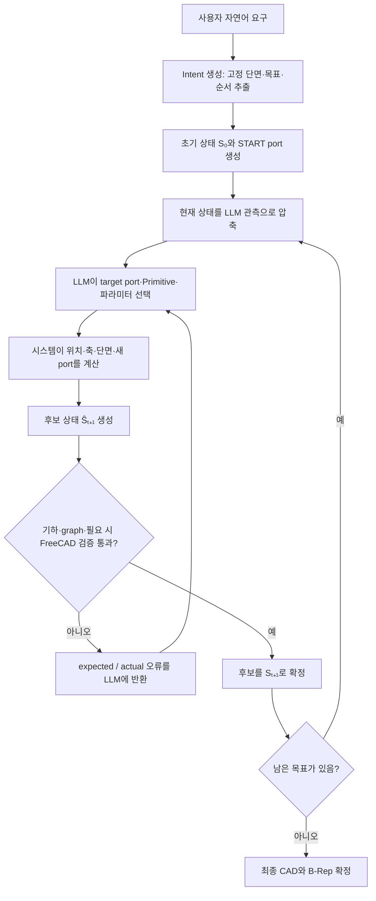

---
> **한 문장 요약**  사용자의 요구를 작은 조립 단계로 나누고, LLM이 다음 부품의 종류와 치수를 고르면, 시스템이 실제로 연결 가능한지 검사하여 통과한 부품만 하나씩 이어 붙이는 방식임.

이 시스템은 완성된 CAD를 한 번에 그리지 않음. 레고 블록을 하나씩 조립하듯, 미리 정한 기본 형상 중 하나를 골라 현재 파이프 끝에 붙이는 방식임.

각 단계에서 LLM은 “무엇을 붙일지”와 “숫자를 얼마로 할지”를 제안함. 시스템은 위치·두께·연결 방향을 계산하고, 위험도가 높은 후보와 최종 상태는 실제 FreeCAD 형상까지 검사함. 실패한 제안은 버리고 마지막으로 통과한 상태에서 다시 시도함.

## Intro. 전체 알고리즘

이 시스템은 완성된 CAD 전체를 LLM이 한 번에 작성하는 구조가 아님. 미리 정의된 작은 형상 생성 규칙인 Primitive를 하나씩 선택하고 연결하는 구조임.

예를 들어 사용자가 다음과 같이 요청했다고 가정함.

> “외경 20 mm, 두께 2 mm인 파이프를 80 mm 직진시키고, 길이 30 mm coupling을 붙인 뒤, 40 mm 구간에서 외경을 12 mm로 줄이고, 다시 60 mm 직진한 다음 cap으로 닫아줘.”

시스템은 이 문장을 곧바로 FreeCAD 코드로 바꾸지 않음. 먼저 “80 mm 직진”, “coupling 설치”, “직경 변경”, “마지막 직진”, “cap으로 종료”라는 작은 목표로 나눔. 이후 현재 열린 port에 Primitive를 하나씩 추가함.



핵심 흐름은 다음과 같음.

1. **Intent 생성**: 자연어에서 바뀌면 안 되는 치수, 목표 순서, 최종 열린 port 수를 추출함.
2. **현재 상태 관측**: 지금까지 승인된 module, 열린 port, 남은 목표, 주변 공간을 요약함.
3. **LLM action 선택**: LLM이 Primitive 하나와 필요한 모든 설계 파라미터를 한 번에 출력함.
4. **시스템 파생**: 시작 위치, 정규화된 축, 끝 위치, 새 port 이름, 연결 edge는 코드가 계산함.
5. **후보 검증**: 모든 후보의 단면, 접선, 곡률, graph, 충돌 후보를 검사함. 설정상 필요한 고위험 후보는 commit 전에 실제 FreeCAD solid도 검사함.
6. **Commit 또는 재시도**: 통과하면 다음 상태가 되고, 실패하면 기존 상태를 유지한 채 같은 단계만 다시 선택함.

의사 코드로 보면 다음과 같음.

```plain text
Intent C를 생성함
S₀ = START port만 가진 초기 CAD 상태임

남은 goal이 있는 동안 반복함
    ωₜ = 현재 상태 Sₜ를 LLM용 관측으로 압축함
    LLM이 action draft를 하나 출력함
    시스템이 draft를 실제 좌표와 port가 포함된 action으로 해석함
    후보 상태 Ŝₜ₊₁을 만듦

    schema·port·goal·기하 검증과 필요한 FreeCAD 검증이 통과하면
        Sₜ₊₁ = Ŝₜ₊₁ 로 확정함
    하나라도 실패하면
        Sₜ₊₁ = Sₜ 로 유지하고 오류를 LLM에 반환함
```

모든 후보는 commit 전에 schema·resolved action·static graph/기하 검증을 통과해야 함. FreeCAD MCP가 활성화된 경우 full-step 설정이거나 transition·junction·connect_ports·terminate·inline_component·spline처럼 위험도가 높은 후보, 정확한 진행량이 필요한 spline, 충돌 경고 후보를 commit 전에 B-Rep으로 추가 검증함. 단순 line/arc는 adaptive 기본 정책에서 step B-Rep을 생략할 수 있으며, 최종 상태는 별도의 FreeCAD 검증 대상으로 처리함.

### 먼저 알아둘 용어

<table header-row="true">
<tr><td>용어</td><td>쉬운 의미</td></tr>
<tr><td>Intent</td><td>사용자 문장에서 추출한 고정 설계 계약임. 단면·목표 순서·최종 열린 port 수를 포함함</td></tr>
<tr><td>Primitive</td><td>파이프를 늘이기, 굽히기, 나누기, 막기처럼 미리 정해 둔 형상 생성 규칙임</td></tr>
<tr><td>Module</td><td>Primitive에 실제 숫자를 넣어 생성한 한 개의 CAD 부품임</td></tr>
<tr><td>Port</td><td>다음 부품을 붙일 수 있는 연결면임. 위치·방향·외경·두께를 가짐</td></tr>
<tr><td>Open port</td><td>아직 다른 부품과 연결되지 않아 다음 action의 시작점이 될 수 있는 port임</td></tr>
<tr><td>Goal</td><td>아직 완료되지 않은 설계 작업임. 예시는 “80 mm 직진” 또는 “cap으로 종료”임</td></tr>
<tr><td>State</td><td>현재까지 승인된 module, port, 연결 관계, 남은 goal을 모두 묶은 상태임</td></tr>
<tr><td>B-Rep</td><td>화면에 보이는 이미지가 아니라 면·모서리·solid로 정의된 실제 CAD 형상임</td></tr>
<tr><td>Validation</td><td>겉보기뿐 아니라 단면·연결·곡률·solid가 실제로 유효한지 확인하는 과정임</td></tr>
</table>

## 1. Primitive Module

Production planner의 기본 core는 `route`·`transition`·`junction`·`connect_ports`·`terminate` 5개임. `inline_component`는 Intent에 아직 배치되지 않은 required accessory가 있을 때만 추가되는 조건부 여섯 번째 family임. 필요한 개수가 모두 배치되면 다시 5-family schema로 돌아감. Legacy 호환용 `straight_pipe`, `bend_pipe` 등은 ActionDraft 스키마에 남아 있지만 production LLM action으로는 거부됨.

<table header-row="true">
<tr><td>Primitive</td><td>직관적인 역할</td><td>열린 port 변화</td></tr>
<tr><td>`route`</td><td>파이프를 직선으로 늘이거나 원호·spline으로 굽힘</td><td>1 → 1</td></tr>
<tr><td>`transition`</td><td>외경과 두께를 동심 또는 편심으로 바꿈</td><td>1 → 1</td></tr>
<tr><td>`junction`</td><td>한 유로를 두 갈래로 나눔</td><td>1 → 2</td></tr>
<tr><td>`connect_ports`</td><td>이미 존재하는 열린 port 두 개를 연결함</td><td>2 → 0</td></tr>
<tr><td>`terminate`</td><td>열린 끝을 cap 또는 plug로 막음</td><td>1 → 0</td></tr>
<tr><td>`inline_component`</td><td>flange·coupling·union·valve를 유로 중간에 넣음</td><td>1 → 1</td></tr>
</table>

> **그림 읽는 법**  아래 그림은 현재 프로젝트 코드로 상태와 FreeCAD 스크립트를 다시 만든 뒤, FreeCAD MCP `execute_code`로 실제 B-Rep을 생성하고 `get_view` 이미지 반환을 확인한 화면임. Primitive 단독 그림의 파랑은 선택한 module임. 단계별 예제에서는 가장 선명한 파랑이 이번 단계에서 새로 추가한 module이고, 반투명하거나 다른 색은 이전 단계에서 이미 승인된 module임.

이 절에서 길이·지름·두께·반경·좌표·offset 단위는 모두 mm이고 각도 단위는 °임. `direction`, `axis`, `tangent`는 길이가 아니라 3차원 방향을 나타내는 벡터임.

### 모든 Primitive에 공통으로 들어가는 값

<table header-row="true">
<tr><td>값</td><td>의미와 규칙</td></tr>
<tr><td>`target_port`</td><td>이번 module을 붙일 현재 열린 port ID임</td></tr>
<tr><td>`affected_goal_ids`</td><td>이번 action이 다루는 아직 완료되지 않은 goal ID임</td></tr>
<tr><td>`completed_goal_ids`</td><td>이번 action으로 완료했다고 주장하는 goal임. affected의 부분집합이어야 함</td></tr>
<tr><td>`section_source=inherit_target`</td><td>target port의 외경과 두께를 그대로 상속함. 이 경우 LLM은 OD와 wall을 다시 쓰면 안 됨</td></tr>
<tr><td>`section_source=explicit`</td><td>LLM이 `outer_diameter`와 `wall_thickness`를 모두 명시함. 연결 대상 단면과 modeling tolerance 안에서 같아야 함</td></tr>
</table>

### 1.1 `route` — 파이프의 진행 경로를 만듦

`route`는 단면을 유지한 채 중심선 경로를 만드는 Primitive임. `line`, `circular_arc`, `spline` 세 variant가 있음.

<table header-row="true">
<tr><td>Variant</td><td>LLM 입력 파라미터</td><td>규칙</td></tr>
<tr><td>공통</td><td>`path_kind`, `section_source`, 선택적으로 OD·wall</td><td>선택한 variant의 파라미터만 사용해야 함</td></tr>
<tr><td>`line`</td><td>`length`, `direction`</td><td>length는 양수, direction은 0이 아닌 벡터여야 함. 직각으로 꺾을 수 없음</td></tr>
<tr><td>`circular_arc`</td><td>`bend_radius`, `sweep_angle`, `plane_normal`, `terminal_axis`</td><td>$`0<|sweep_angle|<360^\circ`$, $`bend_radius>D_o/2+\tau_m`$이어야 함. plane normal은 finite non-zero이며 투영된 시작 tangent가 target axis의 rim 기준을 만족해야 함. terminal axis도 analytic end tangent와 같은 기준을 만족해야 함</td></tr>
<tr><td>`spline`</td><td>`waypoints`, `initial_tangent`, `final_tangent`, `interpolation=bspline`, `frenet`, `minimum_curvature_radius`</td><td>waypoint는 2개 이상이고 finite이며 연속 중복이 없어야 함. 양 끝 tangent는 finite non-zero이고 시작 tangent가 target axis와 dot 0.9999·rim tolerance를 만족해야 함. authored minimum radius는 $`D_o/2+\tau_m`$보다 커야 하며 실제 FreeCAD radius도 이를 만족해야 함</td></tr>
</table>

**기준 line임 — `length=80`, `direction=[1,0,0]`, OD 20, wall 2임**
<image src="file-upload://39977e28-977f-81c4-aaec-00b2ca177280"></image>

**길이만 바꾼 line임 — `length=140`이며 단면은 그대로이고 끝 port만 60 mm 더 이동함**
<image src="file-upload://39977e28-977f-814e-8ce8-00b205af6e45"></image>

**경로를 바꾼 경우임 — `circular_arc`, 반경 40, 회전각 90°, plane normal `[0,-1,0]`, terminal axis `[0,0,1]`임**
<image src="file-upload://39977e28-977f-818f-afe8-00b2f59b5cdf"></image>

### 1.2 `transition` — 단면 크기와 중심 위치를 바꿈

`transition`은 inlet 단면과 outlet 단면 사이를 loft하여 reducer 또는 expander를 만드는 Primitive임. 별도 subtype은 없으며 `offset` 값으로 동심과 편심이 갈림.

<table header-row="true">
<tr><td>파라미터</td><td>의미와 규칙</td></tr>
<tr><td>`diameter_out`</td><td>출구 외경임. 양수이고 `diameter_out > 2 × wall_thickness_out`이어야 함</td></tr>
<tr><td>`wall_thickness_out`</td><td>출구 벽 두께이며 반드시 양수이고 `diameter_out > 2 × wall_thickness_out`이어야 함</td></tr>
<tr><td>`length`</td><td>축 방향 transition 길이임. 양수여야 함</td></tr>
<tr><td>`offset`</td><td>출구 중심의 횡방향 이동량임. 축과 수직이어야 함. [0,0,0]이면 동심임</td></tr>
</table>

**동심 transition임 — OD 20→30, wall 2→2.5, length 60, `offset=[0,0,0]`임**
<image src="file-upload://39977e28-977f-812f-bb53-00b2a0397bad"></image>

**편심 transition임 — OD 20→12, wall 2→1.5, length 75, `offset=[0,6,0]`임. 출구 단면이 작아지면서 중심도 옆으로 이동함**
<image src="file-upload://39977e28-977f-814c-b56c-00b248962be0"></image>

### 1.3 `junction` — 한 유로를 두 갈래로 나눔

Production `junction`은 정확히 두 개의 outlet만 만드는 이진 분기임. 1→3 이상의 manifold는 하나의 action으로 만들지 않고 여러 개의 이진 junction을 순서대로 조합함.

<table header-row="true">
<tr><td>파라미터</td><td>의미와 규칙</td></tr>
<tr><td>`outlets[2]`</td><td>정확히 두 개여야 함. 각 outlet이 자신의 역할·방향·길이·외경·두께를 가짐</td></tr>
<tr><td>`outlets[].role`</td><td>`primary` 또는 `branch`임. primary+branch 또는 branch+branch 조합을 사용함</td></tr>
<tr><td>`outlets[].axis`</td><td>각 출구 방향 벡터임. 두 방향이 사실상 같으면 거부됨</td></tr>
<tr><td>`outlets[].length`</td><td>각 출구 길이임. `max_hub_radius`보다 길어야 함</td></tr>
<tr><td>`outlets[].outer_diameter` / `wall_thickness`</td><td>각 출구의 단면임. 각 outlet마다 `D_o>2t`를 만족해야 함</td></tr>
<tr><td>`blend_mode`</td><td>`hard` 또는 `fillet`임</td></tr>
<tr><td>`blend_radius` / `inner_blend_radius`</td><td>fillet일 때만 두 값 모두 필요함. `max_hub_radius` 이하여야 함</td></tr>
<tr><td>`max_hub_radius`</td><td>LLM이 쓰는 local hub 검증·선택 반경임. fillet edge 후보와 blend 반경 상한, outlet 길이와 보수적 envelope 검사에 사용함. hard mode의 실제 hub 외곽 BoundBox 반경을 직접 제한하는 값은 아님</td></tr>
</table>

**기본 T-junction임 — +X primary 65, +Y branch 50, 각 OD 20·wall 2임**
<image src="file-upload://39977e28-977f-8101-84c5-00b2dcc360e1"></image>

**branch 파라미터를 바꾼 경우임 — axis `[0,0.707,0.707]`, length 70으로 YZ 평면에서 45° 위로 기울어짐**
<image src="file-upload://39977e28-977f-817f-a1a2-00b2de4ec845"></image>

### 1.4 `connect_ports` — 열린 port 두 개를 닫음

`connect_ports`는 새 끝을 만드는 Primitive가 아님. 이미 존재하는 두 열린 port를 동시에 소비하여 loop 또는 merge를 만드는 Primitive임.

<table header-row="true">
<tr><td>Variant</td><td>LLM 입력 파라미터</td><td>규칙</td></tr>
<tr><td>공통</td><td>`other_port_id`, `path_kind`, `section_source`</td><td>target과 other는 서로 다른 열린 port이며, resolved OD와 wall이 양 endpoint 각각과 modeling tolerance 이내로 호환되어야 함</td></tr>
<tr><td>`line`</td><td>추가 curve 파라미터 없음</td><td>두 port를 잇는 직선 chord가 양 끝 접선 방향과 맞아야 함</td></tr>
<tr><td>`circular_arc`</td><td>중간 `waypoint` 정확히 1개, `minimum_curvature_radius`</td><td>세 점이 일직선이면 안 되며 원호 반경이 최소값을 만족해야 함</td></tr>
<tr><td>`spline`</td><td>`waypoints` 1개 이상, 양 끝 tangent, `interpolation=bspline`, `frenet`, 최소 곡률 반경</td><td>시작 tangent는 target 축, 끝 tangent는 other outward 축의 반대 방향과 맞아야 함</td></tr>
</table>

**기준 line 연결임 — 두 port 위치 `[0,0,0]`과 `[100,0,0]`, OD 20·wall 2임**
<image src="file-upload://39977e28-977f-8175-9c41-00b20c106b59"></image>

**port 간격만 160으로 늘린 경우임. 열린 port 2→0이라는 topology는 같고 연결 길이만 변함**
<image src="file-upload://39977e28-977f-81e4-9826-00b22d563ed7"></image>

**B-spline 연결임 — waypoints `[25,28,0]`, `[75,28,0]`, 양 끝 tangent `[1,0,0]`, 최소 곡률 반경 10.1임**
<image src="file-upload://39977e28-977f-817c-950b-00b2bc0f8d30"></image>

### 1.5 `terminate` — 열린 끝을 실제 재료로 막음

<table header-row="true">
<tr><td>파라미터</td><td>의미와 규칙</td></tr>
<tr><td>`termination_type`</td><td>`cap` 또는 `plug`임. 열린 상태를 유지하려면 terminate를 추가하지 않음</td></tr>
<tr><td>`thickness`</td><td>밀봉 재료의 축 방향 두께임. 양수여야 함</td></tr>
</table>

`cap`은 단면 반경 $`D_o/2`$, 축 길이 `thickness`인 cylinder를 port의 +axis 쪽에 만듦. `plug`는 반경 $`D_o/2-t`$, 축 길이 `thickness`인 cylinder를 port의 -axis 쪽에 만들어 bore 안을 채움. 두 경우 모두 열린 port 하나를 소비하고 새 port를 만들지 않음.

**cap 4 mm임**
<image src="file-upload://39977e28-977f-814f-b404-00b2129c67f1"></image>

**plug 8 mm임. 파이프 내부 쪽을 채우므로 cap과 재료 위치가 다름**
<image src="file-upload://39977e28-977f-812c-8ff9-00b251195508"></image>

### 1.6 `inline_component` — 실제 부속품을 유로 중간에 넣음

공통 입력은 다음과 같음.

<table header-row="true">
<tr><td>파라미터</td><td>의미와 규칙</td></tr>
<tr><td>`component_type`</td><td>`flange`, `coupling`, `union`, `valve` 중 하나임</td></tr>
<tr><td>`length`</td><td>module 전체 축 방향 길이임</td></tr>
<tr><td>`body_outer_diameter`</td><td>부속품 body 외경임. 연결 파이프 OD보다 커야 함</td></tr>
<tr><td>`body_start_offset`</td><td>module 시작점에서 body가 시작되는 거리임</td></tr>
<tr><td>`body_length`</td><td>body 길이임. offset+body_length가 전체 length를 넘으면 안 됨</td></tr>
<tr><td>`connector_type_out` / `connector_gender_out` / `connector_standard_out`</td><td>출구 connector metadata임. 형상을 바꾸는 값은 아니지만 다음 연결 호환성 검사에 사용함</td></tr>
</table>

`connector_standard_out`은 null일 수 있지만 field 자체는 필수임. $`body_{end}=body_{start\_offset}+body_{length}\le length+10^{-9}`$이어야 하고, 시스템이 상속·해석한 뒤에는 body OD가 pipe OD보다 커야 함. Output connector type은 `plain` 또는 현재 component type만 가능함. `plain`이면 gender는 `neutral`, standard는 null이어야 함. Non-plain output은 flange/coupling에서 body가 output end에 닿고 현재 action이 모든 pending goal을 완료하는 최종 terminal인 경우에만 허용됨.

Subtype별 추가 입력은 다음과 같음.

<table header-row="true">
<tr><td>Subtype</td><td>추가 파라미터와 규칙</td></tr>
<tr><td>`flange`</td><td>`flange_bolt_count` 3~32, `flange_bolt_circle_diameter`, `flange_bolt_hole_diameter`, `flange_reference_axis`가 필수임. body는 한 axial end에 닿아야 함. $`pipe\_OD+hole\_D<bolt\_circle\_D`$, $`bolt\_circle\_D+hole\_D<body\_OD`$, $`|\hat r\cdot\hat a_{pipe}|\le10^{-3}`$이어야 함</td></tr>
<tr><td>`coupling`</td><td>추가 subtype field는 없음. $`body\_start\_offset\le10^{-9}`$, $`|body\_length-length|\le10^{-9}`$로 sleeve가 전체 길이를 덮어야 함</td></tr>
<tr><td>`union`</td><td>`union_ring_outer_diameter`, `union_ring_length`가 필수임. ring OD>body OD, $`2\times ring\_length\le body\_length`$여야 하며 body가 두 neck 사이에 있어야 함</td></tr>
<tr><td>`valve`</td><td>`actuator_diameter`, `actuator_height`, `actuator_axis`가 필수임. 치수는 양수, axis는 finite non-zero이고 pipe axis와의 절댓값 dot이 $`10^{-3}`$ 이하여야 함. body가 두 neck 사이에 있어야 함</td></tr>
</table>

**4-bolt flange임 — length 24, body OD 40, body length 5, bolt circle 30, hole 4임**
<image src="file-upload://39977e28-977f-8151-8318-00b2dcf949a5"></image>

**8-bolt flange임 — length 28, body OD 50, body length 7, bolt circle 38, hole 4로 바꾼 경우임**
<image src="file-upload://39977e28-977f-8184-82ab-00b22be434f2"></image>

**coupling임 — length 30, body OD 28, body offset 0, body length 30으로 sleeve가 전체 길이를 덮음**
<image src="file-upload://39977e28-977f-81ec-bf2f-00b2be64cea4"></image>

**union임 — length 46, body OD 34, body offset 9, body length 28, ring OD 40, ring length 5임**
<image src="file-upload://39977e28-977f-8139-8b0e-00b285910905"></image>

**valve임 — length 52, body OD 38, body offset 10, body length 32, actuator diameter 20·height 36·axis `[0,0,1]`임**
<image src="file-upload://39977e28-977f-812c-bcb9-00b237a80e23"></image>

## 2. 현재 코드에 적용된 기하 수식과 검증 기준

이 절의 핵심은 “수식이 무엇을 뜻하는지”보다 한 단계 더 나아가, **언제 사용되고 어떤 조건이면 통과하는지**를 이해하는 것임.

기본값은 같지만 역할이 다른 두 허용값이 있음.

$$
\tau_m = 10^{-4}\ \mathrm{mm},\qquad
\varepsilon_v = 10^{-4}
$$

$`\tau_m`$은 프로젝트 validator와 일부 FreeCAD probe가 port 위치·단면·rim 등을 비교할 때 쓰는 모델링 허용오차임. OCC Boolean·체적 검사는 별도 allowance도 사용하므로 FreeCAD kernel 전체의 단일 공차를 뜻하지 않음. 제조 공정에서 허용하는 치수 공차도 아님. $`\tau_m`$은 state에 저장되어 환경설정으로 바뀔 수 있음. $`\varepsilon_v`$는 goal·waypoint·collision broad-phase 등 일부 static validator에 고정된 수치 허용값임. 길이를 비교할 때는 mm, vector·dot 같은 무차원 값을 비교할 때는 해당 값의 단위를 따르므로 항상 mm인 값은 아님. 따라서 modeling tolerance를 바꿔도 모든 검사가 같은 값으로 바뀌지는 않음. 방향성 비교에는 별도의 내적(dot) 기준 `0.9999`도 함께 사용함.

### 2.1 중공 단면이 실제로 존재하는지 확인함

$$
D_i=D_o-2t,\qquad D_o>2t>0
$$

- $`D_o`$는 외경, $`D_i`$는 내경, $`t`$는 벽 두께임.
- **역할**: 벽 두께가 외경보다 너무 커서 bore가 사라지는 형상을 막음.
- **사용 시점**: 모든 Primitive의 inlet과 outlet 단면을 만들 때 사용함.
- **통과 기준**: 외경과 두께가 양수이고 $`D_o>2t`$여야 함. FreeCAD에서는 내반경 $`r_i=D_o/2-t`$가 tolerance보다 커야 함.
- **실패 예시**: OD 10 mm, wall 6 mm이면 $`D_i=-2`$ mm이므로 즉시 거부됨.

### 2.2 직선의 끝 위치를 계산함

$$
\mathbf p_{\text{out}}
=\mathbf p_{\text{in}}+L\hat{\mathbf d}
$$

- $`\mathbf p_{\text{in}}`$은 시작 port 위치, $`L`$은 길이, $`\hat{\mathbf d}`$는 정규화된 방향임.
- **역할**: route line과 직선형 inline component의 끝 위치를 결정함.
- **사용 시점**: route line은 LLM이 쓴 length·direction을 사용하고, inline component는 length와 target에서 상속한 축을 사용함.
- **통과 기준**: $`L>0`$이고 direction이 0 벡터가 아니어야 함. route line의 시작 접선은 target port 축과 dot 0.9999 이상으로 정렬되어야 함.
- **중요점**: line 두 개를 90°로 바로 붙이면 접선이 맞지 않으므로 거부됨. 방향 전환에는 circular arc 또는 시작·끝 접선이 맞는 spline을 사용해야 함.

### 2.3 원호의 위치와 끝 접선을 계산함

$$
\hat{\mathbf t}_p
=\operatorname{normalize}\left(
\hat{\mathbf t}_0-(\hat{\mathbf t}_0\cdot\hat{\mathbf n})\hat{\mathbf n}
\right)
$$

$$
\hat{\mathbf q}
=\operatorname{normalize}(\hat{\mathbf t}_0\times\hat{\mathbf n}),
\qquad
\sigma=\begin{cases}+1,&\theta>0\\-1,&\theta<0\end{cases}
$$

$$
\mathbf c=\mathbf p_0-\sigma R\hat{\mathbf q}
$$

$$
\mathbf p(s)
=\mathbf c+\operatorname{Rot}(\hat{\mathbf n},s\theta)
(\mathbf p_0-\mathbf c),\qquad 0\le s\le1
$$

$$
\hat{\mathbf t}_{out}
=\operatorname{Rot}(\hat{\mathbf n},\theta)\hat{\mathbf t}_p
$$

- $`\hat{\mathbf t}_p`$는 시작 축을 회전 평면에 투영해 정규화한 tangent임.
- $`\hat{\mathbf q}`$는 시작 tangent와 plane normal의 외적을 정규화한 반경 방향임.
- $`\mathbf c`$는 원호 중심, $`R`$은 굽힘 반경, $`\theta`$는 signed 회전각, $`\hat{\mathbf n}`$은 회전 평면의 법선임.
- `Rot`은 법선 축 주위로 벡터를 회전시키는 연산임.
- **역할**: 화면상 대략적인 bend가 아니라 정확한 중심·경로·끝 접선을 가진 analytic elbow를 만듦.
- **사용 시점**: `route.circular_arc`를 해석할 때 사용함.
- **통과 기준**: $`0<|\theta|<360^\circ`$, $`R-r_o>\tau_m`$여야 함. plane normal은 단순히 시작 축과 비평행인 것만으로 충분하지 않음. plane normal이 target axis와 거의 수직이어야 하며, 따라서 회전 평면은 target axis를 포함해야 함. 투영된 시작 tangent가 target axis와 modeling tolerance 안에서 맞고, LLM이 쓴 terminal axis도 계산된 끝 접선과 같은 rim 기준을 만족해야 함.
- **길이**: 원호 중심선 길이는 $`L_{arc}=R|\theta_{\mathrm{rad}}|`$임.

### 2.4 Transition의 끝 위치와 편심 방향을 계산함

$$
\mathbf p_{\text{out}}
=\mathbf p_{\text{in}}+L\hat{\mathbf a}+\boldsymbol\delta
$$

$$
\boldsymbol\delta\cdot\hat{\mathbf a}=0
$$

- $`L\hat{\mathbf a}`$는 축 방향 이동, $`\boldsymbol\delta`$는 횡방향 offset임.
- **역할**: 동심 reducer와 편심 reducer를 같은 Primitive로 표현함.
- **사용 시점**: transition action의 출구 위치를 만들 때 사용함.
- **통과 기준**: offset과 축의 내적 절댓값이 $`10^{-6}`$ 이하여야 함. 출구 단면도 $`D_{o,out}>2t_{out}`$를 만족해야 함.
- **해석**: offset이 0이면 같은 중심축을 유지하고, 0이 아니면 출구 중심만 옆으로 이동함. 출구 축 자체는 inlet 축과 같음.

### 2.5 Junction의 각 출구 위치를 계산함

$$
\mathbf p_i
=\mathbf p_0+L_i\hat{\mathbf a}_i
$$

- 각 outlet이 자신의 방향 $`\hat{\mathbf a}_i`$와 길이 $`L_i`$를 가짐.
- **역할**: branch마다 다른 방향·길이·단면을 독립적으로 계산함.
- **사용 시점**: production binary junction의 두 outlet을 생성할 때 사용함.
- **통과 기준**: outlet은 정확히 2개여야 하며, 각 길이는 max hub radius보다 커야 함. 두 정규화 축의 dot이 0.999보다 크면 사실상 같은 방향으로 보아 거부함.

### 2.6 두 port가 실제로 같은 연결면인지 확인함

먼저 중심과 축의 오차를 계산함.

$$
e_p=\|\mathbf p_a-\mathbf p_b\|
$$

$$
c=-\hat{\mathbf a}_a\cdot\hat{\mathbf a}_b,\qquad
\alpha=\cos^{-1}(\operatorname{clamp}(c,-1,1))
$$

outward port 두 개는 서로 마주 봐야 하므로 축 내적 앞에 음수를 붙임. 완전히 마주 보면 $`c=1`$, $`\alpha=0`$임.

단면 오차는 다음과 같음.

$$
e_{OD}=|D_{o,a}-D_{o,b}|,\qquad
e_{ID}=|D_{i,a}-D_{i,b}|,\qquad
e_t=|t_a-t_b|
$$

중심·반경·각도 오차를 실제 원주 어긋남으로 합친 보수적 식은 다음과 같음.

$$
E_{\mathrm{rim}}
=e_p+|r_a-r_b|
+2\max(r_a,r_b)\sin\left(\frac{\alpha}{2}\right)
$$

$$
E_{outer}=E_{\mathrm{rim}}(r_{o,a},r_{o,b}),\qquad
E_{inner}=E_{\mathrm{rim}}(r_{i,a},r_{i,b})
$$

- **역할**: 축 dot만 비슷한 것이 아니라 실제 mm 단위로 원 둘레가 얼마나 어긋나는지 확인함.
- **사용 시점**: 모든 module inlet과 target port를 연결할 때 사용함. 위의 $`c=-\hat{\mathbf a}_a\cdot\hat{\mathbf a}_b`$는 서로 마주보는 outward port 두 개의 식임. Route 시작·끝 접선은 부호를 뒤집지 않고 $`c_t=\hat{\mathbf t}_{expected}\cdot\hat{\mathbf t}_{actual}`$로 비교하며, `connect_ports`의 끝 접선은 $`\hat{\mathbf t}_{end}\cdot(-\hat{\mathbf a}_{other})`$로 비교함.
- **통과 기준**: port 연결은 $`e_p,e_{OD},e_{ID},e_t,E_{outer},E_{inner}\le\tau_m`$, $`c\ge0.9999`$여야 함. connector type·gender·standard도 맞아야 함.
- **실패 결과**: 후보 module 전체를 버리고, 어느 항목의 expected/actual이 다른지 LLM에 반환함.

### 2.7 열린 port 수가 예상대로 변하는지 확인함

집합식은 다음과 같음.

$$
\mathcal O_{t+1}
=(\mathcal O_t\setminus I(A_t))\cup O_{\mathrm{new}}(A_t)
$$

개수만 보면 다음과 같음.

$$
|\mathcal O_{t+1}|
=|\mathcal O_t|-|I(A_t)|+|O_{\mathrm{new}}(A_t)|
$$

- $`I(A_t)`$는 이번 action이 소비한 열린 port, $`O_{\mathrm{new}}`$는 새로 만든 열린 port임.
- route·transition·inline component는 1개를 쓰고 1개를 만들어 변화가 0임.
- junction은 1개를 쓰고 2개를 만들어 +1임.
- connect_ports는 2개를 쓰고 0개를 만들어 -2임.
- terminate는 1개를 쓰고 0개를 만들어 -1임.
- **역할**: 형상은 보이지만 graph상 끝이 하나 더 남거나 사라지는 오류를 막음.
- **최종 기준**: 마지막 열린 port 수가 Intent의 `expected_open_ports`와 같아야 함.

Graph의 예상 cycle 수는 다음 rank로도 확인함.

$$
\mu=|E|-|V|+C
$$

$`|E|`$는 module–port incidence edge와 port–port connection edge의 합, $`|V|`$는 module node와 port node의 합, $`C`$는 connected component 수임. cycle은 우연한 좌표 중첩이 아니라 `connect_ports` action으로만 증가해야 함.

### 2.8 곡선이 파이프 두께에 비해 너무 급하게 굽지 않는지 확인함

$$
\kappa(u)
=\frac{\|\mathbf r'(u)\times\mathbf r''(u)\|}
{\|\mathbf r'(u)\|^3}
$$

$$
R_{\min}
=\frac{1}{\max_u\kappa(u)}
$$

$$
R_{\mathrm{req}}>r_o+\tau_m
$$

$$
R_{\mathrm{meas}}+\varepsilon_v\ge R_{\mathrm{req}}
$$

- $`u`$는 곡선 위 위치를 나타내는 parameter이고, $`\mathbf r'(u)`$와 $`\mathbf r''(u)`$는 중심선의 1차·2차 미분임. $`\kappa`$는 곡률, $`R_{\mathrm{meas}}=1/\max\kappa`$는 실제 경로에서 측정된 최소 굽힘 반경임. $`R_{\mathrm{req}}`$는 LLM이 쓴 최소 허용 반경임.
- **역할**: 파이프 중심선이 외반경보다 급하게 꺾여 sweep이 자기 자신을 파고드는 상황을 막음.
- **사용 시점**: circular arc와 spline route, curved connect_ports에 사용함.
- **통과 기준**: route circular arc는 $`R_{\mathrm{meas}}=R_{\mathrm{req}}=bend\_radius`$로 보고 첫 식을 직접 검사함. Spline과 curved connect_ports는 authored $`R_{\mathrm{req}}`$가 외반경보다 충분히 커야 하며, FreeCAD 또는 3점 원에서 얻은 $`R_{\mathrm{meas}}`$가 허용오차 안에서 이를 만족해야 함.
- **Spline 주의**: 현재 구현은 uniform sample과 knot-span dense sample을 사용함. 강한 수치 검사이지만 전역 극값의 수학적 증명은 아님.

### 2.9 충돌 가능성을 빠르게 찾고 FreeCAD에서 확정함

$$
c_{\mathrm{clear}}
=d_{\mathrm{segment}}-(r_1+r_2)
$$

- $`d_{\mathrm{segment}}`$는 두 중심선 선분 사이의 최소 거리임. 값이 양수이면 두 외경 envelope 사이에 여유가 있고, 음수이면 envelope가 겹친다는 뜻임.
- **역할**: 두 중심선 segment의 최소 거리에서 두 외반경 합을 빼 충돌 후보를 빠르게 찾음.
- **사용 시점**: 새 module이 기존 비인접 module과 겹칠 가능성을 broad-phase에서 확인할 때 사용함.
- **해석**: $`c_{\mathrm{clear}}<-\varepsilon_v`$이면 broad-phase overlap 후보임. $`-\varepsilon_v\le c_{\mathrm{clear}}<0`$인 미세 겹침은 이 static 후보 조건만으로 보고하지 않음.
- **최종 기준**: 이 식만으로 충돌을 확정하지 않음. 실제 FreeCAD Boolean common volume이 tolerance 허용량보다 큰지 확인하여 최종 판정함.

### 2.10 실제 중공 B-Rep을 만들고 검사함

$$
S_{\mathrm{assembly}}
=S_{\mathrm{outer}}\setminus S_{\mathrm{bore}}
$$

- 먼저 모든 module의 외부 solid를 연결한 $`S_{\mathrm{outer}}`$를 만듦.
- 유체가 흐르는 내부 공간을 연결한 $`S_{\mathrm{bore}}`$를 별도로 만듦.
- 외부에서 bore를 빼 실제 중공 조립체를 만듦.
- **사용 시점**: 고위험 step과 최종 상태를 FreeCAD에서 검증할 때 사용함.
- **통과 기준**: 각 module, outer network, bore network, 최종 assembly가 non-null·valid·closed·solid count 1·volume $`>\tau_m^3`$이어야 하며 BOP checker 오류가 0개여야 함.
- Assembly의 bore 침범 부피는 $`\max(\tau_m^3,V_{bore}\times10^{-8})`$ 이하여야 함. 열린 terminal probe의 막힘은 $`\max(\tau_m^3,V_{probe}\times10^{-5})`$ 이하여야 함.
- FreeCAD는 모든 module pair의 Boolean common volume을 검사함. 기본 허용량은 $`\tau_m^3`$이며 인접 root junction의 의도적 engagement만 annulus 면적×engagement 기반 allowance를 사용함.
- 각 단면에서 8방향 wall sample을 검사함. terminate는 $`\tau_m^3`$ allowance를 고려해 seal probe 체적의 99% 이상이 실제 재료로 채워져야 통과함.
- 보고되는 minimum wall은 authored wall의 최솟값이며, fillet 이후 전역 최소 제조 두께를 수학적으로 증명하는 값은 아님.

### 2.11 Assembly 전체 크기와 개수 제약을 확인함

Primitive 하나가 유효해도 전체 assembly가 사용자 범위를 넘으면 안 됨. 현재 typed geometric constraint는 다음과 같음.

$$
N_{modules}\le N_{max}
$$

$$
\sum_i L_i\le L_{max}+\varepsilon_v
$$

$$
B_{max,k}-B_{min,k}\le E_{max}+\varepsilon_v
$$

$$
B_{min,k}\ge lower_k-\varepsilon_v,\qquad
B_{max,k}\le upper_k+\varepsilon_v
$$

- `max_module_count`는 전체 module 수를 제한함.
- `max_total_centerline_length`는 모든 중심선 길이 합을 제한함. Spline 길이는 digest-bound FreeCAD 측정이 없으면 통과로 추정하지 않고 실패 처리함.
- `max_extent`는 선택한 X·Y·Z 축의 전체 폭을 제한함. +X와 -X는 부호가 아니라 같은 X축 범위로 해석함.
- `bounding_box`는 assembly가 지정된 최소·최대 좌표 상자 안에 들어가는지 확인함.
- Extent와 bounding box는 최종 FreeCAD BoundBox 증거가 없으면 통과로 간주하지 않음.
- 문자열 `hard_constraints`는 현재 deterministic predicate가 없으므로 하나라도 남아 있으면 planning 전에 실패함.

### 2.12 LLM의 goal 완료 주장이 실제 형상과 같은지 확인함

LLM이 `completed_goal_ids`를 썼다고 goal이 자동 완료되는 것은 아님. Validator가 실제 module과 port를 goal 값에 다시 대입함.

$$
|L_{actual}-L_{goal}|
\le\max(10^{-4},10^{-3}L_{goal})
$$

$$
|\theta_{actual}-\theta_{goal}|
\le\max(0.1^\circ,10^{-3}|\theta_{goal}|)
$$

- Branch angle은 서로 다른 outlet에 일대일로 배정하며 허용오차는 0.5°임.
- 명시된 outlet vector와 terminal axis는 정규화 dot 0.9999 이상이어야 함.
- Branch plane은 관련 축과 plane normal의 절댓값 dot이 $`10^{-3}`$ 이하여야 함.
- Required waypoint는 경로에서 $`10\varepsilon_v=0.001`$ mm 이내에 있어야 하고, 경로를 따라 입력 순서대로 나타나야 함.
- Diameter-change goal의 output OD·wall·length·offset은 goal 값과 $`\varepsilon_v`$ 이내로 같아야 함. Inlet과 outlet OD·wall이 모두 같은 no-op transition은 거부함.
- Connector goal은 정확히 같은 subtype의 inline geometry를 가져야 하며, component spec에 명시된 치수도 $`\varepsilon_v`$ 이내로 보존해야 함.

## 3. LLM이 Primitive와 파라미터를 선택하는 방식

### 3.1 LLM이 보는 입력

LLM은 두 단계로 사용함. 첫 호출은 자연어를 고정 Intent로 바꾸고, 이후 호출은 매 단계마다 Primitive 하나와 파라미터를 선택함. 환경은 전체 CAD 상태를 가지고 있지만 step planner에는 다음 선택에 필요한 정보만 압축해서 전달함.

<table header-row="true">
<tr><td>호출</td><td>LLM 입력</td><td>검증 뒤 시스템에 남는 출력</td></tr>
<tr><td>Intent 추출</td><td>사용자 문장, 추출 규칙, `LLMProductionIntent` schema, 유한 숫자 vocabulary임</td><td>`LLMProductionIntent` → `ProductionIntent` → 정규화된 `IntentResult`임. `intent.json`에는 이 결과가 저장되고 digest·hash는 시스템이 추가함</td></tr>
<tr><td>Step 계획</td><td>아래의 압축 상태, 현재 catalog, 선택적 repair 관측, `PlannerDecision` schema임</td><td>choice-wrapped `PlannerDecision` → flat `ActionDraft`임</td></tr>
</table>

Intent는 “무엇을 달성해야 하는가”를 고정하고 step planner는 “지금 무엇을 하나 추가할 것인가”를 정함. 실제 예제의 Intent에는 cap thickness가 `null`이었고, 마지막 step planner가 4 mm를 선택했음.

$$
\omega_t=\phi(S_t)
$$

<table header-row="true">
<tr><td>입력 항목</td><td>내용</td></tr>
<tr><td>고정 설계 계약</td><td>전역 단면, 최종 열린 port 수, 필수 component, 기하 제약임</td></tr>
<tr><td>현재 상태</td><td>state ID와 contract digest임</td></tr>
<tr><td>남은 goal</td><td>순서·dependency를 포함한 아직 완료되지 않은 작업임</td></tr>
<tr><td>열린 port</td><td>ID, 위치, 축, OD, wall, connector type임</td></tr>
<tr><td>graph 요약</td><td>module·edge·open port·remaining goal 개수임</td></tr>
<tr><td>공간 관측</td><td>centerline·port point와 보수적 radius로 계산한 근사 assembly AABB 및 가까운 점유 영역임. AABB는 모델을 감싸는 축 정렬 상자이며, 이 값은 digest-bound FreeCAD BoundBox 측정값은 아님</td></tr>
<tr><td>catalog</td><td>현재 선택 가능한 Primitive와 각 파라미터 스키마임</td></tr>
<tr><td>repair 관측</td><td>재시도라면 직전 실패의 issue code, 관련 step·action·module·port ID, expected와 actual임</td></tr>
</table>

전체 상태를 기호로 쓰면 다음과 같음.

$$
S_t=
(\mathcal M_t,\mathcal P_t,\mathcal E_t,\mathcal O_t,
\mathcal G_t,\mathcal C,\mathcal H_t)
$$

- $`\mathcal M_t`$: 승인된 module 집합임.
- $`\mathcal P_t`$: 위치·축·단면을 가진 port 집합임.
- $`\mathcal E_t`$: module–port와 port–port 연결 edge임.
- $`\mathcal O_t`$: 열린 port 집합임.
- $`\mathcal G_t`$: 남은 goal임.
- $`\mathcal C`$: 실행 중 바뀌지 않는 설계 계약임.
- $`\mathcal H_t`$: `PipeState` 안에 저장된 승인 action history임. Step verification과 retry artifact는 별도 기록이며 그 전체가 매번 LLM payload에 들어가는 것은 아님.

### 3.2 LLM이 출력하는 값

개념적으로 LLM은 관측과 현재 catalog를 보고 다음 draft를 선택함.

$$
\tilde a_t
\sim\pi_{\theta}
\left(\cdot\mid\omega_t,K_t,o_t^{\mathrm{repair}}\right)
$$

여기서 $`K_t`$는 현재 Primitive catalog, $`o_t^{repair}`$는 직전 오류 관측임. 이 식은 실제 학습된 RL policy가 있다는 뜻이 아니라, LLM이 조건부 선택 함수 역할을 한다는 표현임.

치수도 아무 실수나 자유롭게 생성하도록 두지 않음. 시스템이 계약·현재 상태와 제한된 숫자 vocabulary에서 만든 유한 후보를 제공하고, LLM은 그 범위 안에서 값을 조합함. 그 숫자가 기하적으로 안전한지는 뒤의 validator가 판정함.

Action의 내용은 다음과 같음.

$$
A_t=
(m_t,q_t^*,\boldsymbol\lambda_t,G_t^{aff},G_t^{done})
$$

- $`m_t`$: Primitive family임.
- $`q_t^*`$: target open port임. 앞 절에서 위치를 뜻한 $`\mathbf p`$와 구분하기 위한 기호임.
- $`\boldsymbol\lambda_t`$: 길이·방향·반경·직경·waypoint 같은 LLM 입력 파라미터 묶음임. 원호 회전각 $`\theta`$와 구분하기 위한 기호임.
- $`G_t^{aff}`$: 영향을 받는 goal임.
- $`G_t^{done}`$: 완료했다고 주장하는 goal임.

아래는 raw provider 문자열 자체가 아니라, choice-wrapped raw JSON을 schema 검증하고 숫자를 정규화한 `PlannerDecision` 모델의 구조임. Provider boundary의 부동소수 field는 유한 후보 문자열 enum으로 제한되며, 예를 들어 raw의 `"30"`이 검증 뒤 `30.0`으로 바뀜. Raw `output_text`는 artifact에 별도로 저장되지 않음.

```json
{
  "catalog_schema_version": 2,
  "target_port": "M1.out",
  "choice": {
    "module": "inline_component",
    "params": {
      "section_source": "inherit_target",
      "component_type": "coupling",
      "length": 30.0,
      "body_outer_diameter": 30.0,
      "body_start_offset": 0.0,
      "body_length": 30.0,
      "connector_type_out": "plain",
      "connector_gender_out": "neutral",
      "connector_standard_out": null
    }
  },
  "affected_goal_ids": ["coupling_install"],
  "completed_goal_ids": ["coupling_install"],
  "rationale": "..."
}
```

시스템은 이 `PlannerDecision`을 검증한 뒤 flat `ActionDraft`로 변환함. `action_attempts.json`의 `draft`에는 target port, module, params, goal ID, schema version, rationale 등이 저장됨. 아래 단계별 JSON은 이 저장 draft에서 의사결정과 기하에 필요한 핵심 field만 발췌한 것임.

### 3.3 LLM이 정하는 값과 시스템이 계산하는 값

<table header-row="true">
<tr><td>LLM이 정함</td><td>시스템이 파생·측정함</td></tr>
<tr><td>target port와 Primitive</td><td>`A1`, `M1`, `S1`, `E1` 같은 ID</td></tr>
<tr><td>section_source와 explicit 단면</td><td>inherit_target인 경우 target OD·wall 상속</td></tr>
<tr><td>길이·방향·반경·각도·offset·waypoint</td><td>정규화 축, 시작 위치, path point, 끝 위치와 새 port</td></tr>
<tr><td>branch·body·bolt·ring·actuator 치수</td><td>module local port, input binding, connection edge</td></tr>
<tr><td>goal 영향·완료 주장</td><td>실제 goal 측정과 완료 가능 여부</td></tr>
<tr><td>최소 곡률 기준</td><td>FreeCAD edge에서 측정한 실제 곡률</td></tr>
</table>

중요한 점은 **LLM이 기하 수식을 직접 증명하는 구조가 아니라는 것**임. LLM은 수식을 만족할 것으로 예상되는 숫자를 출력함. 시스템이 그 숫자를 수식에 실제 대입하고 검증함.

예를 들면 다음과 같음.

- LLM이 `route(line), length=80, direction=[1,0,0]`을 출력함.
- 시스템이 $`\mathbf p_{out}=\mathbf p_{in}+L\hat{\mathbf d}`$를 계산함.
- 새 port가 `(80,0,0)`에 생성됨.
- port rim, 단면, graph, B-Rep 검사가 통과해야 action이 승인됨.

### 3.4 출력이 통과하는 조건

$$
\operatorname{Commit}(A_t)
=
V_{\mathrm{draft}}
\land V_{\mathrm{resolved}}
\land V_{\mathrm{static}}
\land
\left(V_{\mathrm{FreeCAD}}\ \text{if required}\right)
$$

- $`V_{draft}`$: LLM 출력 JSON과 Primitive 전용 필드가 맞는지 검사함.
- $`V_{resolved}`$: target에 결합해 파생한 위치·단면·축이 유효한지 검사함.
- $`V_{static}`$: graph·port·goal·기하·충돌 후보를 검사함.
- $`V_{FreeCAD}`$: 실제 B-Rep이 valid/closed/solid인지 검사함.

통과하면 다음 상태가 됨.

$$
S_{t+1}=T(S_t,A_t)
$$

실패하면 기존 상태에 머묾.

$$
S_{t+1}=S_t
$$

즉, 실패한 LLM 제안이 이미 승인된 CAD를 오염시키지 않음. 오류의 `issue_code`, 관련 step·action·module·port ID, `expected`, `actual`을 같은 단계의 다음 LLM 관측에 전달함.

## 4. 실제 LLM 의사결정 기반 5단계 예제

이 절은 다음 실제 성공 run을 기준으로 함.

> “외경 20 mm, 두께 2 mm의 중공 파이프를 +X로 80 mm 직진시키고, 길이 30 mm coupling을 설치한다. 이어서 40 mm 구간에서 외경을 12 mm, 두께를 1.5 mm로 줄인 뒤 60 mm 직진시키고 cap으로 닫는다.”

검증된 Intent는 다음 5개 goal로 구성됨.

<table header-row="true">
<tr><td>순서</td><td>Goal</td><td>내용</td></tr>
<tr><td>1</td><td>`initial_straight`</td><td>+X 방향으로 80 mm 직진함</td></tr>
<tr><td>2</td><td>`coupling_install`</td><td>길이 30 mm coupling을 설치함</td></tr>
<tr><td>3</td><td>`diameter_reduction`</td><td>40 mm 구간에서 OD 20→12, wall 2→1.5로 바꿈</td></tr>
<tr><td>4</td><td>`final_straight`</td><td>축소 단면으로 +X 방향 60 mm 직진함</td></tr>
<tr><td>5</td><td>`terminal_cap`</td><td>마지막 열린 port를 cap으로 막음</td></tr>
</table>

최종 열린 port 기대값은 0개이며, 필수 component는 coupling 1개임.

각 단계는 **현재 상태 → LLM 입력 요약 → 저장된 LLM draft → 수식 계산 → 시스템 파생·검증 → 상태 변화 → MCP 화면** 순서로 기록함.

아래의 “LLM 입력 요약” JSON은 실제 payload 전체를 그대로 복사한 것이 아니라, 사람이 읽기 쉽도록 `pending_goal_ids`, `open_ports`, graph count에서 핵심만 추린 문서용 요약임. Source run의 adaptive 정책에서는 고위험 Step 2·3·5만 step MCP를 통과했고, 단순 line인 Step 1·4는 `Step FreeCAD MCP is disabled.` 사유로 생략됨. 따라서 여기의 다섯 화면과 FreeCAD 수치는 **저장된 실제 LLM draft 5개를 현재 코드로 다시 재생하여 전 단계를 모두 검증한 결과**임.

### 4.1 Step 1 — 80 mm 직선 route

**현재 상태와 LLM 입력 요약**

```json
{
  "state_id": "S0",
  "pending_goal_ids": [
    "initial_straight",
    "coupling_install",
    "diameter_reduction",
    "final_straight",
    "terminal_cap"
  ],
  "open_ports": [
    {
      "id": "START",
      "position": [0, 0, 0],
      "axis": [1, 0, 0],
      "outer_diameter": 20,
      "wall_thickness": 2
    }
  ],
  "graph": {
    "placed_module_count": 0,
    "connection_edge_count": 0,
    "open_port_count": 1,
    "remaining_goal_count": 5
  }
}
```

**`action_attempts.json` 저장 draft의 핵심 필드**

```json
{
  "target_port": "START",
  "module": "route",
  "params": {
    "section_source": "inherit_target",
    "path_kind": "line",
    "length": 80,
    "direction": [1, 0, 0]
  },
  "affected_goal_ids": ["initial_straight"],
  "completed_goal_ids": ["initial_straight"]
}
```

LLM의 선택 이유는 첫 goal이 +X 80 mm 직진이며, 이후 coupling goal의 선행 조건이므로 line route를 먼저 배치한다는 의미임.

**수식 대입**

$$
D_i=20-2(2)=16\ \mathrm{mm}
$$

$$
\mathbf p_1
=(0,0,0)+80(1,0,0)
=(80,0,0)
$$

**시스템 파생·검증**

- `A1`, `M1`, `E1`, `S1` ID를 시스템이 생성함.
- `M1.in`은 START와 연결되고 `M1.out=(80,0,0)`이 새 열린 port가 됨.
- position, OD, ID, wall, outer/inner rim error가 모두 0임.
- anti-parallel axis dot은 1임.
- FreeCAD 중심선 길이는 80 mm임.
- 실제 assembly가 valid·closed·1 solid이며 connection failure가 0임.

**상태 변화**

```plain text
S0 → S1
module: 0 → 1
open port: START → M1.out
remaining goal: 5 → 4
```

**MCP 화면 — Step 1까지 승인되어 80 mm 직선 하나가 생성된 상태임**
<image src="file-upload://39977e28-977f-8152-9798-00b2fe04a0d4"></image>

### 4.2 Step 2 — 30 mm coupling

**현재 상태와 LLM 입력 요약**

```json
{
  "state_id": "S1",
  "pending_goal_ids": [
    "coupling_install",
    "diameter_reduction",
    "final_straight",
    "terminal_cap"
  ],
  "open_ports": [
    {
      "id": "M1.out",
      "position": [80, 0, 0],
      "axis": [1, 0, 0],
      "outer_diameter": 20,
      "wall_thickness": 2
    }
  ],
  "graph": {
    "placed_module_count": 1,
    "connection_edge_count": 1,
    "open_port_count": 1,
    "remaining_goal_count": 4
  }
}
```

**`action_attempts.json` 저장 draft의 핵심 필드**

```json
{
  "target_port": "M1.out",
  "module": "inline_component",
  "params": {
    "section_source": "inherit_target",
    "component_type": "coupling",
    "length": 30,
    "body_outer_diameter": 30,
    "body_start_offset": 0,
    "body_length": 30,
    "connector_type_out": "plain",
    "connector_gender_out": "neutral",
    "connector_standard_out": null
  },
  "affected_goal_ids": ["coupling_install"],
  "completed_goal_ids": ["coupling_install"]
}
```

LLM의 선택 이유는 요구된 30 mm coupling을 설치하고, body 전체가 sleeve가 되도록 offset 0과 body length 30을 선택한다는 의미임. body OD 30 mm는 pipe OD 20 mm보다 큰 collar를 만들기 위한 값임.

**수식 대입**

$$
\mathbf p_2
=(80,0,0)+30(1,0,0)
=(110,0,0)
$$

$$
body_{\mathrm{start}}=0,\qquad
body_{\mathrm{length}}=length=30
$$

$$
body_{\mathrm{OD}}=30>pipe_{\mathrm{OD}}=20
$$

**시스템 파생·검증**

- inlet OD 20 mm와 wall 2 mm는 `inherit_target`으로 상속됨.
- `M2.out=(110,0,0)`을 생성함.
- route와 coupling의 연결 오차는 모두 0이며 connector metadata도 일치함.
- FreeCAD 중심선 길이는 M1 80 mm, M2 30 mm임.
- assembly bounds는 x=0~110 mm, y/z=-15~15 mm임.
- 실제 assembly가 valid·closed·1 solid이며 bore가 연속됨.

**상태 변화**

```plain text
S1 → S2
module: 1 → 2
open port: M1.out → M2.out
remaining goal: 4 → 3
```

**MCP 화면 — Step 2에서 직선 끝에 body OD 30인 coupling이 추가된 상태임**
<image src="file-upload://39977e28-977f-8193-b762-00b264b4ec4b"></image>

### 4.3 Step 3 — OD 20→12 mm transition

**현재 상태와 LLM 입력 요약**

```json
{
  "state_id": "S2",
  "pending_goal_ids": [
    "diameter_reduction",
    "final_straight",
    "terminal_cap"
  ],
  "open_ports": [
    {
      "id": "M2.out",
      "position": [110, 0, 0],
      "axis": [1, 0, 0],
      "outer_diameter": 20,
      "wall_thickness": 2
    }
  ],
  "graph": {
    "placed_module_count": 2,
    "connection_edge_count": 2,
    "open_port_count": 1,
    "remaining_goal_count": 3
  }
}
```

**`action_attempts.json` 저장 draft의 핵심 필드**

```json
{
  "target_port": "M2.out",
  "module": "transition",
  "params": {
    "section_source": "inherit_target",
    "diameter_out": 12,
    "wall_thickness_out": 1.5,
    "length": 40,
    "offset": [0, 0, 0]
  },
  "affected_goal_ids": ["diameter_reduction"],
  "completed_goal_ids": ["diameter_reduction"]
}
```

LLM의 선택 이유는 coupling 다음에 요구된 40 mm 동심 축소 구간을 만들고, 이후 final straight가 새 단면을 상속하도록 transition을 배치한다는 의미임.

**수식 대입**

$$
D_{i,\mathrm{in}}=20-2(2)=16\ \mathrm{mm}
$$

$$
D_{i,\mathrm{out}}=12-2(1.5)=9\ \mathrm{mm}
$$

$$
12>2(1.5)=3
$$

$$
(0,0,0)\cdot(1,0,0)=0
$$

$$
\mathbf p_3
=(110,0,0)+40(1,0,0)+(0,0,0)
=(150,0,0)
$$

**시스템 파생·검증**

- inlet 단면은 target에서 상속하고 outlet 단면은 OD 12, wall 1.5로 생성함.
- offset이 0이므로 동심 transition임.
- `M3.out=(150,0,0)`이며 축은 +X를 유지함.
- 연결 오차와 rim error가 모두 0임.
- FreeCAD에서 M3 중심선 길이가 40 mm로 측정됨.
- 외부 loft에서 내부 loft를 뺀 형상이 valid·closed·1 solid임.

**상태 변화**

```plain text
S2 → S3
module: 2 → 3
open port: M2.out(OD20, wall2) → M3.out(OD12, wall1.5)
remaining goal: 3 → 2
```

**MCP 화면 — Step 3에서 coupling 뒤에 OD 20→12 transition이 추가된 상태임**
<image src="file-upload://39977e28-977f-811c-b282-00b289171b4d"></image>

### 4.4 Step 4 — 축소 단면으로 60 mm 직진

**현재 상태와 LLM 입력 요약**

```json
{
  "state_id": "S3",
  "pending_goal_ids": [
    "final_straight",
    "terminal_cap"
  ],
  "open_ports": [
    {
      "id": "M3.out",
      "position": [150, 0, 0],
      "axis": [1, 0, 0],
      "outer_diameter": 12,
      "wall_thickness": 1.5
    }
  ],
  "graph": {
    "placed_module_count": 3,
    "connection_edge_count": 3,
    "open_port_count": 1,
    "remaining_goal_count": 2
  }
}
```

**`action_attempts.json` 저장 draft의 핵심 필드**

```json
{
  "target_port": "M3.out",
  "module": "route",
  "params": {
    "section_source": "inherit_target",
    "path_kind": "line",
    "length": 60,
    "direction": [1, 0, 0]
  },
  "affected_goal_ids": ["final_straight"],
  "completed_goal_ids": ["final_straight"]
}
```

LLM의 선택 이유는 transition이 완료되었으므로 새 단면을 유지한 채 +X 60 mm 직선을 추가한다는 의미임.

**수식 대입**

$$
D_i=12-2(1.5)=9\ \mathrm{mm}
$$

$$
\mathbf p_4
=(150,0,0)+60(1,0,0)
=(210,0,0)
$$

**시스템 파생·검증**

- LLM이 OD 12와 wall 1.5를 다시 쓰지 않았음.
- `inherit_target`에 의해 transition 출구 단면을 정확히 상속함.
- `M4.out=(210,0,0)`을 생성함.
- 연결 오차와 rim error가 모두 0임.
- FreeCAD 중심선 길이는 M4 60 mm이며 전체 x extent는 210 mm임.
- 실제 assembly가 valid·closed·1 solid임.

**상태 변화**

```plain text
S3 → S4
module: 3 → 4
open port: M3.out → M4.out
remaining goal: 2 → 1
```

**MCP 화면 — Step 4에서 축소된 OD 12 단면으로 60 mm 직선이 추가된 상태임**
<image src="file-upload://39977e28-977f-81b9-bd42-00b280844480"></image>

### 4.5 Step 5 — cap으로 종료

**현재 상태와 LLM 입력 요약**

```json
{
  "state_id": "S4",
  "pending_goal_ids": ["terminal_cap"],
  "open_ports": [
    {
      "id": "M4.out",
      "position": [210, 0, 0],
      "axis": [1, 0, 0],
      "outer_diameter": 12,
      "wall_thickness": 1.5
    }
  ],
  "graph": {
    "placed_module_count": 4,
    "connection_edge_count": 4,
    "open_port_count": 1,
    "remaining_goal_count": 1
  }
}
```

**`action_attempts.json` 저장 draft의 핵심 필드**

```json
{
  "target_port": "M4.out",
  "module": "terminate",
  "params": {
    "section_source": "inherit_target",
    "termination_type": "cap",
    "thickness": 4
  },
  "affected_goal_ids": ["terminal_cap"],
  "completed_goal_ids": ["terminal_cap"]
}
```

LLM의 선택 이유는 마지막 열린 port를 OD 12, wall 1.5 단면을 상속한 4 mm cap으로 밀봉한다는 의미임.

**수식 대입**

$$
|\mathcal O_5|
=|\mathcal O_4|-1+0
=1-1=0
$$

cap은 시작 plane x=210 mm에서 +X 방향으로 4 mm 생성되므로 최종 x 최대값은 다음과 같음.

$$
x_{\max}=210+4=214\ \mathrm{mm}
$$

**시스템 파생·검증**

- `M4.out`을 소비하고 새 port를 만들지 않음.
- `M5`는 centerline length 0인 밀봉 module임.
- cap과 target의 위치·단면·rim error가 모두 0임.
- FreeCAD seal probe가 cap 내부 재료 충전을 확인함.
- 최종 assembly가 valid·closed·1 solid이며 connection, wall, termination seal failure가 모두 0임.
- 실제 열린 port 0개가 Intent의 기대값 0개와 일치함.

**상태 변화**

```plain text
S4 → S5
module: 4 → 5
open port: 1 → 0
remaining goal: 1 → 0
final assembly x extent: 210 → 214 mm
```

**MCP 화면 — Step 5에서 마지막 열린 port가 4 mm cap으로 막힌 최종 상태임**
<image src="file-upload://39977e28-977f-81f8-afc4-00b2bc72ed4f"></image>

### 예제 전체를 한 줄로 정리함

```plain text
START
  → route(line, 80)
  → inline_component(coupling, L=30, body OD=30)
  → transition(OD 20→12, wall 2→1.5, L=40)
  → route(line, 60, inherit_target)
  → terminate(cap, t=4)
```

이 예제에서 LLM이 직접 결정한 것은 Primitive와 파라미터임. `M1`, `M2` 같은 module ID, 각 시작·끝 좌표, port, connection edge, B-Rep 측정값은 시스템이 계산한 값임.

## 5. 문서를 해석할 때 주의할 점

- 현재 범위는 원형 중공 pipe network임. 비원형 duct, support, thread, gasket, 제조사 규격 부품은 별도 범위임.
- Production junction은 1→2 이진 분기임. 1→N은 여러 junction을 조합해야 함.
- `minimum_curvature_radius`는 spline 모양을 직접 만드는 값이 아니라 합격해야 하는 최소 기준임.
- `terminal_axis`는 arc의 자유로운 추가 방향값이 아니라 계산된 analytic tangent와 맞는지 확인하는 선언값임.
- Connector metadata는 다음 port의 type·gender·standard 호환성 검사에 쓰임. `frenet`은 spline sweep의 frame 선택에 쓰이는 별도 파라미터임. 둘 다 화면만 보고 차이를 확인하기 어려움.
- Spline 곡률은 dense sampling을 사용하지만 전역 극값을 형식적으로 증명하지는 않음.
- 이 시스템에는 scalar reward, value function, 학습된 RL policy가 없음. 정확한 표현은 제약 만족형 순차 계획임.

## 구현 근거

- LLM intent·action prompt: `cadgen/prompts.py`
- Primitive action schema: `cadgen/schemas.py`
- Production catalog와 draft/resolved 검증: `cadgen/registry.py`
- 좌표·port·graph 상태 전이: `cadgen/state.py`
- 기하·goal·graph·충돌 검증: `cadgen/static_validation.py`
- FreeCAD B-Rep 생성과 측정: `cadgen/freecad_script.py`
- MCP 실행과 screenshot binding: `cadgen/freecad_mcp.py`
- 실제 예제 입력·출력: `outputs/20260710T083734331241Z/`
- 실제 예제 재생성 이미지와 결정 기록: `artifacts/ver2_rebuild/`

## 관련 문서

- 기존 원문: <mention-page url="https://app.notion.com/p/39977e28977f80e2840ed24477779622">Primitive-Based Parametric CAD Generation via Sequential MDP Planning ver1</mention-page>
- <mention-page url="https://app.notion.com/p/39877e28977f80768177fda922874727">6차 모델</mention-page>
- <mention-page url="https://app.notion.com/p/39877e28977f8059bbacf71437d52f7a">방향성 정리</mention-page>
- <mention-page url="https://app.notion.com/p/39577e28977f80ee9e8def79a9d1f6c1">그래프 형태로 CAD 표현 방법</mention-page>
