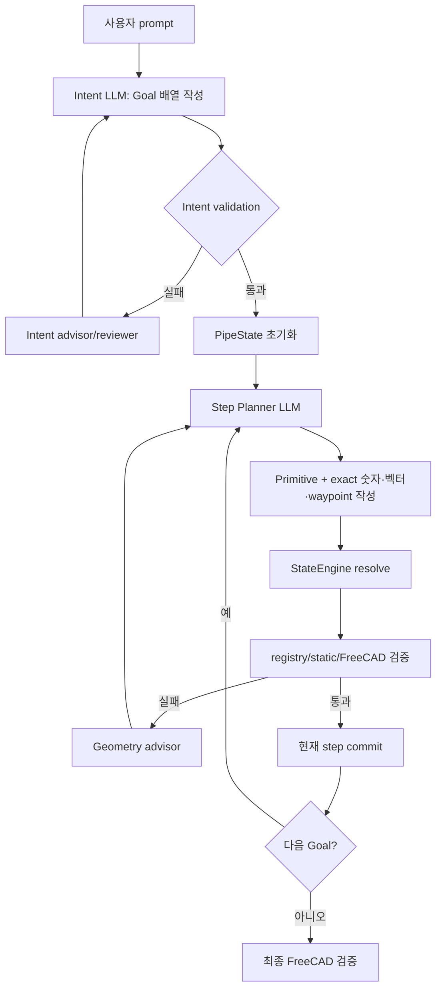
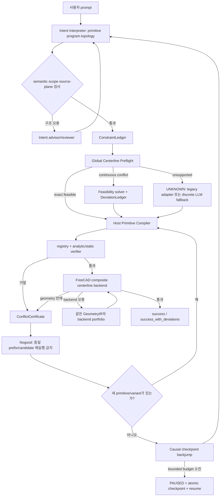

# 파이프 CAD 생성 아키텍처 전면 개편

작성일: 2026-07-11  
대상: `cadgen02`  
핵심 불변식: **LLM이 primitive 의미와 topology를 고르고, 결정론적 기하 엔진이 수치·연결·검증을 책임진다.**

## 결론부터

기존 구조의 본질적인 문제는 검증기가 엄격해서가 아니었다. LLM이 primitive뿐 아니라 좌표·방향·반경·waypoint까지 다시 추측했고, 검증 실패가 현재 step의 숫자 수정 문제로만 전달됐으며, 앞에서 잘못 확정한 primitive까지 되돌아갈 수 없었다.

그래서 advisor를 하나 더 붙이는 방식 대신 다음 다섯 경계로 재구성했다.

1. `ContractCore`: 자연어 intent를 source provenance가 있는 `ConstraintLedger`로 바꾸고, 첫 action 전에 전체 중심선을 검사한다.
2. `DeterministicGeometry`: LLM이 고른 primitive program을 host가 exact pose·접선·폐합 action으로 컴파일한다.
3. `ConflictKernel`: validator 문자열을 원인·증거·수정 권한이 있는 `ConflictCertificate`로 통일한다.
4. `RepairOrchestrator`: 같은 후보 반복을 금지하고, 필요하면 원인과 연결된 이전 checkpoint로 backjump한다.
5. `ExecutionAuditPlane`: provider retry, candidate digest, backjump, pause/resume을 append-only event로 남긴다.

새 기본 경로에서는 일반적인 line/arc/closure 설계의 step별 숫자를 Gemini가 작성하지 않는다. Intent LLM이 primitive program을 고르면 host compiler가 정확한 action을 만든다. 따라서 기존의 `direction=+X` 반복, 소수 enum schema 400, 0.5도 임의 비틀기 같은 실패 경로가 기본 실행에서 사라진다.

---

## 1. 기존에는 어떻게 진행됐는가

기존 production 흐름은 다음과 같았다.



좋았던 부분도 있었다.

- 검증 전 speculative state와 commit state를 분리했다.
- schema, registry, graph, static geometry, FreeCAD B-Rep을 여러 단계에서 검사했다.
- checkpoint와 action attempt를 저장했다.
- intent advisor와 geometry advisor에게 pass 권한을 주지 않았다.

하지만 책임 경계가 잘못되어 있었다.

- Intent LLM이 primitive program을 만들었다.
- Step Planner LLM이 같은 의미를 다시 해석하면서 exact 연속 수치까지 작성했다.
- Resolver가 일부 종속값을 계산했지만, 핵심 line direction·radius·waypoint는 여전히 LLM 값이었다.
- Validator는 거절할 수 있었지만, 앞선 causal decision을 바꿀 권한은 없었다.
- Advisor는 rollback을 제안할 수 있어도 정상 step loop는 현재 state만 반복했다.

즉, 멀티 에이전트 수는 늘었지만 실제 search space는 거의 한 줄짜리 greedy path였다.

---

## 2. 기존에 생성되지 않던 실제 원인

### 2.1 검증 반례가 잘못된 소유자에게 전달됐다

첨부 실행 `outputs/20260711T143542851312Z`에서는 step 3의 직선이 반복해서 거절됐다. 그러나 저장된 static evidence를 보면 현재 직선 방향이 아니라 이미 만들어진 중심선 조합에 전역 문제가 있었다.

- 비인접 M1–M3 중심선 거리: `17.320508 mm`
- 필요한 최소 거리: 약 `20 mm`
- clearance 부족: 약 `2.679492 mm`
- 굽힘 중심선 반경: `10 mm`
- 파이프 외반경: `20 / 2 = 10 mm`

따라서 `R = outer radius`인 horn-torus 경계와 비인접 swept envelope 부족을 첫 action 전에 봤어야 했다.

기존 시스템은 이것을 step 3의 현재 line parameter 문제로 라우팅했다. 결과적으로 다음 일이 발생했다.

- 사실상 같은 M3 geometry를 FreeCAD에 여러 번 보냈다.
- 그 다음에는 line tangent를 0.5도 비틀어 충돌을 피하려 했다.
- 그러자 `MODULE_INPUT_AXIS_MISMATCH`, `PORT_CONTRACT_MISMATCH`, `ROUTE_START_TANGENT_MISMATCH`가 발생했다.
- 마지막 provider timeout이 geometry 복구와 무관하게 전체 실행을 끝냈다.

한 실행에서 LLM 호출은 15회, 총 token은 227,774였지만 유효한 geometry branch는 거의 하나였다.

### 2.2 전체 경로를 보기 전에 앞부분을 고정했다

기존 step loop는 M1이 통과하면 M1을 commit하고, M2가 통과하면 M2를 commit했다. M3에서 M1–M3 충돌이 드러나도 현재 M3만 다시 만들었다.

파이프 폐곡선은 뒤의 step이 앞의 의미를 바꿀 수 있는 문제다.

- turn sign 하나가 뒤의 모든 heading을 바꾼다.
- bend radius 하나가 두 비인접 직선의 접근 거리를 바꾼다.
- 마지막 closure는 전체 line/radius 조합에 의존한다.
- 같은 중심선도 모듈별 Boolean fuse와 composite sweep의 OCC 안정성이 다르다.

이런 문제를 현재 step retry로만 풀 수는 없다.

### 2.3 LLM에게 수치 기하를 두 번 시켰다

Intent 단계에서 이미 다음 정보가 있었다.

- line인지 arc인지
- 길이와 회전각
- turn plane
- 목표 순서와 dependency
- closure 목표

그런데 Step Planner가 다시 exact direction, radius, midpoint, waypoint를 작성했다. 이 때문에 다음 문제가 반복됐다.

- 회전 뒤 직선에 계속 `+X`를 넣어 sequential heading contradiction 발생
- irrational tangent/vector를 제한된 numeric enum으로 표현하려다 schema 복잡도 증가
- provider HTTP 400 뒤 profile만 바꿔도 같은 opaque invalid request 반복
- 검증 gap을 보고도 인과관계 없이 숫자를 조금씩 흔듦

primitive 선택과 연속 수치 계산을 한 LLM 응답에 넣은 것이 문제였다.

### 2.4 evidence가 계층 사이에서 유실됐다

static validator는 M1–M3 clearance 후보를 갖고 있었지만, 뒤의 FreeCAD BOP가 실패하면 사용자와 advisor가 보는 최상위 issue는 `FREECAD_GEOMETRY_VALIDATION_FAILED` 하나가 됐다.

또한 전체 Boolean이 깨진 상황에서는 FreeCAD의 `non_adjacent_overlaps`가 비어 있을 수 있었다. 빈 overlap 배열은 충돌이 없다는 증명이 아니라, 충돌 측정 자체가 실패했다는 뜻일 수 있다.

Advisor를 더 붙여도 입력 evidence가 원인 pair를 잃으면 결과는 좋아지지 않는다.

### 2.5 provider/protocol 오류가 geometry search를 종료했다

기존 outer loop는 `GeminiRequestError`를 configuration/infrastructure terminal로 분류했다. 그래서 timeout이나 schema 400이 발생하면 다음 geometry branch가 남아 있어도 실행이 끝날 수 있었다.

provider 오류와 geometry infeasible은 전혀 다른 사건이다.

- HTTP 400 invalid schema: schema negotiation 문제
- timeout/429/5xx: transport 문제
- static collision: geometry 문제
- OCC MakePipeShell 실패: backend construction 문제

이 네 가지가 같은 retry budget과 종료 경로를 쓰면 안 된다.

### 2.6 모듈별 solid fuse가 연속 파이프를 Boolean 문제로 바꿨다

연속 line/arc 경로도 기존 FreeCAD backend는 각 primitive의 outer/bore solid를 별도로 만든 후 fuse/cut했다.

수학적으로 하나의 G1 중심선인 파이프가 OCC에서는 다음처럼 변했다.

- 다수의 접선 접촉 face
- outer fuse와 bore fuse
- 다시 outer-minus-bore cut
- seam, self-intersection, orientation 문제

연속 degree-2 파이프는 처음부터 하나의 centerline wire를 sweep하는 편이 맞다.

---

## 3. 지금은 어떻게 바뀌었는가

### 3.1 새 전체 흐름



### 3.2 `ConstraintLedger`: 문자열 hard constraint를 typed contract로 교체

새 파일: `cadgen/contract_core.py`  
새 artifact: `constraint_ledger.json`

각 constraint는 다음을 가진다.

- `constraint_id`
- `constraint_type`
- `source_goal_id`
- `source_field`
- 원문 주변의 `source_span`
- `priority`: safety / topology / driving / preference
- `relation`: exact / minimum / maximum / range / derived
- `relaxable`
- `tolerance`
- 관련 variable ID

기본 우선순위는 다음과 같다.

1. 중공 단면, 양의 벽 두께, 무교차 같은 safety
2. connected/closed/open-port count 같은 topology
3. 길이·반경 같은 driving dimension
4. 정성적 preference

사용자가 숫자 주변에 `정확히`, `반드시`, `strict`, `without deviation` 같은 표현을 쓰면 해당 driving value는 strict로 유지한다. `CADGEN_FEASIBILITY_MODE=strict`를 설정하면 모든 자동 치수 실현을 끌 수 있다.

### 3.3 첫 action 전 `Global Centerline Preflight`

새 artifact: `global_preflight.json`

현재 authoritative 범위는 단일 연결 성분, 일정한 원형 단면, graph degree 2 이하, line/circular-arc/closure이다. 이 범위에서는 첫 FreeCAD 호출 전에 다음을 계산한다.

- serial heading과 pose 적분
- analytic circular arc endpoint와 tangent
- closure position/tangent residual
- `centerline radius > outer radius + tolerance`
- 모든 비인접 primitive pair의 swept-envelope clearance
- source가 지정한 XY/XZ/YZ plane 보존
- authored/realized centerline digest

판정은 세 값이다.

- `exact`: 원래 치수 그대로 통과
- `adjusted`: safety/topology를 보존하는 검증된 best-effort 실현
- `unknown`: 현재 solver 범위 밖이며 infeasible로 단정하지 않음
- `infeasible`: strict constraint 집합 안에서 결정론적으로 모순이 증명됨

불완전한 preflight 결과를 `infeasible`로 취급하지 않는 것이 중요하다.

### 3.4 사례별 상수 대신 일반 기하식과 최적화

코드에는 별, 삼각형, `40`, `120`, `189.282032` 같은 사례별 분기가 없다.

line은 다음 전진식을 사용한다.

\[
p_{i+1}=p_i+L_i t_i
\]

signed circular arc는 StateEngine과 같은 analytic frame/회전식을 사용한다.

\[
t_{i+1}=\operatorname{Rot}(n_i,\theta_i)t_i
\]

폐합 위치는 fixed heading/angle에서 line length와 arc radius에 affine하다. Host는 unit perturbation으로 같은 forward compiler의 Jacobian column을 만들고, 상대 변화가 최소인 bounded projection을 푼다. 반경은 외반경+tolerance보다 작아질 수 없고, line length는 양수여야 한다.

그 다음 남은 curvature/clearance conflict는 shape identity를 보존하는 최소 uniform centerline scale로 해결한다. 각도, primitive 순서, topology, OD, wall thickness는 바꾸지 않는다. 모든 길이·반경 변화는 `ConstraintDeviation`으로 남는다.

이 방식은 “특정 prompt를 통과시키기 위해 수치를 하드코딩”하는 것과 다르다. 입력에서 어떤 길이·각도·반경이 오더라도 같은 식과 같은 verifier를 쓴다.

### 3.5 LLM은 primitive를 선택하고 host가 exact action을 만든다

새 파일: `cadgen/primitive_compiler.py`

기본 경로에서 Intent Agent가 다음을 선택한다.

- goal type
- path kind
- primitive 순서
- dependency/topology
- source value와 goal field binding

Host compiler가 다음을 소유한다.

- 현재 target port
- inlet/outlet pose
- line tangent inheritance
- circular arc frame과 endpoint tangent
- closure endpoint와 midpoint
- section inheritance
- resolver-owned spline endpoint tangent/curvature policy

마지막 turn이 START anchor에 정확히 닿는 경우, `turn`과 `connect`를 별도 action으로 만들지 않는다. 한 `connect_ports` circular arc가 두 goal을 동시에 complete하고 두 physical port를 소비한다. 따라서 최종 arc 뒤에 0길이 line을 억지로 넣지 않는다.

Branch처럼 실제로 여러 outlet/primitive 선택이 남아 있거나 현재 compiler 범위 밖이면 기존 Step Planner가 discrete fallback으로 호출된다. 이 경우에도 validator와 ConflictKernel의 권한은 그대로 유지된다.

### 3.6 `ConflictCertificate`: 실패를 repair input으로 바꿈

새 파일: `cadgen/conflict_kernel.py`

모든 failure adapter는 공통 정보를 만든다.

- conflict type
- failed predicate
- proof strength
- 관련 constraint/primitive
- candidate/evidence digest
- measured/required/gap
- causal decision
- earliest backjump step
- mutable field
- 허용된 route

주요 route는 다음과 같다.

- `retry_protocol`
- `retry_infrastructure`
- `reauthor_current`
- `change_primitive`
- `probe`
- `backjump`
- `repair_intent`
- `relax_driving_constraint`
- `proven_infeasible`

Router는 숫자를 만들거나 validation을 통과시킬 권한이 없다.

### 3.7 동일 후보 반복 금지

새 `ActionAttempt.state_digest`는 단순한 `S2` 버전명이 아니라 실제 prefix content digest를 저장한다.

Nogood key는 다음 의미를 가진다.

```text
contract + content-addressed prefix state + resolved geometry candidate
```

같은 key가 한 번 거절되면 다음 일이 금지된다.

- 같은 FreeCAD geometry 재실행
- action ID만 바꾼 재제출
- rationale만 바꾼 재제출

새 시도는 최소한 다음 중 하나를 증명해야 한다.

- primitive/variant 변경
- 인과 필드 변경
- prefix state 변경
- 새 독립 evidence/probe

### 3.8 current-step retry를 causal backjump로 확장

현재 step의 unique 후보를 소진하면 `RepairOrchestrator`가 이전 committed checkpoint를 복원한다.

- issue가 이전 module을 가리키면 그 module의 decision step까지 이동
- 그렇지 않으면 직전 causal step으로 이동
- rejected suffix는 nogood로 유지
- restored state와 pending conflict를 checkpoint에 원자적으로 기록
- 다음 LLM 호출은 current 숫자 재작성 대신 다른 primitive/variant를 고르게 됨

Backjump 횟수는 `CADGEN_MAX_CAUSAL_BACKJUMPS`로 제한한다. 제한 이후에도 증명 없이 `infeasible`로 끝내지 않는다. `paused` report, checkpoint와 다음 명령을 남긴다.

```bash
./run.sh --resume outputs/<run-id>
```

CLI는 이 상태에 일반 실패 코드 1이 아니라 임시·재개 가능 상태를 뜻하는 exit code 75를 사용한다.

### 3.9 ProviderGateway 성격의 retry 분리

`CADGEN_PROVIDER_TRANSPORT_RETRIES`는 timeout, 408/429, 5xx, connection reset에만 적용된다.

- transport retry는 geometry repair attempt를 소비하지 않는다.
- HTTP 400 invalid request는 같은 요청을 반복하지 않는다.
- 400은 provider schema profile negotiation으로만 보낸다.
- supported line/arc 설계는 Step Planner numeric schema 자체를 사용하지 않는다.

이전 `invalid_request` 문제를 단순 재시도로 숨기지 않고 요청 grammar 문제와 transport 문제로 분리했다.

### 3.10 FreeCAD backend: 모듈별 Boolean보다 composite centerline 우선

변경 파일: `cadgen/freecad_script.py`  
generator version: `cadgen02-freecad-v24`

모든 module이 constant-section `route/connect_ports`인 degree-2 component이면 다음 backend가 우선된다.

1. solved line/arc/spline edge를 순서대로 하나의 `Part.Wire`로 구성
2. outer profile을 전체 wire에 한 번 sweep
3. bore profile을 같은 wire에 한 번 sweep
4. outer-bore cut을 한 번 수행

Composite sweep이 OCC backend 이유로 실패하면 geometry를 바꾸지 않고 같은 solved path에 기존 module Boolean portfolio를 fallback으로 적용한다. Fallback은 `backend_fallbacks` evidence에 남고 geometry infeasible로 오인되지 않는다.

FreeCAD/Open CASCADE의 PipeShell은 하나의 spine wire에 profile을 sweep하는 API를 제공한다. 이 개편은 해당 primitive에 맞춰 연속 파이프를 연속 geometry로 생성한다. [Open CASCADE `BRepOffsetAPI_MakePipeShell`](https://dev.opencascade.org/doc/refman/html/class_b_rep_offset_a_p_i___make_pipe_shell.html)

### 3.11 새 감사 artifact

각 실행에는 다음 파일이 추가된다.

- `constraint_ledger.json`: source-bound typed contract
- `global_preflight.json`: exact/adjusted/unknown 판정, conflict, deviation
- `search_events.jsonl`: run, candidate, conflict, backjump, pause event

`run_report.json`에는 다음이 추가된다.

- `realization_status`
- `deviation_count`
- `status=success_with_deviations`
- `status=paused`
- `pause_reason`
- `resume_command`
- `recovery_state`

---

## 4. 연구에서 가져온 원리와 이 프로젝트에서의 적용

이 구조는 특정 논문을 그대로 복제하지 않고 역할별 원리만 결합한다.

### CEGIS: 반례가 다음 후보를 제한해야 한다

CEGIS의 핵심은 candidate → verifier counterexample → refinement이다. 여기서는 validator rejection을 prose가 아니라 `ConflictCertificate`와 nogood로 만든다.

### AlphaGeometry: LLM과 symbolic engine의 권한 분리

AlphaGeometry는 language model이 보조 구성을 제안하고 symbolic engine이 기하 추론을 수행한다. cadgen02에서는 LLM이 primitive program을 제안하고 host가 pose·closure·clearance를 계산한다. [Nature: AlphaGeometry](https://www.nature.com/articles/s41586-023-06747-5)

### Constraint program: CAD를 좌표 묶음이 아니라 프로그램으로 표현

Vitruvion과 geometric constraint solving 연구는 parametric CAD를 geometry+constraint program으로 다룬다. `ConstraintLedger + CenterlineProgram`이 이 역할을 한다. [Vitruvion, ICLR 2022](https://openreview.net/forum?id=Ow1C7s3UcY), [Geometric Constraint Solving review](https://arxiv.org/abs/2202.13795)

### Tree search: 대화형 “생각 나열”이 아니라 명시적 state/backtrack

Tree of Thoughts에서 가져온 것은 여러 reasoning 문장을 생성하는 형식이 아니라 branch evaluation과 backtracking 원리다. 구현에서는 content digest, nogood, checkpoint backjump로 제한한다. [Tree of Thoughts, NeurIPS 2023](https://proceedings.neurips.cc/paper/2023/file/271db9922b8d1f4dd7aaef84ed5ac703-Paper-Conference.pdf)

### Semantic choice × deterministic affordance

SayCan은 언어적 적합성과 실행 가능성을 분리해 행동을 선택한다. 이 프로젝트에서는 hard precondition을 통과한 primitive 후보만 LLM 의미 순위의 대상이 되며, 최종 accept는 확률이 아니라 deterministic verifier가 한다. [SayCan](https://say-can.github.io/)

### Continuous centerline optimization과 독립 검증

CHOMP/TrajOpt 계열에서 가져온 원리는 collision/geometry를 trajectory 공간에서 먼저 다루는 것이다. 다만 penalty 감소를 합격 증명으로 쓰지 않고, solver 뒤에 같은 analytic verifier와 최종 B-Rep verifier를 다시 실행한다. [TrajOpt paper](https://rll.berkeley.edu/~sachin/papers/Schulman-IJRR2014.pdf)

---

## 5. 검증 결과와 release gate

현재 정적 test suite는 다음 범주를 포함한다.

- global preflight가 일반 closed line/arc route를 FreeCAD 전에 복구
- 회전 plane을 바꿔도 같은 scale/feasibility 결과가 나오는 metamorphic test
- prompt의 XY plane과 intent XZ geometry 불일치 검출
- 마지막 turn+connect를 한 analytic closure arc로 compile
- 동일 rejected geometry를 nogood로 차단
- provider 없이 Intent 1회만으로 모든 numeric step action을 host compile
- repairable reject 소진 시 이전 checkpoint backjump
- backjump 뒤 prefix content digest가 달라지면 새 branch로 인정
- 해결 불가한 repair는 failed가 아니라 checkpointed paused 상태
- 생성된 FreeCAD v24 script 자체의 Python compile 검사
- 기존 schema/intent/registry/static/FreeCAD/retry/resume 회귀 전체

Release gate는 다음과 같다.

1. 같은 prefix/candidate digest의 FreeCAD 실행 최대 1회
2. repairable validation reject가 곧바로 terminal failed로 전이하는 경우 0건
3. hard safety/topology conflict가 있는 success 0건
4. 모든 best-effort 값 변경의 deviation manifest 누락 0건
5. provider 400/timeout이 geometry infeasible로 기록되는 경우 0건
6. backjump와 pause마다 checkpoint/resume pointer 존재
7. rigid transform에 대해 feasibility 판정 불변
8. composite backend가 의미 수치나 topology를 바꾸는 경우 0건

---

## 6. 현재 구현 범위와 남은 과제

“어떤 자연어든 모든 명시 치수를 정확히 만족하는 valid CAD가 존재한다”는 보장은 수학적으로 불가능하다. 서로 모순된 치수나 파이프 외경보다 좁은 폐곡선이 있을 수 있기 때문이다.

새 시스템이 보장하려는 결과는 다음 삼분법이다.

1. feasible하면 검증된 CAD
2. ordinary driving dimension의 best-effort가 허용되면 검증된 CAD + deviation manifest
3. 아직 증명할 수 없으면 잘못된 success/failed 대신 checkpointed `unknown/paused`

현재 전역 solver의 authoritative 범위는 constant-section, degree-2, line/arc/closure다.

- arbitrary 3D spline의 exact global self-distance 증명
- branch/junction 전체 topology search
- reducer/component와 route의 공동 nonlinear optimization
- minimal IIS 계산
- 여러 discrete primitive program의 beam search
- version-gated long-term failure memory

이 항목들은 같은 `ConstraintLedger → CenterlineProgram → ConflictCertificate` 인터페이스로 확장할 수 있지만 아직 완전 구현됐다고 주장하지 않는다. 지원 범위 밖에서는 `UNKNOWN`을 반환하고 기존 검증 adapter를 사용한다.

다음 우선순위는 branch/spline까지 전역 GeometryIR을 확장하고, interval clearance와 bounded nonlinear solver를 붙이는 것이다. 중요한 점은 이후 확장에서도 LLM에게 exact 좌표를 맞히게 하거나 validator를 약화하는 방식으로 돌아가지 않는 것이다.

---

## 7. 주요 변경 파일

- `cadgen/contract_core.py`
  - ConstraintLedger
  - CenterlineProgram
  - source plane validation
  - closure projection
  - curvature/clearance preflight
  - best-effort realization/deviation
- `cadgen/primitive_compiler.py`
  - LLM-selected goal → host-owned schema-v2 ActionDraft
  - terminal turn+closure arc 결합
- `cadgen/conflict_kernel.py`
  - candidate/prefix digest
  - StaticIssue → ConflictCertificate adapter
  - exact nogood
  - append-only search event
- `cadgen/pipeline.py`
  - preflight integration
  - host compiler default
  - duplicate guard
  - causal backjump
  - paused/resume state
- `cadgen/freecad_script.py`
  - v24 composite centerline sweep
  - backend fallback evidence
- `cadgen/gemini_client.py`
  - transient provider retry와 HTTP 400 schema negotiation 분리
- `cadgen/schemas.py`
  - typed ledger/deviation/conflict/preflight/report contracts
- `tests/test_contract_core_architecture.py`
  - 새 구조의 end-to-end, metamorphic, nogood, backjump, pause 회귀

이 개편의 핵심은 advisor 수를 늘린 것이 아니다. **LLM의 권한을 discrete semantic choice로 줄이고, 전역 geometry와 실패 복구를 content-addressed deterministic state machine으로 옮긴 것**이다.
